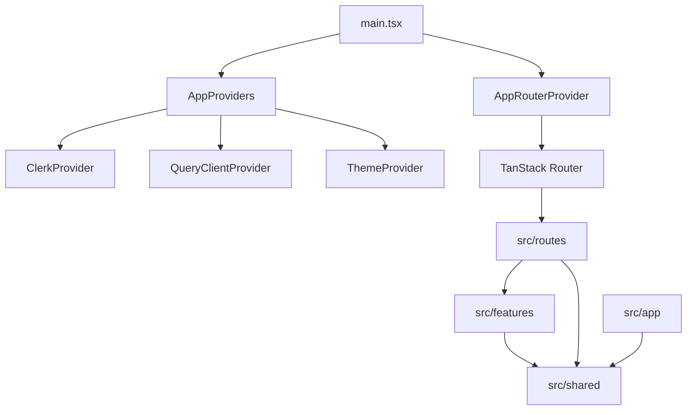

# 00 — Project Initialization & Application Foundation

> บทนี้คือจุดเริ่มต้นของหลักสูตรทั้งหมด เป้าหมายไม่ใช่การ `git clone` โปรเจ็กต์สำเร็จรูป แต่คือการสร้าง DummyJSON Admin ขึ้นมาจากโปรเจ็กต์ว่างจนได้ Foundation ที่พร้อมเริ่มพัฒนาโมดูล Users, Posts, Carts, Todos และ Dashboard ตามลำดับ

---

## 1. สิ่งที่คุณจะได้หลังเรียนบทนี้จบ

เมื่อทำบทนี้ครบ คุณจะมี React SPA ที่พร้อมพัฒนา feature จริง โดยมี:

- Bun เป็น package manager/runtime สำหรับ development workflow
- React + TypeScript + Vite
- Tailwind CSS v4
- shadcn/ui แบบ Base UI
- TanStack Router แบบ file-based routing
- TanStack Query สำหรับ server state/cache
- Clerk สำหรับ authentication boundary
- Axios client กลางสำหรับ HTTP transport
- Zod สำหรับ runtime validation
- URL-driven routing foundation
- Router-aware shadcn navigation
- Error, Loading, Skeleton และ Toast infrastructure
- Admin shell + responsive sidebar + breadcrumb
- ESLint + Prettier + strict TypeScript
- GitHub Actions quality gate

หลังจากบทนี้ **ยังไม่มี Users/Posts/Carts/Todos business feature** นั่นเป็นเรื่องตั้งใจ เพราะเราต้องทำ Foundation ให้แข็งแรงก่อน

---

## 2. Architecture ที่เรากำลังสร้าง



Dependency direction ที่ต้องรักษา:

```text
app      -> shared
routes   -> features -> shared
routes   -> shared
features -> shared
shared   -> ไม่มีสิทธิ์ import app/routes/features
```

### ทำไมต้องแยกแบบนี้

ถ้าเราให้ทุกไฟล์ import หากันได้อิสระ โปรเจ็กต์จะค่อย ๆ กลายเป็น dependency graph ที่วนกันเอง เช่น component ใน `shared` import feature แล้ว feature importกลับ `shared` อีกที การแยกชั้นตั้งแต่วันแรกช่วยให้เพิ่ม module ในภายหลังได้โดยไม่ต้องรื้อระบบเดิม

---

## 3. เอกสารทางการที่ควรเปิดคู่กับบทนี้

อ่านทั้งหมดไม่จำเป็นในครั้งแรก ให้เปิดเฉพาะหัวข้อที่กำลังทำ

- Bun: https://bun.com/docs
- React: https://react.dev/learn
- TypeScript: https://www.typescriptlang.org/docs/
- Vite: https://vite.dev/guide/
- Tailwind CSS + Vite: https://tailwindcss.com/docs/installation/using-vite
- shadcn/ui + Vite: https://ui.shadcn.com/docs/installation/vite
- shadcn Sidebar: https://ui.shadcn.com/docs/components/aria/sidebar
- shadcn Skeleton: https://ui.shadcn.com/docs/components/aria/skeleton
- shadcn Sonner: https://ui.shadcn.com/docs/components/aria/sonner
- TanStack Router Quick Start: https://tanstack.com/router/latest/docs/quick-start
- TanStack Router File-Based Routing: https://tanstack.com/router/latest/docs/routing/file-based-routing
- TanStack Router + shadcn/ui: https://tanstack.com/router/latest/docs/how-to/integrate-shadcn-ui
- TanStack Query: https://tanstack.com/query/latest/docs/framework/react/overview
- TanStack Query `queryOptions`: https://tanstack.com/query/latest/docs/framework/react/reference/queryOptions
- Clerk React: https://clerk.com/docs/react/getting-started/quickstart
- Axios: https://axios-http.com/docs/intro
- Axios Interceptors: https://axios-http.com/docs/interceptors
- Zod: https://zod.dev/
- DummyJSON: https://dummyjson.com/docs

---

# Part A — สร้างโปรเจ็กต์จากศูนย์

## Step 1 — Scaffold React + TypeScript ด้วย Vite

```bash
bunx create-vite dummyjson-admin --template react-ts
cd dummyjson-admin
bun install
```

ทดสอบก่อนว่า starter ทำงาน:

```bash
bun run dev
```

เปิด URL ที่ Vite แสดง หากหน้า starter ทำงานให้หยุด dev server แล้วไปขั้นต่อไป

### Checkpoint

- [ ] React render ได้
- [ ] TypeScript compile ได้
- [ ] `bun install` สำเร็จ

---

## Step 2 — ติดตั้ง dependencies

```bash
bun add \
  @base-ui/react \
  @clerk/react \
  @fontsource-variable/outfit \
  @tailwindcss/vite \
  @tanstack/react-devtools \
  @tanstack/react-query \
  @tanstack/react-router \
  @tanstack/react-router-devtools \
  axios \
  class-variance-authority \
  clsx \
  lucide-react \
  shadcn \
  sonner \
  tailwind-merge \
  tailwindcss \
  tw-animate-css \
  zod

bun add -d \
  @tanstack/devtools-vite \
  @tanstack/eslint-config \
  @tanstack/eslint-plugin-query \
  @tanstack/router-cli@1.167.21 \
  @tanstack/router-plugin@1.168.23 \
  @types/node \
  @types/react \
  @types/react-dom \
  @vitejs/plugin-react \
  eslint \
  prettier \
  typescript \
  vite
```

> Router CLI/Plugin ถูก pin เพราะ build tooling ควร deterministic มากกว่าปล่อยให้ transitive generator version เปลี่ยนเองระหว่าง CI runs

---

## Step 3 — ตั้ง `package.json`

แทนที่ scripts และ package metadata ให้มี quality workflow กลาง

```json
{
  "name": "dummyjson-admin-example",
  "private": true,
  "type": "module",
  "packageManager": "bun@1.3.13",
  "engines": {
    "bun": ">=1.3.13"
  },
  "imports": {
    "#/*": "./src/*"
  },
  "scripts": {
    "dev": "vite --port 3000",
    "routes:generate": "tsr generate",
    "build": "bun run routes:generate && vite build",
    "preview": "vite preview",
    "typecheck": "bun run routes:generate && tsc --noEmit",
    "lint": "eslint .",
    "lint:fix": "eslint . --fix",
    "format": "prettier --write .",
    "format:check": "prettier --check .",
    "check": "bun run format:check && bun run lint && bun run typecheck && bun run build"
  }
}
```

จากนั้นให้ dependencies ที่ติดตั้งด้วย Bun อยู่ต่อใน object `dependencies` และ `devDependencies`

### เหตุผลของ `bun run check`

เราต้องการคำสั่งเดียวที่ตอบคำถามว่า “งานนี้พร้อม merge หรือยัง” โดยตรวจเรียงตามนี้:

```text
Prettier -> ESLint -> Route Generation -> TypeScript -> Production Build
```

---

## Step 4 — `.gitignore`

```gitignore
node_modules/
dist/
.DS_Store
.env
.env.*
!.env.example
*.local
.tanstack/
src/routeTree.gen.ts
bun.lock
```

`src/routeTree.gen.ts` เป็น generated code จึงไม่ควรแก้เอง

---

# Part B — TypeScript, Vite และ Router Generator

## Step 5 — `tsconfig.json`

```json
{
  "include": ["**/*.ts", "**/*.tsx", "eslint.config.js", "prettier.config.js", "vite.config.js"],
  "compilerOptions": {
    "target": "ES2022",
    "jsx": "react-jsx",
    "module": "ESNext",
    "paths": {
      "#/*": ["./src/*"]
    },
    "lib": ["ES2022", "DOM", "DOM.Iterable"],
    "types": ["vite/client"],
    "moduleResolution": "bundler",
    "allowImportingTsExtensions": true,
    "verbatimModuleSyntax": true,
    "noEmit": true,
    "skipLibCheck": true,
    "strict": true,
    "noUnusedLocals": true,
    "noUnusedParameters": true,
    "noFallthroughCasesInSwitch": true,
    "noUncheckedSideEffectImports": true,
    "noUncheckedIndexedAccess": true,
    "exactOptionalPropertyTypes": true,
    "useUnknownInCatchVariables": true
  }
}
```

### ทำไมใช้ alias `#/*`

แทนที่จะเขียน:

```ts
import { httpClient } from "../../../../shared/api/http-client";
```

เราจะเขียน:

```ts
import { httpClient } from "#/shared/api/http-client";
```

ทำให้การย้ายไฟล์ไม่ทำลาย relative imports เป็นทอด ๆ

---

## Step 6 — `tsr.config.json`

```json
{
  "target": "react",
  "routesDirectory": "./src/routes",
  "generatedRouteTree": "./src/routeTree.gen.ts"
}
```

---

## Step 7 — `vite.config.ts`

```ts
import { defineConfig } from "vite";
import { devtools } from "@tanstack/devtools-vite";
import { tanstackRouter } from "@tanstack/router-plugin/vite";
import viteReact from "@vitejs/plugin-react";
import tailwindcss from "@tailwindcss/vite";

const config = defineConfig({
  resolve: { tsconfigPaths: true },
  plugins: [
    devtools(),
    tailwindcss(),
    tanstackRouter({ target: "react", autoCodeSplitting: true }),
    viteReact(),
  ],
});

export default config;
```

### สิ่งที่เกิดขึ้น

- Tailwind ทำงานผ่าน Vite plugin
- Router plugin อ่าน `src/routes`
- route tree ถูก generate อัตโนมัติ
- `autoCodeSplitting` ช่วยให้ route chunks แยกโหลดได้

---

# Part C — shadcn/ui และ Styling Foundation

## Step 8 — สร้าง `components.json`

```json
{
  "$schema": "https://ui.shadcn.com/schema.json",
  "style": "base-vega",
  "rsc": false,
  "tsx": true,
  "tailwind": {
    "config": "",
    "css": "src/styles/globals.css",
    "baseColor": "stone",
    "cssVariables": true,
    "prefix": ""
  },
  "aliases": {
    "components": "#/shared/components",
    "utils": "#/shared/lib/utils",
    "ui": "#/shared/components/ui",
    "lib": "#/shared/lib",
    "hooks": "#/shared/hooks"
  },
  "iconLibrary": "lucide",
  "rtl": false,
  "menuColor": "default-translucent",
  "menuAccent": "subtle",
  "registries": {}
}
```

## Step 9 — ติดตั้ง UI primitives ผ่าน shadcn CLI

```bash
bunx shadcn@latest add \
  button \
  card \
  dialog \
  drawer \
  dropdown-menu \
  alert \
  breadcrumb \
  pagination \
  sidebar \
  skeleton \
  sonner
```

> ไฟล์ใต้ `src/shared/components/ui/` เป็น generated/vendor primitives ให้ใช้ CLI ทางการแทนการ copy snapshot จากคู่มือนี้ ทุกไฟล์ที่เราเขียน business/application logic เองจะให้โค้ดเต็มในบทนี้

---

## Step 10 — `src/shared/lib/utils.ts`

```ts
import { clsx, type ClassValue } from "clsx";
import { twMerge } from "tailwind-merge";

export function cn(...inputs: ClassValue[]) {
  return twMerge(clsx(inputs));
}
```

---

# Part D — Runtime Configuration และ Error Boundary

## Step 11 — `.env.example`

```dotenv
VITE_APP_NAME=DummyJSON Admin
VITE_API_BASE_URL=https://dummyjson.com
VITE_API_TIMEOUT_MS=15000
VITE_CLERK_PUBLISHABLE_KEY=pk_test_your_publishable_key
```

คัดลอกเป็น `.env` แล้วใส่ Clerk Publishable Key จริงของ environment ตัวเอง

```bash
cp .env.example .env
```

> ห้ามใส่ Clerk Secret Key หรือ server secret ใด ๆ ในตัวแปร `VITE_*` เพราะค่ากลุ่มนี้ถูก bundle ไปฝั่ง browser

---

## Step 12 — `src/shared/config/env.ts`

```ts
import { z } from "zod";

const envSchema = z.object({
  VITE_APP_NAME: z.string().trim().min(1).default("DummyJSON Admin"),
  VITE_API_BASE_URL: z.url().default("https://dummyjson.com"),
  VITE_API_TIMEOUT_MS: z.coerce.number().int().positive().default(15_000),
  VITE_CLERK_PUBLISHABLE_KEY: z.string().trim().min(1),
});

const result = envSchema.safeParse(import.meta.env);

if (!result.success) {
  console.error("Invalid environment configuration", result.error.flatten().fieldErrors);
  throw new Error("Invalid environment configuration");
}

export const env = result.data;
```

### ทำไม TypeScript อย่างเดียวไม่พอ

TypeScript ตรวจ type ตอน compile แต่ `.env` เป็นข้อมูล runtime หาก key หายหรือ URL ผิด TypeScript ไม่สามารถช่วยได้ จึงต้องมี Zod boundary

---

## Step 13 — `src/shared/errors/application-error.ts`

```ts
interface ApplicationErrorOptions {
  code?: string;
  status?: number;
  details?: unknown;
  cause?: unknown;
}

export class ApplicationError extends Error {
  readonly code?: string;
  readonly status?: number;
  readonly details?: unknown;
  override readonly cause?: unknown;

  constructor(message: string, options: ApplicationErrorOptions = {}) {
    super(message);
    this.name = "ApplicationError";
    this.code = options.code;
    this.status = options.status;
    this.details = options.details;
    this.cause = options.cause;
  }
}
```

เป้าหมายคือทำให้ทั้ง Axios, API-contract validation และ Route UI สื่อสาร error ในรูปแบบเดียวกัน

---

# Part E — HTTP Infrastructure

## Step 14 — `src/shared/api/http-client.ts`

```ts
import axios from "axios";

import { env } from "#/shared/config/env";
import { ApplicationError } from "#/shared/errors/application-error";

export const httpClient = axios.create({
  baseURL: env.VITE_API_BASE_URL,
  timeout: env.VITE_API_TIMEOUT_MS,
  headers: {
    Accept: "application/json",
  },
});

httpClient.interceptors.response.use(
  (response) => response,
  (error: unknown) => {
    if (!axios.isAxiosError(error)) {
      return Promise.reject(
        new ApplicationError("An unexpected error occurred", {
          code: "UNKNOWN_ERROR",
          cause: error,
        }),
      );
    }

    if (!error.response) {
      return Promise.reject(
        new ApplicationError("The API could not be reached", {
          code: "NETWORK_ERROR",
          cause: error,
        }),
      );
    }

    return Promise.reject(
      new ApplicationError(error.message, {
        code: "HTTP_ERROR",
        status: error.response.status,
        details: error.response.data,
        cause: error,
      }),
    );
  },
);
```

### กฎสำคัญ

```text
axios import ได้เฉพาะ shared/api/http-client.ts
feature clients ต้อง import httpClient เท่านั้น
```

เหตุผลคือถ้าวันหนึ่งต้องเพิ่ม authorization header, tracing, retry policy หรือ error normalization เราแก้จุดเดียว

---

# Part F — TanStack Query Foundation

## Step 15 — `src/app/query-client/query-client.ts`

```ts
import { QueryClient } from "@tanstack/react-query";

import { ApplicationError } from "#/shared/errors/application-error";

export const queryClient = new QueryClient({
  defaultOptions: {
    queries: {
      staleTime: 60_000,
      gcTime: 30 * 60_000,
      retry: (failureCount, error) => {
        if (error instanceof ApplicationError && error.status && error.status < 500) {
          return false;
        }

        return failureCount < 2;
      },
      refetchOnWindowFocus: false,
    },
    mutations: {
      retry: false,
    },
  },
});
```

### Mental Model

- `staleTime`: ช่วงเวลาที่ cache ยังถือว่า fresh
- `gcTime`: อายุสูงสุดโดยประมาณของ inactive cache ก่อน garbage collection
- feature query สามารถ override ค่าเหล่านี้ตามลักษณะข้อมูล
- mutation ไม่ retry อัตโนมัติ เพราะการยิง write ซ้ำอาจสร้าง side effect

---

# Part G — Clerk Authentication Boundary

## Step 16 — `src/app/auth/auth.ts`

```ts
export interface AppAuth {
  isLoaded: boolean;
  isSignedIn: boolean;
  userId: string | null;
}
```

## Step 17 — `src/app/auth/clerk-auth.ts`

```ts
import { useAuth } from "@clerk/react";

import type { AppAuth } from "./auth";

export function useAppAuth(): AppAuth {
  const auth = useAuth();

  return {
    isLoaded: auth.isLoaded,
    isSignedIn: Boolean(auth.isSignedIn),
    userId: auth.userId ?? null,
  };
}
```

เราไม่ส่ง Clerk object ทั้งก้อนไปทั่ว application แต่สร้าง app-owned abstraction บาง ๆ เพื่อไม่ให้ route layer ผูกกับ vendor API มากเกินไป

## Step 18 — `src/app/auth/clerk-navigation.ts`

```ts
import { router } from "#/app/router/router";

export function clerkRouterPush(to: string) {
  void router.navigate({ href: to });
}

export function clerkRouterReplace(to: string) {
  void router.navigate({ href: to, replace: true });
}
```

Clerk จะใช้ TanStack Router navigation แทน hard browser navigation

---

# Part H — Router Context และ Router Instance

## Step 19 — `src/app/router/router-context.ts`

```ts
import type { QueryClient } from "@tanstack/react-query";

import type { AppAuth } from "#/app/auth/auth";

export interface RouterContext {
  queryClient: QueryClient;
  auth: AppAuth;
}
```

Route loader จึงเข้าถึง QueryClient ได้โดยไม่ import singleton แบบกระจายทุก route

---

## Step 20 — สร้าง route พื้นฐานก่อนสร้าง Router

สร้างโฟลเดอร์:

```text
src/routes/
├── __root.tsx
├── index.tsx
└── (protected)/
    └── _admin/
        └── route.tsx
```

### `src/routes/__root.tsx`

```tsx
import { HeadContent, Outlet, createRootRouteWithContext } from "@tanstack/react-router";
import { TanStackRouterDevtoolsPanel } from "@tanstack/react-router-devtools";
import { TanStackDevtools } from "@tanstack/react-devtools";

import type { RouterContext } from "#/app/router/router-context";

export const Route = createRootRouteWithContext<RouterContext>()({
  component: RootComponent,
  notFoundComponent: () => (
    <main className="grid min-h-screen place-items-center bg-background px-6">
      <div className="text-center">
        <p className="text-sm font-medium text-muted-foreground">404</p>
        <h1 className="mt-2 text-3xl font-semibold tracking-tight">Page not found</h1>
        <p className="mt-2 text-sm text-muted-foreground">The requested route does not exist.</p>
      </div>
    </main>
  ),
});

function RootComponent() {
  return (
    <>
      <HeadContent />
      <Outlet />
      {import.meta.env.DEV ? (
        <TanStackDevtools
          config={{ position: "bottom-right" }}
          plugins={[
            {
              name: "TanStack Router",
              render: <TanStackRouterDevtoolsPanel />,
            },
          ]}
        />
      ) : null}
    </>
  );
}
```

### `src/routes/index.tsx`

```tsx
import { createFileRoute, redirect } from "@tanstack/react-router";

export const Route = createFileRoute("/")({
  beforeLoad: ({ context }) => {
    if (context.auth.isSignedIn) {
      throw redirect({ to: "/dashboard" });
    }
  },
  component: LandingPage,
});

function LandingPage() {
  return (
    <main className="grid min-h-screen place-items-center px-6">
      <div className="max-w-lg text-center">
        <h1 className="text-4xl font-semibold tracking-tight">DummyJSON Admin</h1>
        <p className="mt-4 text-muted-foreground">
          Sign in with Clerk before entering the protected admin application.
        </p>
      </div>
    </main>
  );
}
```

ในโปรเจ็กต์จริงหน้า landing สามารถเพิ่ม Clerk `SignInButton` ได้ภายหลังโดยไม่กระทบ architecture

---

## Step 21 — Generate route tree

```bash
bun run routes:generate
```

เมื่อสำเร็จจะมี `src/routeTree.gen.ts` ถูกสร้างขึ้น แต่ไม่ต้องแก้และไม่ต้อง commit

---

## Step 22 — `src/app/router/router.tsx`

```tsx
import { createRouter as createTanStackRouter } from "@tanstack/react-router";

import type { AppAuth } from "#/app/auth/auth";
import { queryClient } from "#/app/query-client/query-client";
import { routeTree } from "#/routeTree.gen";

const initialAuth: AppAuth = {
  isLoaded: false,
  isSignedIn: false,
  userId: null,
};

export const router = createTanStackRouter({
  routeTree,
  context: {
    queryClient,
    auth: initialAuth,
  },
  scrollRestoration: true,
  defaultPreload: "intent",
  defaultPreloadStaleTime: 0,
  defaultPendingMs: 300,
  defaultPendingMinMs: 400,
});

declare module "@tanstack/react-router" {
  interface Register {
    router: typeof router;
  }
}
```

### ทำไม `defaultPreload: "intent"`

เมื่อผู้ใช้แสดง intent เช่น hover/focus ที่ Link, Router สามารถเริ่มเตรียม route ก่อน click ทำให้ navigation รู้สึกเร็วขึ้น

### ทำไมมี pending delay

เราไม่ต้องการให้ Skeleton กระพริบสำหรับ request ที่จบเร็วมาก จึงรอสั้น ๆ ก่อนแสดง pending UI

---

## Step 23 — `src/app/router/router-provider.tsx`

```tsx
import { useEffect, useRef } from "react";
import { RouterProvider } from "@tanstack/react-router";

import { router } from "./router";
import { useAppAuth } from "#/app/auth/clerk-auth";
import { queryClient } from "#/app/query-client/query-client";

export function AppRouterProvider() {
  const auth = useAppAuth();
  const previousUserIdRef = useRef<string | null | undefined>(undefined);

  useEffect(() => {
    if (!auth.isLoaded) return;

    const previousUserId = previousUserIdRef.current;

    if (previousUserId !== undefined && previousUserId !== auth.userId) {
      queryClient.clear();
    }

    previousUserIdRef.current = auth.userId;
    void router.invalidate();
  }, [auth.isLoaded, auth.userId]);

  if (!auth.isLoaded) {
    return (
      <div className="flex min-h-screen items-center justify-center" role="status">
        <p className="text-sm text-muted-foreground">Loading application…</p>
      </div>
    );
  }

  return (
    <RouterProvider
      router={router}
      context={{
        queryClient,
        auth,
      }}
    />
  );
}
```

### Production Reasoning: ทำไม clear query cache ตอน user เปลี่ยน

สมมุติ User A เปิดข้อมูลแล้ว logout จากนั้น User B login ใน SPA เดิม หาก QueryClient ถูก reuse โดยไม่ clear อาจเห็น cache จาก session ก่อนหน้าได้ชั่วคราว การ clear เมื่อ identity เปลี่ยนทำให้ cache isolation ชัดเจนขึ้น

---

# Part I — Theme + Global Providers

## Step 24 — `src/shared/theme/theme-provider.tsx`

```tsx
import { createContext, useContext, useEffect, useMemo, useState } from "react";
import type { PropsWithChildren } from "react";

type Theme = "dark" | "light" | "system";

interface ThemeProviderProps extends PropsWithChildren {
  defaultTheme?: Theme;
  storageKey?: string;
}

interface ThemeContextValue {
  theme: Theme;
  setTheme: (theme: Theme) => void;
}

const ThemeContext = createContext<ThemeContextValue | undefined>(undefined);

export function ThemeProvider({
  children,
  defaultTheme = "system",
  storageKey = "app-theme",
}: ThemeProviderProps) {
  const [theme, setTheme] = useState<Theme>(() => {
    const saved = localStorage.getItem(storageKey);
    return saved === "dark" || saved === "light" || saved === "system" ? saved : defaultTheme;
  });

  useEffect(() => {
    const root = window.document.documentElement;
    root.classList.remove("light", "dark");

    const resolved =
      theme === "system"
        ? window.matchMedia("(prefers-color-scheme: dark)").matches
          ? "dark"
          : "light"
        : theme;

    root.classList.add(resolved);
    localStorage.setItem(storageKey, theme);
  }, [storageKey, theme]);

  const value = useMemo(() => ({ theme, setTheme }), [theme]);

  return <ThemeContext.Provider value={value}>{children}</ThemeContext.Provider>;
}

export function useTheme() {
  const context = useContext(ThemeContext);
  if (!context) throw new Error("useTheme must be used inside ThemeProvider");
  return context;
}
```

---

## Step 25 — `src/app/providers/app-providers.tsx`

```tsx
import { ClerkProvider } from "@clerk/react";
import { QueryClientProvider } from "@tanstack/react-query";
import type { PropsWithChildren } from "react";

import { clerkRouterPush, clerkRouterReplace } from "#/app/auth/clerk-navigation";
import { queryClient } from "#/app/query-client/query-client";
import { Toaster } from "#/shared/components/ui/sonner";
import { env } from "#/shared/config/env";
import { ThemeProvider } from "#/shared/theme/theme-provider";

export function AppProviders({ children }: PropsWithChildren) {
  return (
    <ThemeProvider defaultTheme="system" storageKey="dummyjson-admin-example-theme">
      <ClerkProvider
        publishableKey={env.VITE_CLERK_PUBLISHABLE_KEY}
        routerPush={clerkRouterPush}
        routerReplace={clerkRouterReplace}
        afterSignOutUrl="/"
        signInFallbackRedirectUrl="/dashboard"
        signUpFallbackRedirectUrl="/dashboard"
      >
        <QueryClientProvider client={queryClient}>
          {children}
          <Toaster position="top-right" />
        </QueryClientProvider>
      </ClerkProvider>
    </ThemeProvider>
  );
}
```

Provider order มีความหมาย: application ต้องมี Clerk และ QueryClient พร้อมก่อน Router routes จะใช้งาน context เหล่านั้น

---

# Part J — Router-aware shadcn Navigation

## Step 26 — `src/shared/components/navigation/app-link.tsx`

แนวทางนี้อ้างอิง official TanStack Router + shadcn integration guide

```tsx
import { createLink } from "@tanstack/react-router";
import { forwardRef } from "react";
import type { AnchorHTMLAttributes } from "react";

const Anchor = forwardRef<HTMLAnchorElement, AnchorHTMLAttributes<HTMLAnchorElement>>(
  (props, ref) => <a ref={ref} {...props} />,
);

Anchor.displayName = "AppLinkAnchor";

const CreatedLink = createLink(Anchor);

export function AppLink(props: React.ComponentProps<typeof CreatedLink>) {
  return <CreatedLink preload="intent" {...props} />;
}
```

> `<a>` ที่อยู่ภายใน adapter นี้ไม่ใช่ hard-navigation usage แบบที่ feature components เขียน `href="/users/1"` เอง TanStack Router เป็นผู้ intercept navigation ผ่าน `createLink`

---

## Step 27 — `src/shared/components/navigation/router-button.tsx`

```tsx
import { createLink } from "@tanstack/react-router";

import { Button } from "#/shared/components/ui/button";

export const RouterButton = createLink(Button);
```

จากนี้ Button ที่ทำหน้าที่ navigation สามารถใช้ `to`, `params`, `search`, `preload` แบบ type-safe ได้ โดยไม่แก้ `button.tsx` ของ shadcn

---

# Part K — Shared UX Infrastructure

## Step 28 — `src/shared/hooks/use-debounced-value.ts`

```ts
import { useEffect, useState } from "react";

export function useDebouncedValue<T>(value: T, delay = 600) {
  const [debouncedValue, setDebouncedValue] = useState(value);

  useEffect(() => {
    const timer = window.setTimeout(() => setDebouncedValue(value), delay);
    return () => window.clearTimeout(timer);
  }, [delay, value]);

  return debouncedValue;
}
```

บท Users/Posts จะใช้ hook นี้กับ real-time text search โดย URL ยังคงเป็น committed source of truth

---

## Step 29 — `src/shared/components/route-state.tsx`

```tsx
import { Alert, AlertDescription, AlertTitle } from "#/shared/components/ui/alert";
import { Button } from "#/shared/components/ui/button";

export function RouteErrorState({ error, reset }: { error: unknown; reset: () => void }) {
  const message = error instanceof Error ? error.message : "An unexpected error occurred";

  return (
    <Alert variant="destructive">
      <AlertTitle>Unable to load this page</AlertTitle>
      <AlertDescription className="space-y-3">
        <p>{message}</p>
        <Button variant="outline" size="sm" onClick={reset}>
          Try again
        </Button>
      </AlertDescription>
    </Alert>
  );
}
```

---

## Step 30 — `src/shared/components/api-skeletons.tsx`

```tsx
import { Skeleton } from "#/shared/components/ui/skeleton";

export function FetchingSkeletonBar({ show }: { show: boolean }) {
  return (
    <div className="h-1 overflow-hidden" aria-hidden={!show}>
      {show ? <Skeleton className="h-1 w-full rounded-none" /> : null}
    </div>
  );
}

export function TablePageSkeleton({ rows = 8, columns = 5 }: { rows?: number; columns?: number }) {
  return (
    <div className="space-y-6" role="status" aria-label="Loading table data">
      <PageHeadingSkeleton />
      <div className="overflow-hidden rounded-xl border bg-card shadow-xs">
        <div className="grid gap-3 border-b p-4 sm:grid-cols-2 lg:grid-cols-4">
          {Array.from({ length: 4 }, (_, index) => (
            <Skeleton key={`toolbar-${index}`} className="h-9 w-full" />
          ))}
        </div>
        <div className="divide-y">
          {Array.from({ length: rows }, (_, rowIndex) => (
            <div
              key={`row-${rowIndex}`}
              className="grid items-center gap-4 px-4 py-4"
              style={{ gridTemplateColumns: `repeat(${columns}, minmax(0, 1fr))` }}
            >
              {Array.from({ length: columns }, (_unused, columnIndex) => (
                <Skeleton key={`cell-${rowIndex}-${columnIndex}`} className="h-4 w-full" />
              ))}
            </div>
          ))}
        </div>
      </div>
      <span className="sr-only">Loading data…</span>
    </div>
  );
}

export function DetailPageSkeleton() {
  return (
    <div className="space-y-6" role="status" aria-label="Loading details">
      <div className="rounded-xl border bg-card p-6 shadow-xs">
        <div className="flex items-center gap-5">
          <Skeleton className="size-20 rounded-2xl" />
          <div className="flex-1 space-y-3">
            <Skeleton className="h-4 w-24" />
            <Skeleton className="h-8 w-64 max-w-full" />
            <Skeleton className="h-4 w-80 max-w-full" />
          </div>
        </div>
      </div>
      <Skeleton className="h-40 w-full rounded-xl" />
      <span className="sr-only">Loading details…</span>
    </div>
  );
}

function PageHeadingSkeleton() {
  return (
    <div className="space-y-3">
      <Skeleton className="h-4 w-28" />
      <Skeleton className="h-9 w-72 max-w-full" />
      <Skeleton className="h-4 w-[32rem] max-w-full" />
    </div>
  );
}
```

บท feature จะต่อยอด Skeleton ตาม layout ของข้อมูลจริง แทนการใช้ spinner เดียวทั้งระบบ

---

# Part L — Admin Shell

## Step 31 — โครงสร้าง Shell

```text
src/app/shell/
├── admin-layout.tsx
├── app-sidebar.tsx
└── app-breadcrumb.tsx
```

### `src/app/shell/admin-layout.tsx`

```tsx
import { Outlet } from "@tanstack/react-router";

import { AppBreadcrumb } from "#/app/shell/app-breadcrumb";
import { AppSidebar } from "#/app/shell/app-sidebar";
import { SidebarInset, SidebarProvider, SidebarTrigger } from "#/shared/components/ui/sidebar";

export function AdminLayout() {
  return (
    <SidebarProvider>
      <AppSidebar />
      <SidebarInset>
        <header className="sticky top-0 z-20 flex h-14 items-center gap-3 border-b bg-background/90 px-4 backdrop-blur">
          <SidebarTrigger />
          <AppBreadcrumb />
        </header>
        <main className="min-w-0 flex-1 p-4 md:p-6">
          <Outlet />
        </main>
      </SidebarInset>
    </SidebarProvider>
  );
}
```

### `src/app/shell/app-breadcrumb.tsx`

```tsx
import { useRouterState } from "@tanstack/react-router";

import { AppLink } from "#/shared/components/navigation/app-link";
import {
  Breadcrumb,
  BreadcrumbItem,
  BreadcrumbList,
  BreadcrumbPage,
  BreadcrumbSeparator,
} from "#/shared/components/ui/breadcrumb";

const labels: Record<string, string> = {
  dashboard: "Dashboard",
  users: "Users",
  posts: "Posts",
  carts: "Carts",
  todos: "Tasks",
  tags: "Tags",
};

function labelFor(segment: string) {
  if (labels[segment]) return labels[segment];
  if (/^\d+$/.test(segment)) return `#${segment}`;
  return segment.replace(/-/g, " ").replace(/^./, (value) => value.toUpperCase());
}

export function AppBreadcrumb() {
  const pathname = useRouterState({ select: (state) => state.location.pathname });
  const segments = pathname.split("/").filter(Boolean);

  if (segments.length === 0) return null;

  return (
    <Breadcrumb>
      <BreadcrumbList>
        {segments.map((segment, index) => {
          const to = `/${segments.slice(0, index + 1).join("/")}`;
          const current = index === segments.length - 1;

          return (
            <span className="contents" key={to}>
              {index > 0 ? <BreadcrumbSeparator /> : null}
              <BreadcrumbItem>
                {current ? (
                  <BreadcrumbPage>{labelFor(segment)}</BreadcrumbPage>
                ) : (
                  <AppLink to={to} className="transition-colors hover:text-foreground">
                    {labelFor(segment)}
                  </AppLink>
                )}
              </BreadcrumbItem>
            </span>
          );
        })}
      </BreadcrumbList>
    </Breadcrumb>
  );
}
```

### Sidebar Strategy

`AppSidebar` ให้สร้างตาม shadcn Sidebar composition:

```text
Sidebar
├── SidebarHeader     -> Brand
├── SidebarContent    -> Module navigation
└── SidebarFooter     -> Clerk UserButton
```

ตอนบท 00 สามารถใส่ route placeholders `/dashboard`, `/users`, `/posts`, `/carts`, `/todos` ไว้ก่อน แล้วค่อยทำ route จริงในบทที่เกี่ยวข้อง

สิ่งสำคัญคือ internal navigation ต้องใช้ `AppLink` ไม่ใช้ `<a href="/internal-path">`

---

# Part M — Protected Route Layout

## Step 32 — `src/routes/(protected)/_admin/route.tsx`

```tsx
import { createFileRoute, redirect } from "@tanstack/react-router";

import { AdminLayout } from "#/app/shell/admin-layout";

export const Route = createFileRoute("/(protected)/_admin")({
  beforeLoad: ({ context }) => {
    if (!context.auth.isSignedIn) {
      throw redirect({ to: "/" });
    }
  },
  component: AdminLayout,
});
```

`(protected)` เป็น route group และ `_admin` เป็น pathless layout ดังนั้น URL จริงยังคงเป็น `/users`, `/posts`, ... ไม่ได้กลายเป็น `/protected/admin/users`

---

# Part N — Application Entry Point

## Step 33 — `src/main.tsx`

```tsx
import { StrictMode } from "react";
import ReactDOM from "react-dom/client";

import { AppProviders } from "#/app/providers/app-providers";
import { AppRouterProvider } from "#/app/router/router-provider";

import "#/styles/globals.css";
import "#/styles/admin.css";

const rootElement = document.getElementById("app");

if (!rootElement) {
  throw new Error("Root element #app was not found");
}

ReactDOM.createRoot(rootElement).render(
  <StrictMode>
    <AppProviders>
      <AppRouterProvider />
    </AppProviders>
  </StrictMode>,
);
```

ตรวจ `index.html` ให้ root id ตรงกัน:

```html
<!doctype html>
<html lang="en">
  <head>
    <meta charset="UTF-8" />
    <meta name="viewport" content="width=device-width, initial-scale=1.0" />
    <title>DummyJSON Admin</title>
  </head>
  <body>
    <div id="app"></div>
    <script type="module" src="/src/main.tsx"></script>
  </body>
</html>
```

---

# Part O — ESLint และ Prettier เป็น Architecture Guardrail

## Step 34 — `prettier.config.js`

```js
// @ts-check

/** @type {import('prettier').Config} */
const config = {
  semi: true,
  singleQuote: false,
  trailingComma: "all",
  printWidth: 100,
};

export default config;
```

## Step 35 — `eslint.config.js`

```js
// @ts-check

import { tanstackConfig } from "@tanstack/eslint-config";

export default [
  ...tanstackConfig,
  {
    ignores: [
      "dist/**",
      "src/routeTree.gen.ts",
      "eslint.config.js",
      "prettier.config.js",
      "src/shared/components/ui/**/*",
    ],
  },
  {
    files: ["src/**/*.{ts,tsx}"],
    rules: {
      "no-restricted-imports": [
        "error",
        {
          paths: [
            {
              name: "axios",
              message: "Use the shared HTTP client instead of importing Axios directly.",
            },
          ],
        },
      ],
    },
  },
  {
    files: ["src/shared/api/http-client.ts"],
    rules: {
      "no-restricted-imports": "off",
    },
  },
  {
    files: ["src/shared/**/*.{ts,tsx}"],
    rules: {
      "no-restricted-imports": [
        "error",
        {
          patterns: [
            {
              group: ["#/app/**", "#/features/**", "#/routes/**"],
              message: "Shared code must not depend on app, routes, or feature implementation.",
            },
          ],
        },
      ],
    },
  },
];
```

ESLint จึงไม่ได้เป็นแค่ style checker แต่ป้องกัน dependency architecture ด้วย

---

# Part P — CI Quality Gate

## Step 36 — `.github/workflows/ci.yml`

```yaml
name: CI

on:
  pull_request:
    branches: [main]
  push:
    branches: [main]

permissions:
  contents: read

jobs:
  quality:
    runs-on: ubuntu-latest
    steps:
      - name: Checkout
        uses: actions/checkout@v4

      - name: Setup Bun
        uses: oven-sh/setup-bun@v2
        with:
          bun-version: 1.3.13

      - name: Install dependencies
        run: bun install

      - name: Run quality checks
        run: bun run check
```

---

# Part Q — Directory Structure ก่อนเริ่ม Feature แรก

เมื่อบทนี้จบ โครงควรมีหน้าตาประมาณนี้:

```text
src/
├── app/
│   ├── auth/
│   │   ├── auth.ts
│   │   ├── clerk-auth.ts
│   │   └── clerk-navigation.ts
│   ├── providers/
│   │   └── app-providers.tsx
│   ├── query-client/
│   │   └── query-client.ts
│   ├── router/
│   │   ├── router-context.ts
│   │   ├── router-provider.tsx
│   │   └── router.tsx
│   └── shell/
│       ├── admin-layout.tsx
│       ├── app-breadcrumb.tsx
│       └── app-sidebar.tsx
├── features/
│   └── (ยังว่าง — เริ่มในบท 01)
├── routes/
│   ├── __root.tsx
│   ├── index.tsx
│   └── (protected)/
│       └── _admin/
│           └── route.tsx
├── shared/
│   ├── api/http-client.ts
│   ├── components/
│   │   ├── api-skeletons.tsx
│   │   ├── navigation/
│   │   │   ├── app-link.tsx
│   │   │   └── router-button.tsx
│   │   ├── route-state.tsx
│   │   └── ui/...
│   ├── config/env.ts
│   ├── errors/application-error.ts
│   ├── hooks/use-debounced-value.ts
│   ├── lib/utils.ts
│   └── theme/theme-provider.tsx
├── styles/
│   ├── globals.css
│   └── admin.css
└── main.tsx
```

---

# Part R — Final Verification

รันตามลำดับ:

```bash
bun run routes:generate
bun run format
bun run lint
bun run typecheck
bun run build
bun run check
```

จากนั้น:

```bash
bun run dev
```

### Definition of Done

- [ ] Application bootstrap ได้
- [ ] Clerk Provider โหลดได้
- [ ] QueryClient ถูก mount เพียงชุดเดียว
- [ ] Router context มี `queryClient` และ `auth`
- [ ] protected route redirect user ที่ยังไม่ signed in
- [ ] shadcn Sidebar render ได้ทั้ง desktop/mobile
- [ ] internal links ใช้ TanStack Router integration
- [ ] environment ถูก Zod validate
- [ ] Axios ถูก import ตรงได้เฉพาะ shared HTTP client
- [ ] `src/shared` ไม่ import app/routes/features
- [ ] Skeleton infrastructure พร้อมใช้
- [ ] Toast infrastructure พร้อมใช้
- [ ] `bun run check` ผ่าน

---

# สิ่งที่คุณได้เรียนรู้จริงจากบทนี้

สิ่งสำคัญไม่ใช่จำนวน library ที่ติดตั้ง แต่คือการกำหนด **ownership** ของแต่ละ concern:

| Concern | เจ้าของ |
|---|---|
| App composition | `src/app` |
| Route/URL orchestration | `src/routes` |
| Server state/cache | TanStack Query |
| HTTP transport | `src/shared/api` |
| Runtime validation | Zod schemas |
| Authentication | Clerk boundary ใน `src/app/auth` |
| Reusable UI primitives | `src/shared/components/ui` |
| Domain behavior | `src/features` |

บทต่อไปจะเริ่มสร้าง feature แรกคือ **Users** ซึ่งเป็น central entity ของระบบนี้

➡️ ต่อ: [`01.users.md`](./01.users.md)
