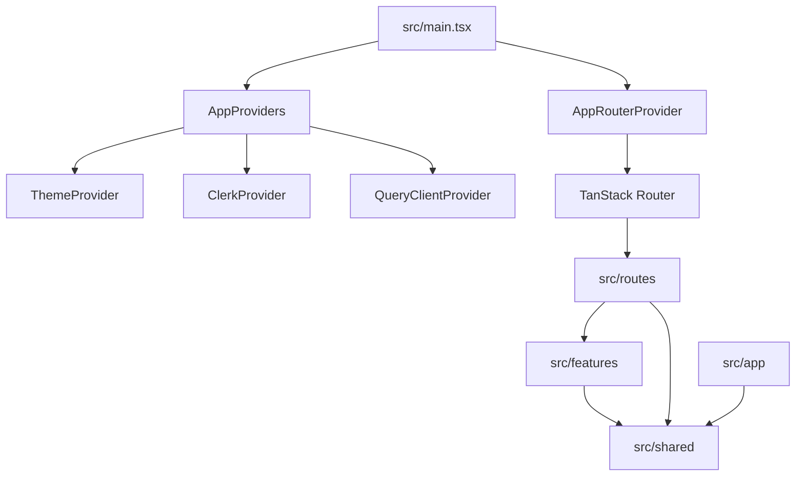
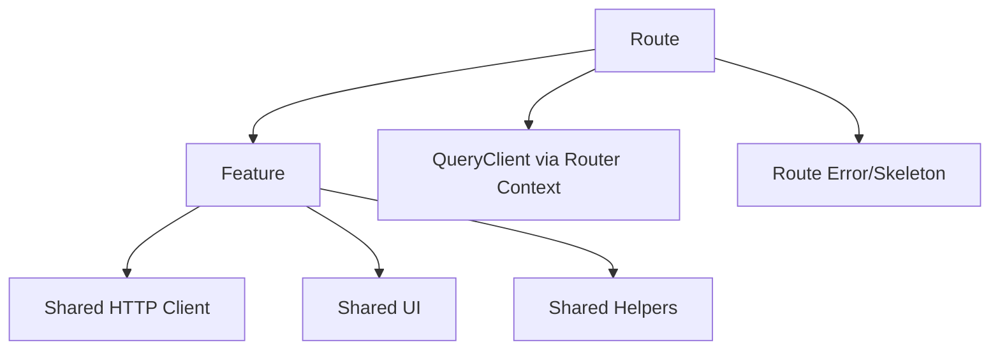

# 00 — Project Initialization & Exact Application Foundation

> บทนี้เป็นจุดเริ่มต้นของการสร้าง Project จากศูนย์โดย **ไม่ clone repository สำเร็จรูป** เป้าหมายคือสร้าง Foundation และ Shared Infrastructure ที่มีอยู่จริงใน Project ปัจจุบันให้ครบ ก่อนเริ่ม Users, Posts, Carts, Todos และ Dashboard ในบท 01–05
>
> Source of truth ของบทนี้คือ Project บน `main` ณ commit `819c22e79fcf65f36ca72b0c33ec82ce74d988ce` โดยคำว่า Project หมายถึงทุกอย่างใน repository ยกเว้น `docs/`

⬅️ ไม่มีบทก่อนหน้า  
➡️ ต่อไป: [`01.users.md`](./01.users.md)

---

## 1. กติกาของบทนี้

บท 00 มีข้อกำหนดต่างจากบท 01–05:

1. ไฟล์ Foundation ที่ Project มีจริงจะให้ **โค้ดฉบับเต็ม**
2. ไม่สร้าง dependency, route, component หรือ utility ที่ไม่มีใน Project
3. generated file `src/routeTree.gen.ts` ไม่ต้องเขียนเองและไม่ commit
4. feature code ของ Users/Posts/Carts/Todos/Dashboard ยังไม่สร้างในบทนี้
5. Project จริงมี typed navigation ไป `/dashboard`, `/users`, `/posts`, `/carts`, `/todos` ตั้งแต่ Foundation แต่ routes เหล่านั้นจะค่อย ๆ เกิดในบท 01–05 ดังนั้น **อย่าคาดหวังว่า `bun run typecheck` หรือ `bun run build` จะผ่านหลังบท 00–04**
6. เราจะใช้ `bun run format:check` และ `bun run lint` เป็น interim checks ระหว่างทาง และใช้ `bun run check` เป็น final gate หลังจบบท 05 เมื่อ route tree สมบูรณ์เท่ากับ Project

เหตุผลของข้อ 5 สำคัญมาก: เราจะไม่สร้าง placeholder route นอก Project เพียงเพื่อให้ intermediate build ผ่าน เพราะนั่นจะทำให้ reconstruction ไม่ตรง Project ที่เป็น source of truth

---

## 2. สิ่งที่จะมีหลังจบบท 00

คุณจะได้ Foundation จริงของ Project:

```text
Repository configuration
├── Bun + package.json
├── TypeScript
├── Vite
├── TanStack Router generator
├── Tailwind CSS v4
├── shadcn/Base UI configuration
├── ESLint + Prettier
└── GitHub Actions CI

Application composition
├── Clerk
├── QueryClient
├── Router Context
├── Router Provider
└── Theme Provider

Shared infrastructure
├── Axios HTTP client
├── Zod environment validation
├── normalized ApplicationError
├── debounce hook
├── route param parser
├── Router-aware links
├── pagination
├── delete confirmation
├── loading/error states
└── Skeleton layouts

Application shell
├── responsive Sidebar
├── Breadcrumb
├── Theme toggle
├── Clerk profile
└── protected admin layout
```

หลังบทนี้ยังไม่มี domain feature:

```text
users
posts
carts
todos
dashboard
```

---

## 3. Architecture ที่ Project ใช้จริง



Dependency direction:

```text
app      -> shared
routes   -> features -> shared
routes   -> shared
features -> shared
shared   -> ห้าม import app/routes/features
```

Project บังคับแนวคิดนี้ด้วย ESLint ไม่ได้พึ่งวินัยอย่างเดียว

---

## 4. เอกสาร Dependencies ที่เกี่ยวข้อง

เปิดอ่านเฉพาะหัวข้อที่กำลังทำ:

- Bun: https://bun.com/docs
- React: https://react.dev/learn
- TypeScript: https://www.typescriptlang.org/docs/
- Vite: https://vite.dev/guide/
- Tailwind CSS: https://tailwindcss.com/docs/installation/using-vite
- shadcn/ui: https://ui.shadcn.com/docs
- Base UI: https://base-ui.com/react/overview/quick-start
- TanStack Router: https://tanstack.com/router/latest/docs/framework/react/overview
- TanStack Router File-Based Routing: https://tanstack.com/router/latest/docs/framework/react/routing/file-based-routing
- TanStack Router + shadcn: https://tanstack.com/router/latest/docs/how-to/integrate-shadcn-ui
- TanStack Query: https://tanstack.com/query/latest/docs/framework/react/overview
- Clerk React: https://clerk.com/docs/react/getting-started/quickstart
- Axios: https://axios-http.com/docs/intro
- Axios Interceptors: https://axios-http.com/docs/interceptors
- Zod: https://zod.dev/
- DummyJSON: https://dummyjson.com/docs

---

# Part A — Scaffold โปรเจ็กต์จากศูนย์

## Step 1 — สร้าง React + TypeScript project ด้วย Vite

```bash
bunx create-vite dummyjson-admin-example --template react-ts
cd dummyjson-admin-example
```

Vite starter มีไฟล์ตัวอย่างที่ Project สุดท้ายไม่มี ให้ลบออกเมื่อมีอยู่:

```bash
rm -f src/App.tsx src/App.css src/assets/react.svg public/vite.svg
```

ห้ามเอาไฟล์ starter เหล่านี้กลับมา เพราะไม่อยู่ใน Project source of truth

---

## Step 2 — สร้าง `package.json` ตาม Project จริง

แทนที่ `package.json` ด้วยไฟล์นี้ทั้งหมด:

```json
{
  "name": "dummyjson-admin-example",
  "private": true,
  "type": "module",
  "packageManager": "bun@1.3.13",
  "engines": {
    "bun": ">=1.3.13"
  },
  "imports": {
    "#/*": "./src/*"
  },
  "scripts": {
    "dev": "vite --port 3000",
    "routes:generate": "tsr generate",
    "build": "bun run routes:generate && vite build",
    "preview": "vite preview",
    "typecheck": "bun run routes:generate && tsc --noEmit",
    "lint": "eslint .",
    "lint:fix": "eslint . --fix",
    "format": "prettier --write .",
    "format:check": "prettier --check .",
    "check": "bun run format:check && bun run lint && bun run typecheck && bun run build"
  },
  "dependencies": {
    "@base-ui/react": "^1.7.0",
    "@clerk/react": "^6.12.8",
    "@fontsource-variable/outfit": "^5.3.0",
    "@tailwindcss/vite": "^4.1.18",
    "@tanstack/react-devtools": "latest",
    "@tanstack/react-query": "^5.101.4",
    "@tanstack/react-router": "latest",
    "@tanstack/react-router-devtools": "latest",
    "axios": "^1.19.0",
    "class-variance-authority": "^0.7.1",
    "clsx": "^2.1.1",
    "lucide-react": "^1.28.0",
    "react": "^19.2.0",
    "react-dom": "^19.2.0",
    "shadcn": "^4.16.1",
    "sonner": "^2.0.7",
    "tailwind-merge": "^3.6.0",
    "tailwindcss": "^4.1.18",
    "tw-animate-css": "^1.4.0",
    "zod": "^4.4.3"
  },
  "devDependencies": {
    "@tanstack/devtools-vite": "latest",
    "@tanstack/eslint-config": "latest",
    "@tanstack/eslint-plugin-query": "^5.101.4",
    "@tanstack/router-cli": "1.167.21",
    "@tanstack/router-plugin": "1.168.23",
    "@types/node": "^22.10.2",
    "@types/react": "^19.2.0",
    "@types/react-dom": "^19.2.0",
    "@vitejs/plugin-react": "^6.0.1",
    "eslint": "^9.20.0",
    "prettier": "^3.8.1",
    "typescript": "^6.0.2",
    "vite": "^8.0.0"
  }
}
```

จากนั้นติดตั้ง:

```bash
bun install
```

`bun.lock` ถูก ignore ใน Project นี้ ดังนั้นอย่าพยายาม commit lockfile เพื่อให้ต่างจาก source of truth

---

# Part B — Repository-level files

## Step 3 — `.gitignore`

```gitignore
node_modules/
dist/
.DS_Store
.env
.env.*
!.env.example
*.local
.tanstack/
src/routeTree.gen.ts
bun.lock
```

## Step 4 — `.prettierignore`

```text
package-lock.json
pnpm-lock.yaml
yarn.lock
node_modules
dist
src/routeTree.gen.ts
```

## Step 5 — `.vscode/settings.json`

```json
{
  "files.watcherExclude": {
    "**/routeTree.gen.ts": true
  },
  "search.exclude": {
    "**/routeTree.gen.ts": true
  },
  "files.readonlyInclude": {
    "**/routeTree.gen.ts": true
  }
}
```

ไฟล์นี้ทำให้ generated route tree ไม่รบกวน watcher/search และเตือนใน editor ว่าไม่ควรแก้เอง

## Step 6 — `.agents/AGENTS.md`

```md
# Engineering Rules

This repository is a production-oriented client-rendered React SPA starter. Preserve these constraints when generating or changing code.

1. `src/app` owns application composition such as Clerk, QueryClient, and Router providers.
2. Routes orchestrate authentication checks, URL state, prefetching, and feature-page composition. Do not place API transport logic in route files.
3. TanStack Query owns server state. Do not copy query data into global client stores without a documented reason.
4. Only `src/shared/api/http-client.ts` may import Axios directly.
5. Validate untrusted boundaries with Zod, including API responses and environment variables.
6. `src/shared` must never import from `src/features`, `src/routes`, or `src/app`.
7. Features expose a narrow public API through `index.ts`; avoid deep-importing private feature implementation.
8. UI primitives contain no domain behavior. Feature-specific UI remains inside its feature.
9. Clerk secret keys and privileged credentials must never be exposed through `VITE_*` browser variables.
10. Client-side route guards are not backend authorization. Private APIs must validate authentication and authorization server-side.
11. Generated `src/routeTree.gen.ts` must not be edited or committed.
12. A change is complete when formatting, linting, typechecking, and production build checks pass.
```

ไฟล์นี้ไม่ได้ทำให้ application run แต่เป็นส่วนหนึ่งของ Project ตามนิยามของหลักสูตร จึงต้องมีในการ reconstruction

---

# Part C — TypeScript, Router Generator และ Vite

## Step 7 — `tsconfig.json`

```json
{
  "include": ["**/*.ts", "**/*.tsx", "eslint.config.js", "prettier.config.js", "vite.config.js"],

  "compilerOptions": {
    "target": "ES2022",
    "jsx": "react-jsx",
    "module": "ESNext",
    "paths": {
      "#/*": ["./src/*"]
    },
    "lib": ["ES2022", "DOM", "DOM.Iterable"],
    "types": ["vite/client"],

    /* Bundler mode */
    "moduleResolution": "bundler",
    "allowImportingTsExtensions": true,
    "verbatimModuleSyntax": true,
    "noEmit": true,

    /* Linting */
    "skipLibCheck": true,
    "strict": true,
    "noUnusedLocals": true,
    "noUnusedParameters": true,
    "noFallthroughCasesInSwitch": true,
    "noUncheckedSideEffectImports": true,

    "noUncheckedIndexedAccess": true,
    "exactOptionalPropertyTypes": true,
    "useUnknownInCatchVariables": true
  }
}
```

## Step 8 — `tsr.config.json`

```json
{
  "target": "react",
  "routesDirectory": "./src/routes",
  "generatedRouteTree": "./src/routeTree.gen.ts"
}
```

## Step 9 — `vite.config.ts`

```ts
import { defineConfig } from "vite";
import { devtools } from "@tanstack/devtools-vite";

import { tanstackRouter } from "@tanstack/router-plugin/vite";

import viteReact from "@vitejs/plugin-react";
import tailwindcss from "@tailwindcss/vite";

const config = defineConfig({
  resolve: { tsconfigPaths: true },
  plugins: [
    devtools(),
    tailwindcss(),
    tanstackRouter({ target: "react", autoCodeSplitting: true }),
    viteReact(),
  ],
});

export default config;
```

Vite configuration นี้ผูก 4 เรื่องเข้าด้วยกัน: TanStack Devtools, Tailwind, file-based Router และ React plugin

---

# Part D — shadcn/Base UI configuration

## Step 10 — `components.json`

```json
{
  "$schema": "https://ui.shadcn.com/schema.json",
  "style": "base-vega",
  "rsc": false,
  "tsx": true,
  "tailwind": {
    "config": "",
    "css": "src/styles/globals.css",
    "baseColor": "stone",
    "cssVariables": true,
    "prefix": ""
  },
  "aliases": {
    "components": "#/shared/components",
    "utils": "#/shared/lib/utils",
    "ui": "#/shared/components/ui",
    "lib": "#/shared/lib",
    "hooks": "#/shared/hooks"
  },
  "iconLibrary": "lucide",
  "rtl": false,
  "menuColor": "default-translucent",
  "menuAccent": "subtle",
  "registries": {}
}
```

> Project มี `shadcn` เป็น dependency แต่ UI primitives ที่ commit อยู่ใน Project ถูกปรับให้ตรงกับ application นี้หลายจุด ดังนั้นเพื่อให้ reconstruction ตรง Project เราจะสร้างไฟล์เหล่านี้จาก source ที่อยู่ใน Project โดยตรง แทนการพึ่ง `shadcn@latest add` แล้วหวังว่าจะได้ snapshot เดียวกัน

---

# Part E — Shared utility และ UI primitives

## Step 11 — `src/shared/lib/utils.ts`

```ts
import { twMerge } from "tailwind-merge";
import { clsx } from "clsx";
import type { ClassValue } from "clsx";

export function cn(...inputs: Array<ClassValue>) {
  return twMerge(clsx(inputs));
}
```

`cn()` เป็น utility รวม conditional classes แล้ว merge Tailwind conflicts

## Step 12 — `src/shared/components/ui/button.tsx`

```tsx
import { Button as ButtonPrimitive } from "@base-ui/react/button";
import { cva, type VariantProps } from "class-variance-authority";

import { cn } from "#/shared/lib/utils.ts";

const buttonVariants = cva(
  "group/button inline-flex shrink-0 items-center justify-center rounded-md border border-transparent bg-clip-padding text-sm font-medium whitespace-nowrap transition-all outline-none select-none focus-visible:border-ring focus-visible:ring-3 focus-visible:ring-ring/50 active:not-aria-[haspopup]:translate-y-px disabled:pointer-events-none disabled:opacity-50 aria-invalid:border-destructive aria-invalid:ring-3 aria-invalid:ring-destructive/20 dark:aria-invalid:border-destructive/50 dark:aria-invalid:ring-destructive/40 [&_svg]:pointer-events-none [&_svg]:shrink-0 [&_svg:not([class*='size-'])]:size-4",
  {
    variants: {
      variant: {
        default: "bg-primary text-primary-foreground hover:bg-primary/80",
        outline:
          "border-border bg-background shadow-xs hover:bg-muted hover:text-foreground aria-expanded:bg-muted aria-expanded:text-foreground dark:border-input dark:bg-input/30 dark:hover:bg-input/50",
        secondary:
          "bg-secondary text-secondary-foreground hover:bg-[color-mix(in_oklch,var(--secondary),var(--foreground)_5%)] aria-expanded:bg-secondary aria-expanded:text-secondary-foreground",
        ghost:
          "hover:bg-muted hover:text-foreground aria-expanded:bg-muted aria-expanded:text-foreground dark:hover:bg-muted/50",
        destructive:
          "bg-destructive/10 text-destructive hover:bg-destructive/20 focus-visible:border-destructive/40 focus-visible:ring-destructive/20 dark:bg-destructive/20 dark:hover:bg-destructive/30 dark:focus-visible:ring-destructive/40",
        link: "text-primary underline-offset-4 hover:underline",
      },
      size: {
        default:
          "h-9 gap-1.5 px-2.5 in-data-[slot=button-group]:rounded-md has-data-[icon=inline-end]:pr-2 has-data-[icon=inline-start]:pl-2",
        xs: "h-6 gap-1 rounded-[min(var(--radius-md),8px)] px-2 text-xs in-data-[slot=button-group]:rounded-md has-data-[icon=inline-end]:pr-1.5 has-data-[icon=inline-start]:pl-1.5 [&_svg:not([class*='size-'])]:size-3",
        sm: "h-8 gap-1 rounded-[min(var(--radius-md),10px)] px-2.5 in-data-[slot=button-group]:rounded-md has-data-[icon=inline-end]:pr-1.5 has-data-[icon=inline-start]:pl-1.5",
        lg: "h-10 gap-1.5 px-2.5 has-data-[icon=inline-end]:pr-2 has-data-[icon=inline-start]:pl-2",
        icon: "size-9",
        "icon-xs":
          "size-6 rounded-[min(var(--radius-md),8px)] in-data-[slot=button-group]:rounded-md [&_svg:not([class*='size-'])]:size-3",
        "icon-sm":
          "size-8 rounded-[min(var(--radius-md),10px)] in-data-[slot=button-group]:rounded-md",
        "icon-lg": "size-10",
      },
    },
    defaultVariants: {
      variant: "default",
      size: "default",
    },
  },
);

function Button({
  className,
  variant = "default",
  size = "default",
  ...props
}: ButtonPrimitive.Props & VariantProps<typeof buttonVariants>) {
  return (
    <ButtonPrimitive
      data-slot="button"
      className={cn(buttonVariants({ variant, size, className }))}
      {...props}
    />
  );
}

export { Button, buttonVariants };
```

## Step 13 — `src/shared/components/ui/card.tsx`

```tsx
import * as React from "react";

import { cn } from "#/shared/lib/utils.ts";

function Card({
  className,
  size = "default",
  ...props
}: React.ComponentProps<"div"> & { size?: "default" | "sm" }) {
  return (
    <div
      data-slot="card"
      data-size={size}
      className={cn(
        "group/card flex flex-col gap-(--card-spacing) overflow-hidden rounded-xl bg-card py-(--card-spacing) text-sm text-card-foreground shadow-xs ring-1 ring-foreground/10 [--card-spacing:--spacing(6)] has-[>img:first-child]:pt-0 data-[size=sm]:[--card-spacing:--spacing(4)] *:[img:first-child]:rounded-t-xl *:[img:last-child]:rounded-b-xl",
        className,
      )}
      {...props}
    />
  );
}

function CardHeader({ className, ...props }: React.ComponentProps<"div">) {
  return (
    <div
      data-slot="card-header"
      className={cn(
        "group/card-header @container/card-header grid auto-rows-min items-start gap-1 rounded-t-xl px-(--card-spacing) has-data-[slot=card-action]:grid-cols-[1fr_auto] has-data-[slot=card-description]:grid-rows-[auto_auto] [.border-b]:pb-(--card-spacing)",
        className,
      )}
      {...props}
    />
  );
}

function CardTitle({ className, ...props }: React.ComponentProps<"div">) {
  return (
    <div
      data-slot="card-title"
      className={cn(
        "font-heading text-base leading-normal font-medium group-data-[size=sm]/card:text-sm",
        className,
      )}
      {...props}
    />
  );
}

function CardDescription({ className, ...props }: React.ComponentProps<"div">) {
  return (
    <div
      data-slot="card-description"
      className={cn("text-sm text-muted-foreground", className)}
      {...props}
    />
  );
}

function CardAction({ className, ...props }: React.ComponentProps<"div">) {
  return (
    <div
      data-slot="card-action"
      className={cn("col-start-2 row-span-2 row-start-1 self-start justify-self-end", className)}
      {...props}
    />
  );
}

function CardContent({ className, ...props }: React.ComponentProps<"div">) {
  return (
    <div data-slot="card-content" className={cn("px-(--card-spacing)", className)} {...props} />
  );
}

function CardFooter({ className, ...props }: React.ComponentProps<"div">) {
  return (
    <div
      data-slot="card-footer"
      className={cn(
        "flex items-center rounded-b-xl px-(--card-spacing) [.border-t]:pt-(--card-spacing)",
        className,
      )}
      {...props}
    />
  );
}

export { Card, CardHeader, CardFooter, CardTitle, CardAction, CardDescription, CardContent };
```

## Step 14 — `src/shared/components/ui/alert.tsx`

```tsx
import * as React from "react";

import { cn } from "#/shared/lib/utils";

export function Alert({
  variant = "default",
  className,
  ...props
}: React.ComponentProps<"div"> & { variant?: "default" | "destructive" | "warning" }) {
  return (
    <div
      role="alert"
      {...props}
      className={cn(
        "grid w-full gap-1 rounded-lg border px-4 py-3 text-sm",
        variant === "destructive" && "border-destructive/30 bg-destructive/5 text-destructive",
        variant === "warning" &&
          "border-amber-500/30 bg-amber-500/10 text-amber-950 dark:text-amber-100",
        className,
      )}
    />
  );
}

export function AlertTitle(props: React.ComponentProps<"h5">) {
  return <h5 {...props} className={cn("font-medium", props.className)} />;
}

export function AlertDescription(props: React.ComponentProps<"div">) {
  return <div {...props} className={cn("text-sm opacity-90", props.className)} />;
}
```

## Step 15 — `src/shared/components/ui/breadcrumb.tsx`

```tsx
import * as React from "react";
import { ChevronRight, MoreHorizontal } from "lucide-react";

import { cn } from "#/shared/lib/utils";

export function Breadcrumb(props: React.ComponentProps<"nav">) {
  return <nav aria-label="breadcrumb" {...props} />;
}

export function BreadcrumbList(props: React.ComponentProps<"ol">) {
  return (
    <ol
      {...props}
      className={cn(
        "flex flex-wrap items-center gap-1.5 text-sm text-muted-foreground",
        props.className,
      )}
    />
  );
}

export function BreadcrumbItem(props: React.ComponentProps<"li">) {
  return <li {...props} className={cn("inline-flex items-center gap-1.5", props.className)} />;
}

export function BreadcrumbLink(props: React.ComponentProps<"a">) {
  return (
    <a {...props} className={cn("transition-colors hover:text-foreground", props.className)} />
  );
}

export function BreadcrumbPage(props: React.ComponentProps<"span">) {
  return (
    <span
      {...props}
      aria-current="page"
      className={cn("font-medium text-foreground", props.className)}
    />
  );
}

export function BreadcrumbSeparator({ children, ...props }: React.ComponentProps<"li">) {
  return (
    <li aria-hidden="true" {...props} className={cn("[&>svg]:size-3.5", props.className)}>
      {children ?? <ChevronRight />}
    </li>
  );
}

export function BreadcrumbEllipsis(props: React.ComponentProps<"span">) {
  return (
    <span {...props} className={cn("flex size-7 items-center justify-center", props.className)}>
      <MoreHorizontal className="size-4" />
      <span className="sr-only">More</span>
    </span>
  );
}
```

## Step 16 — `src/shared/components/ui/dialog.tsx`

```tsx
import * as React from "react";
import { Dialog as DialogPrimitive } from "@base-ui/react/dialog";
import { X } from "lucide-react";

import { cn } from "#/shared/lib/utils";

export const Dialog = DialogPrimitive.Root;
export const DialogTrigger = DialogPrimitive.Trigger;
export const DialogClose = DialogPrimitive.Close;

export function DialogContent({
  className,
  children,
  ...props
}: React.ComponentProps<typeof DialogPrimitive.Popup>) {
  return (
    <DialogPrimitive.Portal>
      <DialogPrimitive.Backdrop className="fixed inset-0 z-50 bg-black/50 transition-opacity data-[ending-style]:opacity-0 data-[starting-style]:opacity-0" />
      <DialogPrimitive.Viewport className="fixed inset-0 z-50 grid place-items-center overflow-y-auto p-4">
        <DialogPrimitive.Popup
          {...props}
          className={cn(
            "relative w-full max-w-lg rounded-xl border bg-background p-6 shadow-xl outline-none transition data-[ending-style]:scale-95 data-[ending-style]:opacity-0 data-[starting-style]:scale-95 data-[starting-style]:opacity-0",
            className,
          )}
        >
          {children}
          <DialogPrimitive.Close className="absolute right-4 top-4 rounded-md p-1 text-muted-foreground transition hover:bg-muted hover:text-foreground">
            <X className="size-4" />
            <span className="sr-only">Close</span>
          </DialogPrimitive.Close>
        </DialogPrimitive.Popup>
      </DialogPrimitive.Viewport>
    </DialogPrimitive.Portal>
  );
}

export function DialogHeader(props: React.ComponentProps<"div">) {
  return <div {...props} className={cn("space-y-1.5 text-left", props.className)} />;
}

export function DialogFooter(props: React.ComponentProps<"div">) {
  return (
    <div
      {...props}
      className={cn("mt-6 flex flex-col-reverse gap-2 sm:flex-row sm:justify-end", props.className)}
    />
  );
}

export function DialogTitle(props: React.ComponentProps<typeof DialogPrimitive.Title>) {
  return (
    <DialogPrimitive.Title {...props} className={cn("text-lg font-semibold", props.className)} />
  );
}

export function DialogDescription(props: React.ComponentProps<typeof DialogPrimitive.Description>) {
  return (
    <DialogPrimitive.Description
      {...props}
      className={cn("text-sm text-muted-foreground", props.className)}
    />
  );
}
```

## Step 17 — `src/shared/components/ui/drawer.tsx`

```tsx
import * as React from "react";
import { Dialog as DialogPrimitive } from "@base-ui/react/dialog";
import { X } from "lucide-react";

import { cn } from "#/shared/lib/utils";

export const Drawer = DialogPrimitive.Root;
export const DrawerTrigger = DialogPrimitive.Trigger;
export const DrawerClose = DialogPrimitive.Close;

export function DrawerContent({
  className,
  children,
  ...props
}: React.ComponentProps<typeof DialogPrimitive.Popup>) {
  return (
    <DialogPrimitive.Portal>
      <DialogPrimitive.Backdrop className="fixed inset-0 z-50 bg-black/50 transition-opacity data-[ending-style]:opacity-0 data-[starting-style]:opacity-0" />
      <DialogPrimitive.Viewport className="fixed inset-0 z-50 flex justify-end">
        <DialogPrimitive.Popup
          {...props}
          className={cn(
            "relative flex h-full w-full max-w-xl flex-col border-l bg-background shadow-2xl outline-none transition-transform duration-200 data-[ending-style]:translate-x-full data-[starting-style]:translate-x-full",
            className,
          )}
        >
          {children}
          <DialogPrimitive.Close className="absolute right-4 top-4 rounded-md p-1 text-muted-foreground transition hover:bg-muted hover:text-foreground">
            <X className="size-4" />
            <span className="sr-only">Close</span>
          </DialogPrimitive.Close>
        </DialogPrimitive.Popup>
      </DialogPrimitive.Viewport>
    </DialogPrimitive.Portal>
  );
}

export function DrawerHeader(props: React.ComponentProps<"div">) {
  return <div {...props} className={cn("border-b p-6 pr-12", props.className)} />;
}

export function DrawerBody(props: React.ComponentProps<"div">) {
  return <div {...props} className={cn("min-h-0 flex-1 overflow-y-auto p-6", props.className)} />;
}

export function DrawerFooter(props: React.ComponentProps<"div">) {
  return <div {...props} className={cn("flex justify-end gap-2 border-t p-6", props.className)} />;
}

export function DrawerTitle(props: React.ComponentProps<typeof DialogPrimitive.Title>) {
  return (
    <DialogPrimitive.Title {...props} className={cn("text-lg font-semibold", props.className)} />
  );
}

export function DrawerDescription(props: React.ComponentProps<typeof DialogPrimitive.Description>) {
  return (
    <DialogPrimitive.Description
      {...props}
      className={cn("mt-1 text-sm text-muted-foreground", props.className)}
    />
  );
}
```

## Step 18 — `src/shared/components/ui/pagination.tsx`

```tsx
import * as React from "react";
import { ChevronLeft, ChevronRight, MoreHorizontal } from "lucide-react";

import { cn } from "#/shared/lib/utils";

export function Pagination(props: React.ComponentProps<"nav">) {
  return (
    <nav
      role="navigation"
      aria-label="pagination"
      {...props}
      className={cn("mx-auto flex w-full justify-center", props.className)}
    />
  );
}

export function PaginationContent(props: React.ComponentProps<"ul">) {
  return <ul {...props} className={cn("flex items-center gap-1", props.className)} />;
}

export function PaginationItem(props: React.ComponentProps<"li">) {
  return <li {...props} />;
}

export function PaginationButton({
  active,
  className,
  ...props
}: React.ComponentProps<"button"> & { active?: boolean }) {
  return (
    <button
      type="button"
      aria-current={active ? "page" : undefined}
      {...props}
      className={cn(
        "inline-flex size-9 items-center justify-center rounded-md text-sm transition-colors hover:bg-muted disabled:pointer-events-none disabled:opacity-50",
        active ? "border bg-background font-medium shadow-xs" : "text-muted-foreground",
        className,
      )}
    />
  );
}

export function PaginationPrevious(props: React.ComponentProps<typeof PaginationButton>) {
  return (
    <PaginationButton {...props} className={cn("w-auto gap-1 px-2.5", props.className)}>
      <ChevronLeft className="size-4" />
      <span className="hidden sm:inline">Previous</span>
    </PaginationButton>
  );
}

export function PaginationNext(props: React.ComponentProps<typeof PaginationButton>) {
  return (
    <PaginationButton {...props} className={cn("w-auto gap-1 px-2.5", props.className)}>
      <span className="hidden sm:inline">Next</span>
      <ChevronRight className="size-4" />
    </PaginationButton>
  );
}

export function PaginationEllipsis() {
  return (
    <span className="flex size-9 items-center justify-center text-muted-foreground">
      <MoreHorizontal className="size-4" />
      <span className="sr-only">More pages</span>
    </span>
  );
}
```

## Step 19 — `src/shared/components/ui/sidebar.tsx`

```tsx
import * as React from "react";
import { PanelLeft } from "lucide-react";

import { Button } from "#/shared/components/ui/button";
import { cn } from "#/shared/lib/utils";

type SidebarContextValue = {
  open: boolean;
  openMobile: boolean;
  setOpen: React.Dispatch<React.SetStateAction<boolean>>;
  setOpenMobile: React.Dispatch<React.SetStateAction<boolean>>;
  toggleSidebar: () => void;
};

const SidebarContext = React.createContext<SidebarContextValue | null>(null);

export function useSidebar() {
  const value = React.useContext(SidebarContext);
  if (!value) {
    throw new Error("useSidebar must be used within SidebarProvider");
  }
  return value;
}

export function SidebarProvider({
  children,
  defaultOpen = true,
}: React.PropsWithChildren<{ defaultOpen?: boolean }>) {
  const [open, setOpen] = React.useState(defaultOpen);
  const [openMobile, setOpenMobile] = React.useState(false);

  const toggleSidebar = React.useCallback(() => {
    if (window.matchMedia("(max-width: 767px)").matches) {
      setOpenMobile((value) => !value);
      return;
    }
    setOpen((value) => !value);
  }, []);

  React.useEffect(() => {
    const onKeyDown = (event: KeyboardEvent) => {
      if ((event.ctrlKey || event.metaKey) && event.key.toLowerCase() === "b") {
        event.preventDefault();
        toggleSidebar();
      }
    };
    window.addEventListener("keydown", onKeyDown);
    return () => window.removeEventListener("keydown", onKeyDown);
  }, [toggleSidebar]);

  const value = React.useMemo(
    () => ({ open, openMobile, setOpen, setOpenMobile, toggleSidebar }),
    [open, openMobile, toggleSidebar],
  );

  return (
    <SidebarContext.Provider value={value}>
      <div className="flex min-h-svh w-full bg-sidebar p-0 md:p-2">{children}</div>
    </SidebarContext.Provider>
  );
}

export function Sidebar({ children, className }: React.PropsWithChildren<{ className?: string }>) {
  const { open, openMobile, setOpenMobile } = useSidebar();

  return (
    <>
      {openMobile ? (
        <div className="fixed inset-0 z-50 md:hidden">
          <button
            aria-label="Close sidebar"
            className="absolute inset-0 bg-black/50"
            onClick={() => setOpenMobile(false)}
          />
          <aside className="relative z-10 flex h-full w-[18rem] flex-col bg-sidebar text-sidebar-foreground shadow-xl">
            {children}
          </aside>
        </div>
      ) : null}

      <aside
        data-state={open ? "expanded" : "collapsed"}
        className={cn(
          "hidden h-[calc(100svh-1rem)] shrink-0 flex-col overflow-hidden rounded-xl border bg-sidebar text-sidebar-foreground shadow-sm transition-[width] duration-200 md:flex",
          open ? "w-64" : "w-16",
          className,
        )}
      >
        {children}
      </aside>
    </>
  );
}

export function SidebarInset({ className, ...props }: React.ComponentProps<"main">) {
  return (
    <main
      className={cn(
        "relative flex min-h-svh min-w-0 flex-1 flex-col bg-background md:min-h-[calc(100svh-1rem)] md:rounded-xl md:border md:shadow-sm",
        className,
      )}
      {...props}
    />
  );
}

export function SidebarTrigger({ className }: { className?: string }) {
  const { toggleSidebar } = useSidebar();
  return (
    <Button
      type="button"
      variant="ghost"
      size="icon-sm"
      className={className}
      onClick={toggleSidebar}
      aria-label="Toggle sidebar"
    >
      <PanelLeft className="size-4" />
    </Button>
  );
}

export function SidebarHeader(props: React.ComponentProps<"div">) {
  return <div {...props} className={cn("flex flex-col gap-2 p-3", props.className)} />;
}

export function SidebarContent(props: React.ComponentProps<"div">) {
  return (
    <div
      {...props}
      className={cn("flex min-h-0 flex-1 flex-col gap-2 overflow-y-auto p-2", props.className)}
    />
  );
}

export function SidebarFooter(props: React.ComponentProps<"div">) {
  return <div {...props} className={cn("border-t p-3", props.className)} />;
}

export function SidebarGroup(props: React.ComponentProps<"section">) {
  return <section {...props} className={cn("space-y-1", props.className)} />;
}

export function SidebarGroupLabel(props: React.ComponentProps<"div">) {
  return (
    <div
      {...props}
      className={cn(
        "px-2 py-1 text-[11px] font-medium uppercase tracking-[0.16em] text-sidebar-foreground/55",
        props.className,
      )}
    />
  );
}

export function SidebarMenu(props: React.ComponentProps<"ul">) {
  return <ul {...props} className={cn("space-y-1", props.className)} />;
}

export function SidebarMenuItem(props: React.ComponentProps<"li">) {
  return <li {...props} className={cn("relative", props.className)} />;
}

export function SidebarMenuSub(props: React.ComponentProps<"ul">) {
  return <ul {...props} className={cn("ml-5 space-y-1 border-l pl-3", props.className)} />;
}

export function SidebarMenuSubItem(props: React.ComponentProps<"li">) {
  return <li {...props} />;
}
```

## Step 20 — `src/shared/components/ui/skeleton.tsx`

```tsx
import * as React from "react";

import { cn } from "#/shared/lib/utils";

function Skeleton({ className, ...props }: React.ComponentProps<"div">) {
  return (
    <div
      data-slot="skeleton"
      className={cn("animate-pulse rounded-md bg-accent", className)}
      {...props}
    />
  );
}

export { Skeleton };
```

## Step 21 — `src/shared/components/ui/sonner.tsx`

```tsx
import * as React from "react";
import { Toaster as SonnerToaster } from "sonner";

export function Toaster(props: React.ComponentProps<typeof SonnerToaster>) {
  return <SonnerToaster richColors closeButton {...props} />;
}
```

## Step 22 — `src/shared/components/ui/dropdown-menu.tsx`

ไฟล์นี้ยาว แต่ Project ใช้ source นี้จริง โดยเฉพาะ `ModeToggle` ที่พึ่ง `DropdownMenuTrigger`, `DropdownMenuContent` และ `DropdownMenuItem`

```tsx
import * as React from "react";
import { Menu as MenuPrimitive } from "@base-ui/react/menu";

import { cn } from "#/shared/lib/utils.ts";
import { ChevronRightIcon, CheckIcon } from "lucide-react";

function DropdownMenu({ ...props }: MenuPrimitive.Root.Props) {
  return <MenuPrimitive.Root data-slot="dropdown-menu" {...props} />;
}

function DropdownMenuPortal({ ...props }: MenuPrimitive.Portal.Props) {
  return <MenuPrimitive.Portal data-slot="dropdown-menu-portal" {...props} />;
}

function DropdownMenuTrigger({ ...props }: MenuPrimitive.Trigger.Props) {
  return <MenuPrimitive.Trigger data-slot="dropdown-menu-trigger" {...props} />;
}

function DropdownMenuContent({
  align = "start",
  alignOffset = 0,
  side = "bottom",
  sideOffset = 4,
  className,
  ...props
}: MenuPrimitive.Popup.Props &
  Pick<MenuPrimitive.Positioner.Props, "align" | "alignOffset" | "side" | "sideOffset">) {
  return (
    <MenuPrimitive.Portal>
      <MenuPrimitive.Positioner
        className="isolate z-50 outline-none"
        align={align}
        alignOffset={alignOffset}
        side={side}
        sideOffset={sideOffset}
      >
        <MenuPrimitive.Popup
          data-slot="dropdown-menu-content"
          className={cn(
            "z-50 max-h-(--available-height) w-(--anchor-width) min-w-32 origin-(--transform-origin) overflow-x-hidden overflow-y-auto rounded-md p-1 text-popover-foreground shadow-md ring-1 ring-foreground/10 duration-100 outline-none data-[side=bottom]:slide-in-from-top-2 data-[side=inline-end]:slide-in-from-left-2 data-[side=inline-start]:slide-in-from-right-2 data-[side=left]:slide-in-from-right-2 data-[side=right]:slide-in-from-left-2 data-[side=top]:slide-in-from-bottom-2 data-open:animate-in data-open:fade-in-0 data-open:zoom-in-95 data-closed:animate-out data-closed:overflow-hidden data-closed:fade-out-0 data-closed:zoom-out-95 animate-none! relative bg-popover/70 before:pointer-events-none before:absolute before:inset-0 before:-z-1 before:rounded-[inherit] before:backdrop-blur-2xl before:backdrop-saturate-150 **:data-[slot$=-item]:focus:bg-foreground/10 **:data-[slot$=-item]:data-highlighted:bg-foreground/10 **:data-[slot$=-separator]:bg-foreground/5 **:data-[slot$=-trigger]:focus:bg-foreground/10 **:data-[slot$=-trigger]:aria-expanded:bg-foreground/10! **:data-[variant=destructive]:focus:bg-foreground/10! **:data-[variant=destructive]:text-accent-foreground! **:data-[variant=destructive]:**:text-accent-foreground!",
            className,
          )}
          {...props}
        />
      </MenuPrimitive.Positioner>
    </MenuPrimitive.Portal>
  );
}

function DropdownMenuGroup({ ...props }: MenuPrimitive.Group.Props) {
  return <MenuPrimitive.Group data-slot="dropdown-menu-group" {...props} />;
}

function DropdownMenuLabel({
  className,
  inset,
  ...props
}: MenuPrimitive.GroupLabel.Props & {
  inset?: boolean;
}) {
  return (
    <MenuPrimitive.GroupLabel
      data-slot="dropdown-menu-label"
      data-inset={inset}
      className={cn(
        "px-2 py-1.5 text-xs font-medium text-muted-foreground data-inset:pl-8",
        className,
      )}
      {...props}
    />
  );
}

function DropdownMenuItem({
  className,
  inset,
  variant = "default",
  ...props
}: MenuPrimitive.Item.Props & {
  inset?: boolean;
  variant?: "default" | "destructive";
}) {
  return (
    <MenuPrimitive.Item
      data-slot="dropdown-menu-item"
      data-inset={inset}
      data-variant={variant}
      className={cn(
        "group/dropdown-menu-item relative flex cursor-default items-center gap-2 rounded-sm px-2 py-1.5 text-sm outline-hidden select-none focus:bg-accent focus:text-accent-foreground not-data-[variant=destructive]:focus:**:text-accent-foreground data-inset:pl-8 data-[variant=destructive]:text-destructive data-[variant=destructive]:focus:bg-destructive/10 data-[variant=destructive]:focus:text-destructive dark:data-[variant=destructive]:focus:bg-destructive/20 data-disabled:pointer-events-none data-disabled:opacity-50 [&_svg]:pointer-events-none [&_svg]:shrink-0 [&_svg:not([class*='size-'])]:size-4 data-[variant=destructive]:*:[svg]:text-destructive",
        className,
      )}
      {...props}
    />
  );
}

function DropdownMenuSub({ ...props }: MenuPrimitive.SubmenuRoot.Props) {
  return <MenuPrimitive.SubmenuRoot data-slot="dropdown-menu-sub" {...props} />;
}

function DropdownMenuSubTrigger({
  className,
  inset,
  children,
  ...props
}: MenuPrimitive.SubmenuTrigger.Props & {
  inset?: boolean;
}) {
  return (
    <MenuPrimitive.SubmenuTrigger
      data-slot="dropdown-menu-sub-trigger"
      data-inset={inset}
      className={cn(
        "flex cursor-default items-center gap-2 rounded-sm px-2 py-1.5 text-sm outline-hidden select-none focus:bg-accent focus:text-accent-foreground not-data-[variant=destructive]:focus:**:text-accent-foreground data-inset:pl-8 data-popup-open:bg-accent data-popup-open:text-accent-foreground data-open:bg-accent data-open:text-accent-foreground [&_svg]:pointer-events-none [&_svg]:shrink-0 [&_svg:not([class*='size-'])]:size-4",
        className,
      )}
      {...props}
    >
      {children}
      <ChevronRightIcon className="ml-auto" />
    </MenuPrimitive.SubmenuTrigger>
  );
}

function DropdownMenuSubContent({
  align = "start",
  alignOffset = -3,
  side = "right",
  sideOffset = 0,
  className,
  ...props
}: React.ComponentProps<typeof DropdownMenuContent>) {
  return (
    <DropdownMenuContent
      data-slot="dropdown-menu-sub-content"
      className={cn(
        "w-auto min-w-[96px] rounded-md p-1 text-popover-foreground shadow-lg ring-1 ring-foreground/10 duration-100 data-[side=bottom]:slide-in-from-top-2 data-[side=left]:slide-in-from-right-2 data-[side=right]:slide-in-from-left-2 data-[side=top]:slide-in-from-bottom-2 data-open:animate-in data-open:fade-in-0 data-open:zoom-in-95 data-closed:animate-out data-closed:fade-out-0 data-closed:zoom-out-95 animate-none! relative bg-popover/70 before:pointer-events-none before:absolute before:inset-0 before:-z-1 before:rounded-[inherit] before:backdrop-blur-2xl before:backdrop-saturate-150 **:data-[slot$=-item]:focus:bg-foreground/10 **:data-[slot$=-item]:data-highlighted:bg-foreground/10 **:data-[slot$=-separator]:bg-foreground/5 **:data-[slot$=-trigger]:focus:bg-foreground/10 **:data-[slot$=-trigger]:aria-expanded:bg-foreground/10! **:data-[variant=destructive]:focus:bg-foreground/10! **:data-[variant=destructive]:text-accent-foreground! **:data-[variant=destructive]:**:text-accent-foreground!",
        className,
      )}
      align={align}
      alignOffset={alignOffset}
      side={side}
      sideOffset={sideOffset}
      {...props}
    />
  );
}

function DropdownMenuCheckboxItem({
  className,
  children,
  checked,
  inset,
  ...props
}: MenuPrimitive.CheckboxItem.Props & {
  inset?: boolean;
}) {
  return (
    <MenuPrimitive.CheckboxItem
      data-slot="dropdown-menu-checkbox-item"
      data-inset={inset}
      className={cn(
        "relative flex cursor-default items-center gap-2 rounded-sm py-1.5 pr-8 pl-2 text-sm outline-hidden select-none focus:bg-accent focus:text-accent-foreground focus:**:text-accent-foreground data-inset:pl-8 data-disabled:pointer-events-none data-disabled:opacity-50 [&_svg]:pointer-events-none [&_svg]:shrink-0 [&_svg:not([class*='size-'])]:size-4",
        className,
      )}
      checked={checked}
      {...props}
    >
      <span
        className="pointer-events-none absolute right-2 flex items-center justify-center"
        data-slot="dropdown-menu-checkbox-item-indicator"
      >
        <MenuPrimitive.CheckboxItemIndicator>
          <CheckIcon />
        </MenuPrimitive.CheckboxItemIndicator>
      </span>
      {children}
    </MenuPrimitive.CheckboxItem>
  );
}

function DropdownMenuRadioGroup({ ...props }: MenuPrimitive.RadioGroup.Props) {
  return <MenuPrimitive.RadioGroup data-slot="dropdown-menu-radio-group" {...props} />;
}

function DropdownMenuRadioItem({
  className,
  children,
  inset,
  ...props
}: MenuPrimitive.RadioItem.Props & {
  inset?: boolean;
}) {
  return (
    <MenuPrimitive.RadioItem
      data-slot="dropdown-menu-radio-item"
      data-inset={inset}
      className={cn(
        "relative flex cursor-default items-center gap-2 rounded-sm py-1.5 pr-8 pl-2 text-sm outline-hidden select-none focus:bg-accent focus:text-accent-foreground focus:**:text-accent-foreground data-inset:pl-8 data-disabled:pointer-events-none data-disabled:opacity-50 [&_svg]:pointer-events-none [&_svg]:shrink-0 [&_svg:not([class*='size-'])]:size-4",
        className,
      )}
      {...props}
    >
      <span
        className="pointer-events-none absolute right-2 flex items-center justify-center"
        data-slot="dropdown-menu-radio-item-indicator"
      >
        <MenuPrimitive.RadioItemIndicator>
          <CheckIcon />
        </MenuPrimitive.RadioItemIndicator>
      </span>
      {children}
    </MenuPrimitive.RadioItem>
  );
}

function DropdownMenuSeparator({ className, ...props }: MenuPrimitive.Separator.Props) {
  return (
    <MenuPrimitive.Separator
      data-slot="dropdown-menu-separator"
      className={cn("-mx-1 my-1 h-px bg-border", className)}
      {...props}
    />
  );
}

function DropdownMenuShortcut({ className, ...props }: React.ComponentProps<"span">) {
  return (
    <span
      data-slot="dropdown-menu-shortcut"
      className={cn(
        "ml-auto text-xs tracking-widest text-muted-foreground group-focus/dropdown-menu-item:text-accent-foreground",
        className,
      )}
      {...props}
    />
  );
}

export {
  DropdownMenu,
  DropdownMenuPortal,
  DropdownMenuTrigger,
  DropdownMenuContent,
  DropdownMenuGroup,
  DropdownMenuLabel,
  DropdownMenuItem,
  DropdownMenuCheckboxItem,
  DropdownMenuRadioGroup,
  DropdownMenuRadioItem,
  DropdownMenuSeparator,
  DropdownMenuShortcut,
  DropdownMenuSub,
  DropdownMenuSubTrigger,
  DropdownMenuSubContent,
};
```

---

# Part F — Styling

## Step 23 — `src/styles/globals.css`

```css
@import "tailwindcss";
@import "tw-animate-css";
@import "shadcn/tailwind.css";
@import "@fontsource-variable/outfit";

@custom-variant dark (&:is(.dark *));

@theme inline {
  --color-background: var(--background);
  --color-foreground: var(--foreground);
  --color-card: var(--card);
  --color-card-foreground: var(--card-foreground);
  --color-popover: var(--popover);
  --color-popover-foreground: var(--popover-foreground);
  --color-primary: var(--primary);
  --color-primary-foreground: var(--primary-foreground);
  --color-secondary: var(--secondary);
  --color-secondary-foreground: var(--secondary-foreground);
  --color-muted: var(--muted);
  --color-muted-foreground: var(--muted-foreground);
  --color-accent: var(--accent);
  --color-accent-foreground: var(--accent-foreground);
  --color-destructive: var(--destructive);
  --color-destructive-foreground: var(--destructive-foreground);
  --color-border: var(--border);
  --color-input: var(--input);
  --color-ring: var(--ring);
  --color-chart-1: var(--chart-1);
  --color-chart-2: var(--chart-2);
  --color-chart-3: var(--chart-3);
  --color-chart-4: var(--chart-4);
  --color-chart-5: var(--chart-5);
  --radius-sm: calc(var(--radius) * 0.6);
  --radius-md: calc(var(--radius) * 0.8);
  --radius-lg: var(--radius);
  --radius-xl: calc(var(--radius) * 1.4);
  --radius-2xl: calc(var(--radius) * 1.8);
  --radius-3xl: calc(var(--radius) * 2.2);
  --radius-4xl: calc(var(--radius) * 2.6);
  --color-sidebar: var(--sidebar);
  --color-sidebar-foreground: var(--sidebar-foreground);
  --color-sidebar-primary: var(--sidebar-primary);
  --color-sidebar-primary-foreground: var(--sidebar-primary-foreground);
  --color-sidebar-accent: var(--sidebar-accent);
  --color-sidebar-accent-foreground: var(--sidebar-accent-foreground);
  --color-sidebar-border: var(--sidebar-border);
  --color-sidebar-ring: var(--sidebar-ring);
  --font-heading: var(--font-sans);
  --font-sans: "Outfit Variable", sans-serif;
}

:root {
  --radius: 0.45rem;
  --background: oklch(1 0 0);
  --foreground: oklch(0.147 0.004 49.25);
  --card: oklch(1 0 0);
  --card-foreground: oklch(0.147 0.004 49.25);
  --popover: oklch(1 0 0);
  --popover-foreground: oklch(0.147 0.004 49.25);
  --primary: oklch(0.508 0.118 165.612);
  --primary-foreground: oklch(0.979 0.021 166.113);
  --secondary: oklch(0.967 0.001 286.375);
  --secondary-foreground: oklch(0.21 0.006 285.885);
  --muted: oklch(0.97 0.001 106.424);
  --muted-foreground: oklch(0.553 0.013 58.071);
  --accent: oklch(0.97 0.001 106.424);
  --accent-foreground: oklch(0.216 0.006 56.043);
  --destructive: oklch(0.577 0.245 27.325);
  --border: oklch(0.923 0.003 48.717);
  --input: oklch(0.923 0.003 48.717);
  --ring: oklch(0.709 0.01 56.259);
  --chart-1: oklch(0.845 0.143 164.978);
  --chart-2: oklch(0.696 0.17 162.48);
  --chart-3: oklch(0.596 0.145 163.225);
  --chart-4: oklch(0.508 0.118 165.612);
  --chart-5: oklch(0.432 0.095 166.913);
  --sidebar: oklch(0.985 0.001 106.423);
  --sidebar-foreground: oklch(0.147 0.004 49.25);
  --sidebar-primary: oklch(0.596 0.145 163.225);
  --sidebar-primary-foreground: oklch(0.979 0.021 166.113);
  --sidebar-accent: oklch(0.97 0.001 106.424);
  --sidebar-accent-foreground: oklch(0.216 0.006 56.043);
  --sidebar-border: oklch(0.923 0.003 48.717);
  --sidebar-ring: oklch(0.709 0.01 56.259);
}

.dark {
  --background: oklch(0.147 0.004 49.25);
  --foreground: oklch(0.985 0.001 106.423);
  --card: oklch(0.216 0.006 56.043);
  --card-foreground: oklch(0.985 0.001 106.423);
  --popover: oklch(0.216 0.006 56.043);
  --popover-foreground: oklch(0.985 0.001 106.423);
  --primary: oklch(0.432 0.095 166.913);
  --primary-foreground: oklch(0.979 0.021 166.113);
  --secondary: oklch(0.274 0.006 286.033);
  --secondary-foreground: oklch(0.985 0 0);
  --muted: oklch(0.268 0.007 34.298);
  --muted-foreground: oklch(0.709 0.01 56.259);
  --accent: oklch(0.268 0.007 34.298);
  --accent-foreground: oklch(0.985 0.001 106.423);
  --destructive: oklch(0.704 0.191 22.216);
  --border: oklch(1 0 0 / 10%);
  --input: oklch(1 0 0 / 15%);
  --ring: oklch(0.553 0.013 58.071);
  --chart-1: oklch(0.845 0.143 164.978);
  --chart-2: oklch(0.696 0.17 162.48);
  --chart-3: oklch(0.596 0.145 163.225);
  --chart-4: oklch(0.508 0.118 165.612);
  --chart-5: oklch(0.432 0.095 166.913);
  --sidebar: oklch(0.216 0.006 56.043);
  --sidebar-foreground: oklch(0.985 0.001 106.423);
  --sidebar-primary: oklch(0.696 0.17 162.48);
  --sidebar-primary-foreground: oklch(0.262 0.051 172.552);
  --sidebar-accent: oklch(0.268 0.007 34.298);
  --sidebar-accent-foreground: oklch(0.985 0.001 106.423);
  --sidebar-border: oklch(1 0 0 / 10%);
  --sidebar-ring: oklch(0.553 0.013 58.071);
}

@layer base {
  * {
    @apply border-border outline-ring/50;
  }

  body {
    @apply bg-background text-foreground;
  }

  html {
    @apply font-sans;
  }
}
```

## Step 24 — `src/styles/admin.css`

```css
body {
  position: relative;
}

.field-input {
  min-height: 2.25rem;
  width: 100%;
  border: 1px solid var(--border);
  border-radius: 0.375rem;
  background: var(--background);
  color: var(--foreground);
  padding: 0.5rem 0.75rem;
  font-size: 0.875rem;
  outline: none;
}

.field-input:focus {
  border-color: var(--ring);
  box-shadow: 0 0 0 3px color-mix(in oklch, var(--ring) 20%, transparent);
}
```

---

# Part G — Environment และ HTTP Boundary

## Step 25 — `.env.example`

```dotenv
VITE_APP_NAME=TanStack Router Clerk Boilerplate
VITE_API_BASE_URL=https://dummyjson.com
VITE_API_TIMEOUT_MS=15000
VITE_CLERK_PUBLISHABLE_KEY=pk_test_replace_me
```

สร้าง local environment:

```bash
cp .env.example .env
```

แล้วเปลี่ยนเฉพาะ `VITE_CLERK_PUBLISHABLE_KEY` เป็น publishable key ของ Clerk environment ที่คุณใช้

## Step 26 — `src/shared/config/env.ts`

```ts
import { z } from "zod";

const envSchema = z.object({
  VITE_APP_NAME: z.string().trim().min(1).default("TanStack Router Clerk Boilerplate"),
  VITE_API_BASE_URL: z.url().default("https://dummyjson.com"),
  VITE_API_TIMEOUT_MS: z.coerce.number().int().positive().default(15_000),
  VITE_CLERK_PUBLISHABLE_KEY: z.string().trim().min(1),
});

const result = envSchema.safeParse(import.meta.env);

if (!result.success) {
  console.error("Invalid environment configuration", result.error.flatten().fieldErrors);
  throw new Error("Invalid environment configuration");
}

export const env = result.data;
```

## Step 27 — `src/shared/errors/application-error.ts`

```ts
export type ApplicationErrorCode =
  "HTTP_ERROR" | "NETWORK_ERROR" | "API_CONTRACT_ERROR" | "UNKNOWN_ERROR";

interface ApplicationErrorOptions {
  code: ApplicationErrorCode;
  status?: number;
  details?: unknown;
  cause?: unknown;
}

export class ApplicationError extends Error {
  readonly code: ApplicationErrorCode;
  readonly status?: number;
  readonly details?: unknown;

  constructor(message: string, options: ApplicationErrorOptions) {
    super(message, { cause: options.cause });
    this.name = "ApplicationError";
    this.code = options.code;

    if (options.status !== undefined) {
      this.status = options.status;
    }

    if (options.details !== undefined) {
      this.details = options.details;
    }
  }
}
```

## Step 28 — `src/shared/api/http-client.ts`

```ts
import axios from "axios";

import { env } from "#/shared/config/env";
import { ApplicationError } from "#/shared/errors/application-error";

export const httpClient = axios.create({
  baseURL: env.VITE_API_BASE_URL,
  timeout: env.VITE_API_TIMEOUT_MS,
  headers: {
    Accept: "application/json",
  },
});

httpClient.interceptors.response.use(
  (response) => response,
  (error: unknown) => {
    if (!axios.isAxiosError(error)) {
      return Promise.reject(
        new ApplicationError("An unexpected error occurred", {
          code: "UNKNOWN_ERROR",
          cause: error,
        }),
      );
    }

    if (!error.response) {
      return Promise.reject(
        new ApplicationError("The API could not be reached", {
          code: "NETWORK_ERROR",
          cause: error,
        }),
      );
    }

    return Promise.reject(
      new ApplicationError(error.message, {
        code: "HTTP_ERROR",
        status: error.response.status,
        details: error.response.data,
        cause: error,
      }),
    );
  },
);
```

ทุก Feature Client ในบทถัดไปต้อง import `httpClient` จากไฟล์นี้ ไม่ import Axios ตรง ๆ

---

# Part H — Shared application helpers

## Step 29 — `src/shared/hooks/use-debounced-value.ts`

```ts
import * as React from "react";

export function useDebouncedValue<T>(value: T, delayMs = 600): T {
  const [debouncedValue, setDebouncedValue] = React.useState(value);

  React.useEffect(() => {
    const timeoutId = window.setTimeout(() => setDebouncedValue(value), delayMs);
    return () => window.clearTimeout(timeoutId);
  }, [delayMs, value]);

  return debouncedValue;
}
```

Users และ Posts ใช้ 600ms debounce กับ text search ตาม Project จริง

## Step 30 — `src/shared/lib/route-params.ts`

```ts
export function parseNumericId(value: string, label = "id") {
  const id = Number(value);
  if (!Number.isInteger(id) || id <= 0) {
    throw new Error(`Invalid ${label}`);
  }
  return id;
}
```

Detail routes ของ User/Post/Cart/Todo ใช้ helper นี้ร่วมกัน

## Step 31 — `src/shared/components/navigation/app-link.tsx`

```tsx
import * as React from "react";
import { createLink } from "@tanstack/react-router";
import type { LinkComponent } from "@tanstack/react-router";

interface AppLinkAnchorProps extends Omit<React.AnchorHTMLAttributes<HTMLAnchorElement>, "href"> {}

const AppLinkAnchor = React.forwardRef<HTMLAnchorElement, AppLinkAnchorProps>((props, ref) => (
  <a ref={ref} {...props} />
));
AppLinkAnchor.displayName = "AppLinkAnchor";

const CreatedAppLink = createLink(AppLinkAnchor);

export const AppLink: LinkComponent<typeof AppLinkAnchor> = (props) => (
  <CreatedAppLink preload="intent" {...props} />
);
```

## Step 32 — `src/shared/components/navigation/router-button.tsx`

```tsx
import * as React from "react";
import { createLink } from "@tanstack/react-router";
import type { LinkComponent } from "@tanstack/react-router";
import type { VariantProps } from "class-variance-authority";

import { buttonVariants } from "#/shared/components/ui/button";
import { cn } from "#/shared/lib/utils";

type RouterButtonAnchorProps = Omit<React.AnchorHTMLAttributes<HTMLAnchorElement>, "href"> &
  VariantProps<typeof buttonVariants>;

const RouterButtonAnchor = React.forwardRef<HTMLAnchorElement, RouterButtonAnchorProps>(
  ({ className, variant = "default", size = "default", ...props }, ref) => (
    <a ref={ref} className={cn(buttonVariants({ variant, size, className }))} {...props} />
  ),
);
RouterButtonAnchor.displayName = "RouterButtonAnchor";

const CreatedRouterButton = createLink(RouterButtonAnchor);

export const RouterButton: LinkComponent<typeof RouterButtonAnchor> = (props) => (
  <CreatedRouterButton preload="intent" {...props} />
);
```

สองไฟล์นี้คือ integration layer ที่ทำให้ internal navigation เป็น TanStack Router navigation โดยไม่แก้ Button primitive โดยตรง

## Step 33 — `src/shared/components/route-state.tsx`

```tsx
import { Alert, AlertDescription, AlertTitle } from "#/shared/components/ui/alert";
import { Button } from "#/shared/components/ui/button";

export function RoutePendingState({ label = "Loading…" }: { label?: string }) {
  return (
    <div className="grid min-h-[40vh] place-items-center">
      <p className="text-sm text-muted-foreground">{label}</p>
    </div>
  );
}

export function RouteErrorState({ error, reset }: { error: Error; reset: () => void }) {
  return (
    <div className="mx-auto max-w-xl py-10">
      <Alert variant="destructive">
        <AlertTitle>Unable to load this screen</AlertTitle>
        <AlertDescription>{error.message}</AlertDescription>
        <div className="mt-3">
          <Button type="button" variant="outline" onClick={reset}>
            Try again
          </Button>
        </div>
      </Alert>
    </div>
  );
}
```

## Step 34 — `src/shared/components/confirm-delete-dialog.tsx`

```tsx
import { Button } from "#/shared/components/ui/button";
import {
  Dialog,
  DialogContent,
  DialogDescription,
  DialogFooter,
  DialogHeader,
  DialogTitle,
} from "#/shared/components/ui/dialog";

interface ConfirmDeleteDialogProps {
  open: boolean;
  onOpenChange: (open: boolean) => void;
  title: string;
  description: string;
  pending?: boolean;
  onConfirm: () => void;
}

export function ConfirmDeleteDialog({
  open,
  onOpenChange,
  title,
  description,
  pending = false,
  onConfirm,
}: ConfirmDeleteDialogProps) {
  return (
    <Dialog open={open} onOpenChange={onOpenChange}>
      <DialogContent>
        <DialogHeader>
          <DialogTitle>{title}</DialogTitle>
          <DialogDescription>{description}</DialogDescription>
        </DialogHeader>
        <DialogFooter>
          <Button
            type="button"
            variant="outline"
            onClick={() => onOpenChange(false)}
            disabled={pending}
          >
            Cancel
          </Button>
          <Button type="button" variant="destructive" onClick={onConfirm} disabled={pending}>
            {pending ? "Deleting…" : "Delete"}
          </Button>
        </DialogFooter>
      </DialogContent>
    </Dialog>
  );
}
```

## Step 35 — `src/shared/components/data-pagination.tsx`

```tsx
import * as React from "react";

import {
  Pagination,
  PaginationButton,
  PaginationContent,
  PaginationEllipsis,
  PaginationItem,
  PaginationNext,
  PaginationPrevious,
} from "#/shared/components/ui/pagination";

interface DataPaginationProps {
  page: number;
  pageSize: number;
  total: number;
  onPageChange: (page: number) => void;
  onPageSizeChange: (pageSize: number) => void;
}

function getPages(page: number, totalPages: number) {
  const pages = new Set([1, totalPages, page - 1, page, page + 1]);
  return [...pages].filter((value) => value >= 1 && value <= totalPages).sort((a, b) => a - b);
}

export function DataPagination({
  page,
  pageSize,
  total,
  onPageChange,
  onPageSizeChange,
}: DataPaginationProps) {
  const totalPages = Math.max(1, Math.ceil(total / pageSize));
  const pages = getPages(page, totalPages);

  return (
    <div className="flex flex-col gap-3 border-t px-4 py-4 sm:flex-row sm:items-center sm:justify-between">
      <div className="flex items-center gap-2 text-sm text-muted-foreground">
        <span>{total.toLocaleString()} records</span>
        <label className="flex items-center gap-2">
          <span className="sr-only sm:not-sr-only">Rows</span>
          <select
            value={pageSize}
            onChange={(event) => onPageSizeChange(Number(event.target.value))}
            className="h-8 rounded-md border bg-background px-2 text-foreground"
          >
            {[5, 10, 20, 30].map((size) => (
              <option key={size} value={size}>
                {size}
              </option>
            ))}
          </select>
        </label>
      </div>

      <Pagination className="mx-0 w-auto justify-end">
        <PaginationContent>
          <PaginationItem>
            <PaginationPrevious disabled={page <= 1} onClick={() => onPageChange(page - 1)} />
          </PaginationItem>
          {pages.map((value, index) => {
            const previous = pages[index - 1];
            return (
              <React.Fragment key={value}>
                {previous && value - previous > 1 ? (
                  <PaginationItem>
                    <PaginationEllipsis />
                  </PaginationItem>
                ) : null}
                <PaginationItem>
                  <PaginationButton active={value === page} onClick={() => onPageChange(value)}>
                    {value}
                  </PaginationButton>
                </PaginationItem>
              </React.Fragment>
            );
          })}
          <PaginationItem>
            <PaginationNext disabled={page >= totalPages} onClick={() => onPageChange(page + 1)} />
          </PaginationItem>
        </PaginationContent>
      </Pagination>
    </div>
  );
}
```

## Step 36 — `src/shared/components/api-skeletons.tsx`

```tsx
import { Skeleton } from "#/shared/components/ui/skeleton";

export function FetchingSkeletonBar({ show }: { show: boolean }) {
  return (
    <div className="h-1 overflow-hidden" aria-hidden={!show}>
      {show ? <Skeleton className="h-1 w-full rounded-none" /> : null}
    </div>
  );
}

export function TablePageSkeleton({ rows = 8, columns = 5 }: { rows?: number; columns?: number }) {
  return (
    <div className="space-y-6" role="status" aria-label="Loading table data">
      <PageHeadingSkeleton />
      <div className="overflow-hidden rounded-xl border bg-card shadow-xs">
        <div className="grid gap-3 border-b p-4 sm:grid-cols-2 lg:grid-cols-4">
          {Array.from({ length: 4 }, (_toolbarValue, index) => (
            <Skeleton key={`toolbar-${index}`} className="h-9 w-full" />
          ))}
        </div>
        <div className="divide-y">
          {Array.from({ length: rows }, (_rowValue, rowIndex) => (
            <div
              key={`row-${rowIndex}`}
              className="grid items-center gap-4 px-4 py-4"
              style={{ gridTemplateColumns: `repeat(${columns}, minmax(0, 1fr))` }}
            >
              {Array.from({ length: columns }, (_columnValue, columnIndex) => (
                <Skeleton
                  key={`cell-${rowIndex}-${columnIndex}`}
                  className={columnIndex === 0 ? "h-10 w-full" : "h-4 w-full"}
                />
              ))}
            </div>
          ))}
        </div>
        <div className="flex items-center justify-between border-t p-4">
          <Skeleton className="h-4 w-28" />
          <Skeleton className="h-8 w-52" />
        </div>
      </div>
      <span className="sr-only">Loading data…</span>
    </div>
  );
}

export function DetailPageSkeleton() {
  return (
    <div className="space-y-6" role="status" aria-label="Loading details">
      <div className="rounded-xl border bg-card p-6 shadow-xs">
        <div className="flex items-center gap-5">
          <Skeleton className="size-20 rounded-2xl" />
          <div className="flex-1 space-y-3">
            <Skeleton className="h-4 w-24" />
            <Skeleton className="h-8 w-64 max-w-full" />
            <Skeleton className="h-4 w-80 max-w-full" />
          </div>
          <Skeleton className="h-7 w-20 rounded-full" />
        </div>
        <div className="mt-6 grid gap-4 border-t pt-5 sm:grid-cols-2 lg:grid-cols-4">
          {Array.from({ length: 4 }, (_metaValue, index) => (
            <div key={`meta-${index}`} className="space-y-2">
              <Skeleton className="h-3 w-20" />
              <Skeleton className="h-5 w-32 max-w-full" />
            </div>
          ))}
        </div>
      </div>
      <Skeleton className="h-40 w-full rounded-xl" />
      <span className="sr-only">Loading details…</span>
    </div>
  );
}

export function RelationPanelSkeleton() {
  return (
    <section
      className="rounded-xl border bg-card shadow-xs"
      role="status"
      aria-label="Loading related data"
    >
      <div className="flex items-center justify-between border-b p-5">
        <Skeleton className="h-6 w-28" />
        <Skeleton className="h-4 w-20" />
      </div>
      <div className="grid gap-3 p-5">
        {Array.from({ length: 4 }, (_relationValue, index) => (
          <div key={`relation-${index}`} className="space-y-2 rounded-lg border p-4">
            <Skeleton className="h-5 w-2/3" />
            <Skeleton className="h-4 w-full" />
          </div>
        ))}
      </div>
      <span className="sr-only">Loading related data…</span>
    </section>
  );
}

export function TagsPageSkeleton() {
  return (
    <div className="space-y-6" role="status" aria-label="Loading tags">
      <PageHeadingSkeleton />
      <div className="grid gap-3 sm:grid-cols-2 xl:grid-cols-3">
        {Array.from({ length: 9 }, (_tagCardValue, index) => (
          <div key={`tag-card-${index}`} className="space-y-3 rounded-xl border bg-card p-5">
            <Skeleton className="h-5 w-32" />
            <Skeleton className="h-4 w-24" />
          </div>
        ))}
      </div>
      <div className="rounded-xl border bg-card p-5">
        <Skeleton className="h-5 w-24" />
        <div className="mt-4 flex flex-wrap gap-2">
          {Array.from({ length: 12 }, (_tagPillValue, index) => (
            <Skeleton key={`tag-pill-${index}`} className="h-7 w-20 rounded-full" />
          ))}
        </div>
      </div>
      <span className="sr-only">Loading tags…</span>
    </div>
  );
}

export function PostDetailSkeleton() {
  return (
    <div
      className="grid gap-6 xl:grid-cols-[minmax(0,1fr)_360px]"
      role="status"
      aria-label="Loading post"
    >
      <article className="rounded-xl border bg-card p-6 shadow-xs">
        <Skeleton className="h-4 w-24" />
        <Skeleton className="mt-3 h-9 w-4/5" />
        <Skeleton className="mt-3 h-4 w-2/3" />
        <div className="mt-4 flex gap-2">
          <Skeleton className="h-7 w-16 rounded-full" />
          <Skeleton className="h-7 w-20 rounded-full" />
        </div>
        <div className="mt-8 space-y-3">
          {Array.from({ length: 6 }, (_lineValue, index) => (
            <Skeleton key={`post-line-${index}`} className="h-4 w-full" />
          ))}
        </div>
      </article>
      <aside className="rounded-xl border bg-card shadow-xs">
        <div className="border-b p-5">
          <Skeleton className="h-5 w-24" />
          <Skeleton className="mt-2 h-4 w-20" />
        </div>
        <div className="divide-y">
          {Array.from({ length: 4 }, (_commentValue, index) => (
            <div key={`comment-${index}`} className="space-y-3 p-5">
              <Skeleton className="h-4 w-32" />
              <Skeleton className="h-4 w-full" />
              <Skeleton className="h-4 w-4/5" />
            </div>
          ))}
        </div>
      </aside>
      <span className="sr-only">Loading post…</span>
    </div>
  );
}

export function DashboardPageSkeleton() {
  return (
    <div className="space-y-6" role="status" aria-label="Loading dashboard">
      <PageHeadingSkeleton />
      <div className="grid gap-4 sm:grid-cols-2 xl:grid-cols-4">
        {Array.from({ length: 4 }, (_metricValue, index) => (
          <div
            key={`metric-${index}`}
            className="space-y-4 rounded-xl border bg-card p-5 shadow-xs"
          >
            <Skeleton className="h-4 w-24" />
            <Skeleton className="h-9 w-20" />
            <Skeleton className="h-3 w-32" />
          </div>
        ))}
      </div>
      <div className="grid gap-6 xl:grid-cols-[1.3fr_.7fr]">
        <Skeleton className="h-80 w-full rounded-xl" />
        <Skeleton className="h-80 w-full rounded-xl" />
      </div>
      <span className="sr-only">Loading dashboard…</span>
    </div>
  );
}

function PageHeadingSkeleton() {
  return (
    <div className="space-y-3">
      <Skeleton className="h-4 w-28" />
      <Skeleton className="h-9 w-72 max-w-full" />
      <Skeleton className="h-4 w-[32rem] max-w-full" />
    </div>
  );
}
```

---

# Part I — Theme

## Step 37 — `src/shared/theme/theme-provider.tsx`

```tsx
import { createContext, useContext, useEffect, useState } from "react";

type Theme = "dark" | "light" | "system";

type ThemeProviderProps = {
  children: React.ReactNode;
  defaultTheme?: Theme;
  storageKey?: string;
};

type ThemeProviderState = {
  theme: Theme;
  setTheme: (theme: Theme) => void;
};

const initialState: ThemeProviderState = {
  theme: "system",
  setTheme: () => null,
};

const ThemeProviderContext = createContext<ThemeProviderState>(initialState);

export function ThemeProvider({
  children,
  defaultTheme = "system",
  storageKey = "vite-ui-theme",
  ...props
}: ThemeProviderProps) {
  const [theme, setTheme] = useState<Theme>(
    // eslint-disable-next-line @typescript-eslint/no-unnecessary-condition
    () => (localStorage.getItem(storageKey) as Theme) || defaultTheme,
  );

  useEffect(() => {
    const root = window.document.documentElement;

    root.classList.remove("light", "dark");

    if (theme === "system") {
      const systemTheme = window.matchMedia("(prefers-color-scheme: dark)").matches
        ? "dark"
        : "light";

      root.classList.add(systemTheme);
      return;
    }

    root.classList.add(theme);
  }, [theme]);

  const value = {
    theme,
    // eslint-disable-next-line no-shadow
    setTheme: (theme: Theme) => {
      localStorage.setItem(storageKey, theme);
      setTheme(theme);
    },
  };

  return (
    <ThemeProviderContext.Provider {...props} value={value}>
      {children}
    </ThemeProviderContext.Provider>
  );
}

export const useTheme = () => {
  const context = useContext(ThemeProviderContext);

  // eslint-disable-next-line @typescript-eslint/no-unnecessary-condition
  if (context === undefined) throw new Error("useTheme must be used within a ThemeProvider");

  return context;
};
```

## Step 38 — `src/shared/theme/mode-toggle.tsx`

```tsx
import { Moon, Sun } from "lucide-react";

import { useTheme } from "./theme-provider";
import { Button } from "#/shared/components/ui/button";
import {
  DropdownMenu,
  DropdownMenuContent,
  DropdownMenuItem,
  DropdownMenuTrigger,
} from "#/shared/components/ui/dropdown-menu";

export function ModeToggle() {
  const { setTheme } = useTheme();

  return (
    <DropdownMenu>
      <DropdownMenuTrigger
        render={
          <Button variant="outline" size="icon">
            <Sun className="h-[1.2rem] w-[1.2rem] scale-100 rotate-0 transition-all dark:scale-0 dark:-rotate-90" />
            <Moon className="absolute h-[1.2rem] w-[1.2rem] scale-0 rotate-90 transition-all dark:scale-100 dark:rotate-0" />
            <span className="sr-only">Toggle theme</span>
          </Button>
        }
      />
      <DropdownMenuContent align="end">
        <DropdownMenuItem onClick={() => setTheme("light")}>Light</DropdownMenuItem>
        <DropdownMenuItem onClick={() => setTheme("dark")}>Dark</DropdownMenuItem>
        <DropdownMenuItem onClick={() => setTheme("system")}>System</DropdownMenuItem>
      </DropdownMenuContent>
    </DropdownMenu>
  );
}
```

---

# Part J — Authentication + Query Client

## Step 39 — `src/app/auth/auth.ts`

```ts
export interface AppAuth {
  isLoaded: boolean;
  isSignedIn: boolean;
  userId: string | null;
}
```

## Step 40 — `src/app/auth/clerk-auth.ts`

```ts
import { useMemo } from "react";
import { useAuth } from "@clerk/react";

import type { AppAuth } from "./auth";

export function useAppAuth(): AppAuth {
  const { isLoaded, isSignedIn, userId } = useAuth();

  return useMemo(
    () => ({
      isLoaded,
      isSignedIn: isSignedIn === true,
      userId: userId ?? null,
    }),
    [isLoaded, isSignedIn, userId],
  );
}
```

## Step 41 — `src/app/query-client/query-client.ts`

```ts
import { QueryClient } from "@tanstack/react-query";

import { ApplicationError } from "#/shared/errors/application-error";

export const queryClient = new QueryClient({
  defaultOptions: {
    queries: {
      staleTime: 60_000,
      gcTime: 30 * 60_000,
      retry: (failureCount, error) => {
        if (error instanceof ApplicationError && error.status && error.status < 500) {
          return false;
        }

        return failureCount < 2;
      },
      refetchOnWindowFocus: false,
    },
    mutations: {
      retry: false,
    },
  },
});
```

Cache baseline ของ Project คือ:

```text
staleTime = 60s
gcTime = 30m
refetchOnWindowFocus = false
mutation retry = false
```

Feature query แต่ละตัวสามารถ override stale time ได้ในบทถัดไป

---

# Part K — Router Composition

## Step 42 — `src/app/router/router-context.ts`

```ts
import type { QueryClient } from "@tanstack/react-query";

import type { AppAuth } from "#/app/auth/auth";

export interface RouterContext {
  queryClient: QueryClient;
  auth: AppAuth;
}
```

## Step 43 — `src/app/router/router.tsx`

```tsx
import { createRouter as createTanStackRouter } from "@tanstack/react-router";

import type { AppAuth } from "#/app/auth/auth";
import { queryClient } from "#/app/query-client/query-client";
import { routeTree } from "#/routeTree.gen";

const initialAuth: AppAuth = {
  isLoaded: false,
  isSignedIn: false,
  userId: null,
};

export const router = createTanStackRouter({
  routeTree,
  context: {
    queryClient,
    auth: initialAuth,
  },
  scrollRestoration: true,
  defaultPreload: "intent",
  defaultPreloadStaleTime: 0,
  defaultPendingMs: 300,
  defaultPendingMinMs: 400,
});

declare module "@tanstack/react-router" {
  interface Register {
    router: typeof router;
  }
}
```

`defaultPreload="intent"` ทำให้ internal links สามารถ preload เมื่อผู้ใช้แสดง intent เช่น hover/focus ส่วน pending thresholds ลด Skeleton flash สำหรับ request ที่เร็วมาก

## Step 44 — `src/app/auth/clerk-navigation.ts`

```ts
import { router } from "#/app/router/router";

interface ClerkNavigationMetadata {
  windowNavigate: (to: string | URL) => void;
}

function resolveLocalHref(to: string): string | null {
  const target = new URL(to, window.location.href);

  if (target.origin !== window.location.origin) {
    return null;
  }

  return `${target.pathname}${target.search}${target.hash}`;
}

export function clerkRouterPush(to: string, metadata?: ClerkNavigationMetadata) {
  const localHref = resolveLocalHref(to);

  if (localHref) {
    router.history.push(localHref);
    return;
  }

  if (metadata) {
    metadata.windowNavigate(to);
    return;
  }

  window.location.assign(to);
}

export function clerkRouterReplace(to: string, metadata?: ClerkNavigationMetadata) {
  const localHref = resolveLocalHref(to);

  if (localHref) {
    router.history.replace(localHref);
    return;
  }

  if (metadata) {
    metadata.windowNavigate(to);
    return;
  }

  window.location.replace(to);
}
```

หลักการคือ internal Clerk navigation ต้องรักษา SPA runtime ส่วน external destination ใช้ browser navigation

## Step 45 — `src/app/auth/clerk-profile.tsx`

```tsx
import { UserButton } from "@clerk/react";

export function ClerkProfile({ compact = false }: { compact?: boolean }) {
  return (
    <div className={compact ? "flex justify-center" : "rounded-lg border bg-background/70 p-2"}>
      <UserButton showName={!compact} />
    </div>
  );
}
```

ไฟล์นี้ต้องสร้างก่อน `AppSidebar` เพราะ Sidebar import โดยตรง

## Step 46 — `src/app/providers/app-providers.tsx`

```tsx
import { ClerkProvider } from "@clerk/react";
import { QueryClientProvider } from "@tanstack/react-query";
import type { PropsWithChildren } from "react";

import { clerkRouterPush, clerkRouterReplace } from "#/app/auth/clerk-navigation";
import { queryClient } from "#/app/query-client/query-client";
import { Toaster } from "#/shared/components/ui/sonner";
import { env } from "#/shared/config/env";
import { ThemeProvider } from "#/shared/theme/theme-provider";

export function AppProviders({ children }: PropsWithChildren) {
  return (
    <ThemeProvider defaultTheme="system" storageKey="dummyjson-admin-example-theme">
      <ClerkProvider
        publishableKey={env.VITE_CLERK_PUBLISHABLE_KEY}
        routerPush={clerkRouterPush}
        routerReplace={clerkRouterReplace}
        afterSignOutUrl="/"
        signInFallbackRedirectUrl="/dashboard"
        signUpFallbackRedirectUrl="/dashboard"
      >
        <QueryClientProvider client={queryClient}>
          {children}
          <Toaster position="top-right" />
        </QueryClientProvider>
      </ClerkProvider>
    </ThemeProvider>
  );
}
```

## Step 47 — `src/app/router/router-provider.tsx`

```tsx
import { useEffect, useRef } from "react";
import { RouterProvider } from "@tanstack/react-router";

import { router } from "./router";
import { useAppAuth } from "#/app/auth/clerk-auth";
import { queryClient } from "#/app/query-client/query-client";

export function AppRouterProvider() {
  const auth = useAppAuth();
  const previousUserIdRef = useRef<string | null | undefined>(undefined);

  useEffect(() => {
    if (!auth.isLoaded) {
      return;
    }

    const previousUserId = previousUserIdRef.current;

    if (previousUserId !== undefined && previousUserId !== auth.userId) {
      queryClient.clear();
    }

    previousUserIdRef.current = auth.userId;
    void router.invalidate();
  }, [auth.isLoaded, auth.userId]);

  if (!auth.isLoaded) {
    return (
      <div
        className="flex min-h-screen items-center justify-center bg-background"
        role="status"
        aria-live="polite"
      >
        <p className="text-sm text-muted-foreground">Loading application…</p>
      </div>
    );
  }

  return (
    <RouterProvider
      router={router}
      context={{
        queryClient,
        auth,
      }}
    />
  );
}
```

Identity เปลี่ยนแล้ว `queryClient.clear()` เพื่อไม่ให้ in-memory server state ของ Clerk user เดิมไหลไป identity ใหม่

---

# Part L — Application Shell

## Step 48 — `src/app/shell/app-breadcrumb.tsx`

```tsx
import { useRouterState } from "@tanstack/react-router";

import { AppLink } from "#/shared/components/navigation/app-link";
import {
  Breadcrumb,
  BreadcrumbItem,
  BreadcrumbList,
  BreadcrumbPage,
  BreadcrumbSeparator,
} from "#/shared/components/ui/breadcrumb";

const labels: Record<string, string> = {
  dashboard: "Dashboard",
  users: "Users",
  posts: "Posts",
  carts: "Carts",
  todos: "Tasks",
  tags: "Tags",
};

function labelFor(segment: string) {
  if (labels[segment]) return labels[segment];
  if (/^\d+$/.test(segment)) return `#${segment}`;
  return segment.replace(/-/g, " ").replace(/^./, (value) => value.toUpperCase());
}

export function AppBreadcrumb() {
  const pathname = useRouterState({ select: (state) => state.location.pathname });
  const segments = pathname.split("/").filter(Boolean);

  if (segments.length === 0) return null;

  return (
    <Breadcrumb>
      <BreadcrumbList>
        {segments.map((segment, index) => {
          const to = `/${segments.slice(0, index + 1).join("/")}`;
          const current = index === segments.length - 1;
          return (
            <span className="contents" key={to}>
              {index > 0 ? <BreadcrumbSeparator /> : null}
              <BreadcrumbItem>
                {current ? (
                  <BreadcrumbPage>{labelFor(segment)}</BreadcrumbPage>
                ) : (
                  <AppLink to={to} className="transition-colors hover:text-foreground">
                    {labelFor(segment)}
                  </AppLink>
                )}
              </BreadcrumbItem>
            </span>
          );
        })}
      </BreadcrumbList>
    </Breadcrumb>
  );
}
```

## Step 49 — `src/app/shell/app-sidebar.tsx`

ไฟล์นี้ใน Project มี behavior จริง จึงห้ามแทนด้วยคำว่า “สร้างตาม Sidebar composition”

```tsx
import * as React from "react";
import { useRouterState } from "@tanstack/react-router";
import {
  CheckSquare2,
  ChevronRight,
  FileText,
  LayoutDashboard,
  PackageOpen,
  ShoppingCart,
  UsersRound,
} from "lucide-react";

import { ClerkProfile } from "#/app/auth/clerk-profile";
import { AppLink } from "#/shared/components/navigation/app-link";
import {
  Sidebar,
  SidebarContent,
  SidebarFooter,
  SidebarGroup,
  SidebarGroupLabel,
  SidebarHeader,
  SidebarMenu,
  SidebarMenuItem,
  SidebarMenuSub,
  SidebarMenuSubItem,
  useSidebar,
} from "#/shared/components/ui/sidebar";
import { cn } from "#/shared/lib/utils";

const modules = [
  {
    title: "Overview",
    icon: LayoutDashboard,
    items: [{ label: "Dashboard", to: "/dashboard" as const }],
  },
  {
    title: "User Management",
    icon: UsersRound,
    items: [{ label: "Users", to: "/users" as const }],
  },
  {
    title: "Content",
    icon: FileText,
    items: [
      { label: "Posts", to: "/posts" as const },
      { label: "Tags", to: "/posts/tags" as const },
    ],
  },
  {
    title: "Commerce",
    icon: ShoppingCart,
    items: [{ label: "Carts", to: "/carts" as const }],
  },
  {
    title: "Task Management",
    icon: CheckSquare2,
    items: [{ label: "Tasks", to: "/todos" as const }],
  },
];

export function AppSidebar() {
  const pathname = useRouterState({ select: (state) => state.location.pathname });
  const { open, setOpenMobile } = useSidebar();
  const [expanded, setExpanded] = React.useState<Record<string, boolean>>(() =>
    Object.fromEntries(modules.map((module) => [module.title, true])),
  );

  return (
    <Sidebar>
      <SidebarHeader>
        <AppLink
          to="/dashboard"
          onClick={() => setOpenMobile(false)}
          className="flex items-center gap-3 rounded-lg px-2 py-2 hover:bg-sidebar-accent"
        >
          <span className="grid size-9 shrink-0 place-items-center rounded-lg bg-sidebar-primary text-sidebar-primary-foreground">
            <PackageOpen className="size-4" />
          </span>
          {open ? (
            <span className="min-w-0">
              <span className="block truncate text-sm font-semibold">DummyJSON Admin</span>
              <span className="block truncate text-xs text-sidebar-foreground/60">
                Backoffice Console
              </span>
            </span>
          ) : null}
        </AppLink>
      </SidebarHeader>

      <SidebarContent>
        <SidebarGroup>
          <SidebarGroupLabel>{open ? "Modules" : ""}</SidebarGroupLabel>
          <SidebarMenu>
            {modules.map((module) => {
              const active = module.items.some(
                (item) => pathname === item.to || pathname.startsWith(`${item.to}/`),
              );
              const Icon = module.icon;
              return (
                <SidebarMenuItem key={module.title}>
                  <button
                    type="button"
                    onClick={() =>
                      setExpanded((value) => ({
                        ...value,
                        [module.title]: !value[module.title],
                      }))
                    }
                    className={cn(
                      "flex h-9 w-full items-center gap-3 rounded-md px-2 text-left text-sm font-medium transition-colors hover:bg-sidebar-accent hover:text-sidebar-accent-foreground",
                      active && "bg-sidebar-accent text-sidebar-accent-foreground",
                      !open && "justify-center",
                    )}
                    title={!open ? module.title : undefined}
                  >
                    <Icon className="size-4 shrink-0" />
                    {open ? <span className="min-w-0 flex-1 truncate">{module.title}</span> : null}
                    {open ? (
                      <ChevronRight
                        className={cn(
                          "size-4 transition-transform",
                          expanded[module.title] && "rotate-90",
                        )}
                      />
                    ) : null}
                  </button>
                  {open && expanded[module.title] ? (
                    <SidebarMenuSub>
                      {module.items.map((item) => (
                        <SidebarMenuSubItem key={item.to}>
                          <AppLink
                            to={item.to}
                            onClick={() => setOpenMobile(false)}
                            className={cn(
                              "block rounded-md px-2 py-1.5 text-sm text-sidebar-foreground/70 transition-colors hover:bg-sidebar-accent hover:text-sidebar-accent-foreground",
                              (pathname === item.to || pathname.startsWith(`${item.to}/`)) &&
                                "bg-sidebar-accent font-medium text-sidebar-accent-foreground",
                            )}
                          >
                            {item.label}
                          </AppLink>
                        </SidebarMenuSubItem>
                      ))}
                    </SidebarMenuSub>
                  ) : null}
                </SidebarMenuItem>
              );
            })}
          </SidebarMenu>
        </SidebarGroup>
      </SidebarContent>

      <SidebarFooter>
        <ClerkProfile compact={!open} />
      </SidebarFooter>
    </Sidebar>
  );
}
```

สิ่งที่ Sidebar ทำจริง:

- group modules
- ตรวจ active pathname
- expand/collapse กลุ่ม
- collapse sidebar desktop
- overlay sidebar mobile
- ปิด mobile sidebar เมื่อเลือก internal link
- Clerk profile ใน footer
- ใช้ `AppLink` เพื่อรักษา SPA navigation และ QueryClient instance

## Step 50 — `src/app/shell/admin-layout.tsx`

```tsx
import type { ReactNode } from "react";

import { AppBreadcrumb } from "#/app/shell/app-breadcrumb";
import { AppSidebar } from "#/app/shell/app-sidebar";
import { ModeToggle } from "#/shared/theme/mode-toggle";
import { SidebarInset, SidebarProvider, SidebarTrigger } from "#/shared/components/ui/sidebar";

export function AdminLayout({ children }: { children: ReactNode }) {
  return (
    <SidebarProvider>
      <AppSidebar />
      <SidebarInset>
        <header className="sticky top-0 z-20 flex h-14 shrink-0 items-center gap-3 border-b bg-background/90 px-4 backdrop-blur">
          <SidebarTrigger className="-ml-1" />
          <div className="h-4 w-px bg-border" />
          <div className="min-w-0 flex-1 overflow-hidden">
            <AppBreadcrumb />
          </div>
          <ModeToggle />
        </header>
        <div className="flex-1 p-4 md:p-6 lg:p-8">{children}</div>
      </SidebarInset>
    </SidebarProvider>
  );
}
```

---

# Part M — Root Routes

## Step 51 — `src/routes/__root.tsx`

```tsx
import { HeadContent, Outlet, createRootRouteWithContext } from "@tanstack/react-router";
import { TanStackRouterDevtoolsPanel } from "@tanstack/react-router-devtools";
import { TanStackDevtools } from "@tanstack/react-devtools";

import type { RouterContext } from "#/app/router/router-context";

export const Route = createRootRouteWithContext<RouterContext>()({
  component: RootComponent,
  notFoundComponent: () => (
    <main className="grid min-h-screen place-items-center bg-background px-6">
      <div className="text-center">
        <p className="text-sm font-medium text-muted-foreground">404</p>
        <h1 className="mt-2 text-3xl font-semibold tracking-tight">Page not found</h1>
        <p className="mt-2 text-sm text-muted-foreground">The requested route does not exist.</p>
      </div>
    </main>
  ),
});

function RootComponent() {
  return (
    <>
      <HeadContent />
      <Outlet />
      {import.meta.env.DEV ? (
        <TanStackDevtools
          config={{ position: "bottom-right" }}
          plugins={[
            {
              name: "TanStack Router",
              render: <TanStackRouterDevtoolsPanel />,
            },
          ]}
        />
      ) : null}
    </>
  );
}
```

## Step 52 — `src/routes/index.tsx`

> เนื้อหาด้านล่างอาจมี copy ที่กล่าวถึง contacts ซึ่งเป็นข้อความที่หลงเหลืออยู่ใน Project ปัจจุบัน เราจะไม่แก้เอง เพราะเงื่อนไขของการ reconstruction คือยึด Project เป็น source of truth ไม่แต่ง source ใหม่

```tsx
import { SignInButton, SignUpButton } from "@clerk/react";
import { createFileRoute, redirect } from "@tanstack/react-router";
import { ArrowRight, LayoutDashboard, LockKeyhole, Users } from "lucide-react";

import { Button } from "#/shared/components/ui/button";
import { ModeToggle } from "#/shared/theme/mode-toggle";

export const Route = createFileRoute("/")({
  beforeLoad: ({ context }) => {
    if (context.auth.isSignedIn) {
      throw redirect({ to: "/dashboard" });
    }
  },
  head: () => ({
    meta: [{ title: "TanStack Router Clerk Boilerplate" }],
  }),
  component: WelcomePage,
});

const features = [
  {
    icon: LockKeyhole,
    title: "Authentication ready",
    description: "Clerk is wired at the application boundary and available everywhere.",
  },
  {
    icon: LayoutDashboard,
    title: "Protected dashboard",
    description: "TanStack Router guards authenticated routes before page rendering.",
  },
  {
    icon: Users,
    title: "Server state example",
    description: "TanStack Query loads and caches contacts from the DummyJSON API.",
  },
];

function WelcomePage() {
  return (
    <main className="relative min-h-screen overflow-hidden bg-background">
      <div className="pointer-events-none absolute inset-0 bg-[radial-gradient(circle_at_top_left,color-mix(in_oklch,var(--primary)_14%,transparent),transparent_36%),radial-gradient(circle_at_80%_20%,color-mix(in_oklch,var(--muted-foreground)_10%,transparent),transparent_30%)]" />

      <div className="relative mx-auto flex min-h-screen w-full max-w-7xl flex-col px-6 lg:px-8">
        <header className="flex h-20 items-center justify-between border-b border-border/60">
          <div className="flex items-center gap-3">
            <div className="grid size-9 place-items-center rounded-xl bg-primary text-primary-foreground shadow-sm">
              <LayoutDashboard className="size-4" aria-hidden="true" />
            </div>
            <div>
              <p className="font-heading text-sm font-semibold tracking-tight">TanStack + Clerk</p>
              <p className="text-xs text-muted-foreground">SPA Boilerplate</p>
            </div>
          </div>

          <div className="flex items-center gap-2">
            <ModeToggle />
            <SignInButton
              mode="modal"
              forceRedirectUrl="/dashboard"
              fallbackRedirectUrl="/dashboard"
            >
              <Button variant="ghost">Sign in</Button>
            </SignInButton>
            <SignUpButton
              mode="modal"
              forceRedirectUrl="/dashboard"
              fallbackRedirectUrl="/dashboard"
            >
              <Button>Sign up</Button>
            </SignUpButton>
          </div>
        </header>

        <section className="grid flex-1 items-center gap-14 py-16 lg:grid-cols-[1.1fr_0.9fr] lg:py-24">
          <div className="max-w-3xl">
            <div className="mb-6 inline-flex items-center gap-2 rounded-full border bg-background/70 px-3 py-1 text-xs font-medium text-muted-foreground shadow-sm backdrop-blur">
              <span className="size-1.5 rounded-full bg-primary" />
              Production-oriented React SPA foundation
            </div>

            <h1 className="font-heading text-5xl leading-[1.02] font-semibold tracking-[-0.04em] text-balance sm:text-6xl lg:text-7xl">
              Start with architecture,
              <span className="text-muted-foreground"> not authentication plumbing.</span>
            </h1>

            <p className="mt-7 max-w-2xl text-base leading-7 text-muted-foreground sm:text-lg">
              A focused TanStack Router boilerplate with Clerk authentication, TanStack Query server
              state, runtime validation, Tailwind CSS, and shadcn/ui primitives already composed at
              the correct boundaries.
            </p>

            <div className="mt-9 flex flex-wrap items-center gap-3">
              <SignUpButton
                mode="modal"
                forceRedirectUrl="/dashboard"
                fallbackRedirectUrl="/dashboard"
              >
                <Button size="lg">
                  Create account
                  <ArrowRight className="size-4" aria-hidden="true" />
                </Button>
              </SignUpButton>

              <SignInButton
                mode="modal"
                forceRedirectUrl="/dashboard"
                fallbackRedirectUrl="/dashboard"
              >
                <Button variant="outline" size="lg">
                  Open dashboard
                </Button>
              </SignInButton>
            </div>
          </div>

          <div className="relative">
            <div className="absolute -inset-8 rounded-[2.5rem] bg-primary/5 blur-3xl" />
            <div className="relative overflow-hidden rounded-3xl border bg-card/90 p-2 shadow-2xl shadow-foreground/5 backdrop-blur">
              <div className="rounded-[0.75rem] border bg-background p-6 sm:p-8">
                <div className="mb-8 flex items-center justify-between">
                  <div>
                    <p className="text-sm font-medium">Application foundation</p>
                    <p className="mt-1 text-xs text-muted-foreground">
                      Minimal surface, clear ownership
                    </p>
                  </div>
                  <div className="flex gap-1.5" aria-hidden="true">
                    <span className="size-2 rounded-full bg-muted-foreground/25" />
                    <span className="size-2 rounded-full bg-muted-foreground/25" />
                    <span className="size-2 rounded-full bg-muted-foreground/25" />
                  </div>
                </div>

                <div className="space-y-3">
                  {features.map(({ icon: Icon, title, description }) => (
                    <div
                      key={title}
                      className="flex gap-4 rounded-2xl border bg-card p-4 shadow-xs"
                    >
                      <div className="grid size-10 shrink-0 place-items-center rounded-xl bg-muted">
                        <Icon className="size-4" aria-hidden="true" />
                      </div>
                      <div>
                        <p className="text-sm font-medium">{title}</p>
                        <p className="mt-1 text-sm leading-6 text-muted-foreground">
                          {description}
                        </p>
                      </div>
                    </div>
                  ))}
                </div>
              </div>
            </div>
          </div>
        </section>

        <footer className="flex flex-wrap items-center justify-between gap-3 border-t border-border/60 py-6 text-xs text-muted-foreground">
          <p>Built for TanStack Router + React + Clerk.</p>
          <p>Authentication is enforced again at your backend API boundary.</p>
        </footer>
      </div>
    </main>
  );
}
```

## Step 53 — `src/routes/(protected)/_admin/route.tsx`

```tsx
import { Outlet, createFileRoute, redirect } from "@tanstack/react-router";

import { AdminLayout } from "#/app/shell/admin-layout";

export const Route = createFileRoute("/(protected)/_admin")({
  beforeLoad: ({ context }) => {
    if (!context.auth.isSignedIn) {
      throw redirect({ to: "/" });
    }
  },
  component: AdminRoute,
});

function AdminRoute() {
  return (
    <AdminLayout>
      <Outlet />
    </AdminLayout>
  );
}
```

---

# Part N — Application Entry

## Step 54 — `index.html`

```html
<!doctype html>
<html lang="en">
  <head>
    <meta charset="UTF-8" />
    <meta name="viewport" content="width=device-width, initial-scale=1.0" />
    <meta
      name="description"
      content="A Clerk-protected DummyJSON admin backoffice built with TanStack Router and TanStack Query."
    />
    <title>DummyJSON Admin</title>
  </head>
  <body>
    <div id="app"></div>
    <script type="module" src="/src/main.tsx"></script>
  </body>
</html>
```

## Step 55 — `src/main.tsx`

```tsx
import { StrictMode } from "react";
import ReactDOM from "react-dom/client";

import { AppProviders } from "#/app/providers/app-providers";
import { AppRouterProvider } from "#/app/router/router-provider";

import "#/styles/globals.css";
import "#/styles/admin.css";

const rootElement = document.getElementById("app");

if (!rootElement) {
  throw new Error("Root element #app was not found");
}

ReactDOM.createRoot(rootElement).render(
  <StrictMode>
    <AppProviders>
      <AppRouterProvider />
    </AppProviders>
  </StrictMode>,
);
```

---

# Part O — Formatting และ Architecture Guardrail

## Step 56 — `prettier.config.js`

```js
//  @ts-check

/** @type {import('prettier').Config} */
const config = {
  semi: true,
  singleQuote: false,
  trailingComma: "all",
  printWidth: 100,
};

export default config;
```

## Step 57 — `eslint.config.js`

```js
// @ts-check

import { tanstackConfig } from "@tanstack/eslint-config";

export default [
  ...tanstackConfig,
  {
    ignores: [
      "dist/**",
      "src/routeTree.gen.ts",
      "eslint.config.js",
      "prettier.config.js",
      "src/shared/components/ui/**/*",
      "#/shared/components/ui/**/*",
    ],
  },
  {
    files: ["src/**/*.{ts,tsx}"],
    rules: {
      "no-restricted-imports": [
        "error",
        {
          paths: [
            {
              name: "axios",
              message: "Use the shared HTTP client instead of importing Axios directly.",
            },
          ],
        },
      ],
    },
  },
  {
    files: ["src/shared/api/http-client.ts"],
    rules: {
      "no-restricted-imports": "off",
    },
  },
  {
    files: ["src/shared/**/*.{ts,tsx}"],
    rules: {
      "no-restricted-imports": [
        "error",
        {
          patterns: [
            {
              group: ["#/app/**", "#/features/**", "#/routes/**"],
              message: "Shared code must not depend on app, routes, or feature implementation.",
            },
          ],
        },
      ],
    },
  },
];
```

ESLint rules นี้ทำให้ architecture rule กลายเป็น executable constraint:

```text
Axios direct import
-> allowed เฉพาะ shared/api/http-client.ts

shared
-> ห้าม depend on app/features/routes
```

---

# Part P — CI

## Step 58 — `.github/workflows/ci.yml`

```yaml
name: CI

on:
  pull_request:
    branches: [main]
  push:
    branches: [main]

permissions:
  contents: read

jobs:
  quality:
    runs-on: ubuntu-latest
    steps:
      - name: Checkout
        uses: actions/checkout@v4

      - name: Setup Bun
        uses: oven-sh/setup-bun@v2
        with:
          bun-version: 1.3.13

      - name: Install dependencies
        run: bun install

      - name: Run quality checks
        run: bun run check
```

Final CI เรียก command เดียว:

```text
bun run check
  ├── Prettier
  ├── ESLint
  ├── Route generation
  ├── TypeScript
  └── Production build
```

---

# Part Q — README ที่อยู่ใน Project

## Step 59 — `README.md`

README เป็นส่วนหนึ่งของ Project ตามนิยามของหลักสูตร แม้ไม่ได้เป็น runtime dependency ดังนั้นให้สร้างไฟล์ให้ตรง Project:

````md
# DummyJSON Admin Example

A production-oriented client-rendered React SPA demonstrating a user-centered admin backoffice with Bun, TanStack Router, TanStack Query, Clerk, Axios, Zod, Tailwind CSS v4, and shadcn/ui-style Base UI primitives.

## Modules

- Dashboard overview
- Users: list, detail, search, nested filter, pagination, sort, related carts/posts/tasks, simulated add/update/delete
- Posts: list, detail, search, pagination, sort, tags, tag list, posts by tag/user, comments, simulated add/update/delete
- Carts: list, detail, filter by user
- Tasks (DummyJSON Todos): list, detail, pagination, filter by assignee, simulated add/update/delete and reassignment

## Admin shell

The protected area adapts the composition of shadcn/ui `sidebar-08`:

- `SidebarHeader`: DummyJSON Admin brand
- `SidebarContent`: nested module navigation
- `SidebarFooter`: Clerk profile
- `SidebarInset`: trigger, breadcrumb, routed module content
- list screens: URL-driven shadcn-style pagination

## Routes

```text
/
└── protected admin
    ├── /dashboard
    ├── /users
    │   └── /users/:userId
    │       ├── /users/:userId/posts
    │       ├── /users/:userId/carts
    │       └── /users/:userId/todos
    ├── /posts
    │   ├── /posts/tags
    │   └── /posts/:postId
    ├── /carts
    │   └── /carts/:cartId
    └── /todos
        └── /todos/:todoId
```
````

## State ownership

- URL state: TanStack Router search params
- Server state: TanStack Query
- API contracts: Zod
- HTTP transport: shared Axios client
- Authentication: Clerk at the application composition boundary
- form/drawer/dialog state: local React state

DummyJSON write endpoints are simulations and do not persist on the server. The mutation layer updates Query Cache on successful add/update/delete so the admin experience behaves like a real application during the current session.

## Environment

```dotenv
VITE_APP_NAME=DummyJSON Admin
VITE_API_BASE_URL=https://dummyjson.com
VITE_API_TIMEOUT_MS=15000
VITE_CLERK_PUBLISHABLE_KEY=pk_test_your_publishable_key
```

## Install and validate

```bash
bun install
bun run check
```

Then run:

```bash
bun run dev
```

````

> README ใช้ `VITE_APP_NAME=DummyJSON Admin` ในตัวอย่าง แม้ `.env.example` ของ Project ปัจจุบันใช้ `TanStack Router Clerk Boilerplate` เราจะคงทั้งสองไฟล์ตาม Project จริง ไม่แก้ให้ดูสอดคล้องเอง เพราะเป้าหมายรอบนี้คือ exact reconstruction ไม่ใช่ source cleanup

---

# Part R — Directory Structure หลังจบบท 00

หลังทำครบ ให้ตรวจว่ามี Foundation tree ดังนี้:

```text
.
├── .agents/
│   └── AGENTS.md
├── .github/
│   └── workflows/
│       └── ci.yml
├── .vscode/
│   └── settings.json
├── .env.example
├── .gitignore
├── .prettierignore
├── README.md
├── components.json
├── eslint.config.js
├── index.html
├── package.json
├── prettier.config.js
├── tsconfig.json
├── tsr.config.json
├── vite.config.ts
└── src/
    ├── app/
    │   ├── auth/
    │   │   ├── auth.ts
    │   │   ├── clerk-auth.ts
    │   │   ├── clerk-navigation.ts
    │   │   └── clerk-profile.tsx
    │   ├── providers/
    │   │   └── app-providers.tsx
    │   ├── query-client/
    │   │   └── query-client.ts
    │   ├── router/
    │   │   ├── router-context.ts
    │   │   ├── router-provider.tsx
    │   │   └── router.tsx
    │   └── shell/
    │       ├── admin-layout.tsx
    │       ├── app-breadcrumb.tsx
    │       └── app-sidebar.tsx
    ├── routes/
    │   ├── __root.tsx
    │   ├── index.tsx
    │   └── (protected)/
    │       └── _admin/
    │           └── route.tsx
    ├── shared/
    │   ├── api/
    │   │   └── http-client.ts
    │   ├── components/
    │   │   ├── api-skeletons.tsx
    │   │   ├── confirm-delete-dialog.tsx
    │   │   ├── data-pagination.tsx
    │   │   ├── navigation/
    │   │   │   ├── app-link.tsx
    │   │   │   └── router-button.tsx
    │   │   ├── route-state.tsx
    │   │   └── ui/
    │   │       ├── alert.tsx
    │   │       ├── breadcrumb.tsx
    │   │       ├── button.tsx
    │   │       ├── card.tsx
    │   │       ├── dialog.tsx
    │   │       ├── drawer.tsx
    │   │       ├── dropdown-menu.tsx
    │   │       ├── pagination.tsx
    │   │       ├── sidebar.tsx
    │   │       ├── skeleton.tsx
    │   │       └── sonner.tsx
    │   ├── config/
    │   │   └── env.ts
    │   ├── errors/
    │   │   └── application-error.ts
    │   ├── hooks/
    │   │   └── use-debounced-value.ts
    │   ├── lib/
    │   │   ├── route-params.ts
    │   │   └── utils.ts
    │   └── theme/
    │       ├── mode-toggle.tsx
    │       └── theme-provider.tsx
    ├── styles/
    │   ├── admin.css
    │   └── globals.css
    └── main.tsx
````

ไม่มี `src/features/*` ในตอนนี้เพราะจะสร้างตามบท 01–05

---

# Part S — Checkpoint ของบท 00

## สิ่งที่ตรวจได้ทันที

```bash
bun install
bun run format:check
bun run lint
```

ตรวจเพิ่มด้วย filesystem:

- [ ] ไม่มี `src/App.tsx`, `src/App.css`, starter assets ที่ Project ไม่มี
- [ ] Root/config files ครบ
- [ ] `clerk-profile.tsx` มีจริง
- [ ] `mode-toggle.tsx` มีจริง
- [ ] `confirm-delete-dialog.tsx` มีจริง
- [ ] `data-pagination.tsx` มีจริง
- [ ] `route-params.ts` มีจริง
- [ ] `api-skeletons.tsx` export Skeleton ครบทุกตัวที่ Project ใช้
- [ ] `globals.css` และ `admin.css` มีจริง
- [ ] `AppSidebar` เป็น implementation เต็ม ไม่ใช่ placeholder
- [ ] `.env` มี Clerk publishable key ที่ใช้ได้

## ทำไมยังไม่ใช้ `bun run check`

Project Foundation มี forward route references:

```text
src/routes/index.tsx
-> redirect /dashboard

src/app/shell/app-sidebar.tsx
-> /dashboard
-> /users
-> /posts
-> /posts/tags
-> /carts
-> /todos
```

แต่ routes เหล่านี้จะค่อย ๆ เกิดในบท 01–05 หากเราสร้าง placeholder routes เพื่อให้ typecheck ผ่าน เราจะเพิ่มไฟล์ที่ไม่มีใน Project ซึ่งผิดกติกา ดังนั้น final typecheck/build gate จะทำหลังบท 05

---

# Part T — Mental Model ก่อนเริ่ม Users

เมื่อเริ่มบท 01 ให้คิด dependency chain แบบนี้:



Shared dependencies ที่บท 01–05 ต้องใช้ถูกสร้างครบในบทนี้แล้ว:

```text
AppLink
RouterButton
ConfirmDeleteDialog
DataPagination
FetchingSkeletonBar
TablePageSkeleton
DetailPageSkeleton
RelationPanelSkeleton
TagsPageSkeleton
PostDetailSkeleton
DashboardPageSkeleton
RouteErrorState
useDebouncedValue
parseNumericId
```

ดังนั้นบท 01 เป็นต้นไปจะสร้างเฉพาะ domain-owned files และ route files ที่มีอยู่จริงใน Project

---

## Definition of Done — Chapter 00

ถือว่าบทนี้จบเมื่อ:

- [ ] Foundation file ทุกไฟล์ใน Project ถูกสร้างแล้ว
- [ ] Shared file ที่ feature chapters import มีครบ
- [ ] ไม่มี file/capability นอก Project ถูกเพิ่ม
- [ ] ทุก Full Code block ด้านบนมาจาก Project source of truth
- [ ] `bun install` สำเร็จ
- [ ] `bun run format:check` ผ่านหลังจัด format
- [ ] `bun run lint` ผ่าน
- [ ] เข้าใจว่า full route typecheck/build จะทำหลัง Chapter 05

➡️ ไปต่อ [`01.users.md`](./01.users.md)
