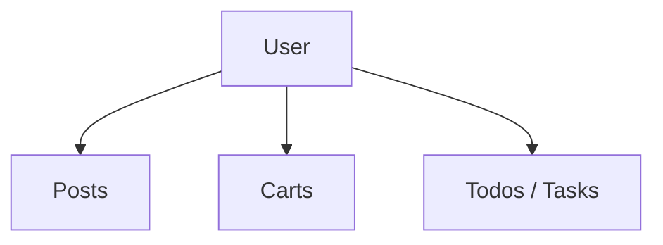
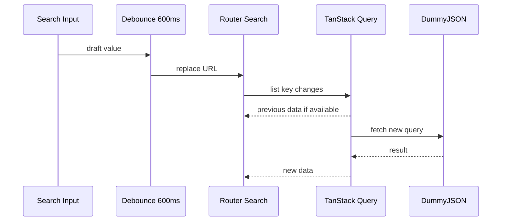

# 01 — Users Module Roadmap

> บทนี้สร้าง Users module **ตาม Project ปัจจุบันเท่านั้น** ตั้งแต่ API contract, transport, Query Cache, URL state, real-time search/filter, simulated CRUD, detail และ user relations โดยไม่เพิ่ม capability หรือไฟล์ที่ไม่มีใน Project

⬅️ ก่อนหน้า: [`00.project-init.md`](./00.project-init.md)  
➡️ ต่อไป: [`02.posts.md`](./02.posts.md)

---

## 1. เป้าหมายของบทนี้

เมื่อจบบท 01 คุณจะเพิ่มเฉพาะไฟล์ Users ที่ Project มีจริง:

```text
src/features/users/
├── api/
│   ├── client.ts
│   ├── contracts.ts
│   ├── mutations.ts
│   └── queries.ts
├── pages/
│   ├── user-detail-page.tsx
│   ├── user-relations.tsx
│   └── users-page.tsx
└── index.ts

src/routes/(protected)/_admin/users/
├── index.tsx
└── $userId/
    ├── route.tsx
    ├── index.tsx
    ├── posts.tsx
    ├── carts.tsx
    └── todos.tsx
```

ไม่มีไฟล์อื่นใน Users module ของ Project

Reference directories:

- [Users feature](https://github.com/thehermitdev/dummyjson-example/tree/main/src/features/users)
- [Users routes](https://github.com/thehermitdev/dummyjson-example/tree/main/src/routes/%28protected%29/_admin/users)

---

## 2. Foundation ที่ต้องมีจากบท 00

ก่อนเริ่มบทนี้ ตรวจว่าไฟล์ต่อไปนี้มีอยู่จริง เพราะ Users import โดยตรงหรือทาง Route:

```text
src/shared/api/http-client.ts
src/shared/errors/application-error.ts
src/shared/hooks/use-debounced-value.ts
src/shared/lib/route-params.ts
src/shared/components/api-skeletons.tsx
src/shared/components/confirm-delete-dialog.tsx
src/shared/components/data-pagination.tsx
src/shared/components/navigation/app-link.tsx
src/shared/components/navigation/router-button.tsx
src/shared/components/route-state.tsx
src/shared/components/ui/alert.tsx
src/shared/components/ui/button.tsx
src/shared/components/ui/drawer.tsx
```

ถ้าไฟล์ใดหาย อย่าแก้ Users ด้วยการสร้าง helper ใหม่ใน feature ให้ย้อนกลับไปตรวจบท 00 เพราะ Project ใช้ shared dependency เหล่านี้จริง

---

## 3. เอกสารที่ควรอ่านคู่กับบทนี้

- DummyJSON Users: https://dummyjson.com/docs/users
- TanStack Query Query Keys: https://tanstack.com/query/latest/docs/framework/react/guides/query-keys
- TanStack Query `queryOptions`: https://tanstack.com/query/latest/docs/framework/react/reference/queryOptions
- TanStack Query Mutations: https://tanstack.com/query/latest/docs/framework/react/guides/mutations
- TanStack Query Paginated Queries: https://tanstack.com/query/latest/docs/framework/react/guides/paginated-queries
- TanStack Router Search Params: https://tanstack.com/router/latest/docs/framework/react/guide/search-params
- TanStack Router Data Loading: https://tanstack.com/router/latest/docs/framework/react/guide/data-loading
- Zod: https://zod.dev/

---

# Phase 1 — เข้าใจ Users Domain ก่อนเขียน UI

## Step 1 — ทำ API Inventory

Project ใช้ความสามารถต่อไปนี้ของ DummyJSON Users:

```text
GET    /users
GET    /users/:id
GET    /users/search?q=...
GET    /users/filter?key=...&value=...
GET    /users/:id/posts
GET    /users/:id/carts
GET    /users/:id/todos
POST   /users/add
PATCH  /users/:id
DELETE /users/:id
```

List รองรับ input ที่ Project model ไว้:

```text
page
pageSize
q?
filterKey?
filterValue?
sortBy?
order?
select?
```

Reference implementation:

- [Users API client](https://github.com/thehermitdev/dummyjson-example/blob/main/src/features/users/api/client.ts)

### เหตุผลที่ Users มาก่อน module อื่น

Users เป็น central entity ของ Project:



Posts ใช้ User Directory เพื่อ resolve author, Carts ใช้เพื่อ resolve owner และ Todos ใช้เพื่อ resolve assignee ดังนั้นสร้าง Users ให้ถูกก่อนจะลด duplication ในบทถัดไป

---

# Phase 2 — Contracts: Runtime Boundary

## Step 2 — สร้าง `src/features/users/api/contracts.ts`

หน้าที่ของไฟล์นี้คือกำหนด shape ที่ Project ยอมรับจาก external API และ form inputs

ให้สร้างตาม Reference โดยตรง:

- [Users contracts.ts](https://github.com/thehermitdev/dummyjson-example/blob/main/src/features/users/api/contracts.ts)

สิ่งที่ต้องสังเกตในไฟล์จริง:

- `userRoleSchema`
- `userSchema`
- `usersListResponseSchema`
- lightweight user option/directory schemas
- create input schema
- update input schema
- deleted user schema
- relation response schemas ของ Posts/Carts/Todos
- TypeScript types ที่ derive จาก Zod

### ทำไมต้องมี Zod ทั้งที่มี TypeScript

TypeScript ตรวจ code ตอน compile แต่ response จาก network เกิดตอน runtime หาก DummyJSON ส่ง shape ไม่ตรง type ที่เราเขียนเอง TypeScript ไม่สามารถหยุดได้

Flow ของ Project คือ:

```text
Unknown JSON
   ↓
Zod parse
   ↓
Validated object
   ↓
TanStack Query cache
   ↓
UI
```

ดังนั้น component ไม่ต้อง cast API response เอง

### Checkpoint

ก่อนทำ Client คุณควรตอบได้ว่า:

- `User` read model มาจาก schema ใด
- Create/Update inputs ต่างจาก User read model อย่างไร
- User Directory ใช้ข้อมูล subset อะไร
- relation responses มี wrapper shape อย่างไร

---

# Phase 3 — Transport Adapter

## Step 3 — สร้าง `src/features/users/api/client.ts`

Reference:

- [Users client.ts](https://github.com/thehermitdev/dummyjson-example/blob/main/src/features/users/api/client.ts)
- [Shared HTTP client](https://github.com/thehermitdev/dummyjson-example/blob/main/src/shared/api/http-client.ts)

Functions ที่มีอยู่จริง:

```text
getUsers(input, signal)
getUser(userId, signal)
getUsersDirectory(signal)
getUserPosts(userId, signal)
getUserCarts(userId, signal)
getUserTodos(userId, signal)
addUser(input)
updateUser(userId, input)
deleteUser(userId)
```

### Responsibility

Client ต้องรับผิดชอบ:

```text
Feature input
→ เลือก endpoint
→ แปลง page เป็น limit/skip
→ HTTP request ผ่าน shared httpClient
→ Zod parse response
→ คืน typed output
```

Route/Page ไม่ควรรู้รายละเอียด endpoint

---

## Step 4 — เข้าใจ List endpoint precedence

Project เลือก endpoint ตามลำดับ:

```text
ถ้ามี q
→ /users/search

else ถ้ามี filterKey + filterValue
→ /users/filter

else
→ /users
```

นี่หมายความว่า `q` มี precedence เหนือ filter ใน transport behavior

อย่าแก้ให้ยิง search + filter พร้อมกัน เพราะ Project ไม่ได้ทำแบบนั้น

---

## Step 5 — Pagination conversion

UI และ URL ใช้:

```text
page
pageSize
```

DummyJSON ใช้:

```text
limit
skip
```

Project คำนวณ:

```text
skip = (page - 1) * pageSize
limit = pageSize
```

ตัวอย่าง:

```text
page = 3
pageSize = 10
skip = 20
limit = 10
```

ให้ formula อยู่ที่ Client boundary ไม่กระจายไป Page component

---

## Step 6 — AbortSignal

`getUsers`, `getUser`, relation getters และ directory query รับ `AbortSignal`

เหตุผล:

```text
User พิมพ์ search
→ query key เปลี่ยน
→ request ก่อนหน้าอาจไม่จำเป็นแล้ว
→ TanStack Query ส่ง signal
→ Axios request ถูก cancel ได้
```

Project จึงส่ง `signal` ลง HTTP call สำหรับ read queries

---

# Phase 4 — Query Keys + Cache Policy

## Step 7 — สร้าง `src/features/users/api/queries.ts`

Reference:

- [Users queries.ts](https://github.com/thehermitdev/dummyjson-example/blob/main/src/features/users/api/queries.ts)

Key hierarchy ของ Project:

```text
["users"]
├── ["users", "list", input]
├── ["users", "detail", userId]
├── ["users", "directory"]
├── ["users", "detail", userId, "posts"]
├── ["users", "detail", userId, "carts"]
└── ["users", "detail", userId, "todos"]
```

### ทำไม `input` ต้องอยู่ใน list key

ผลลัพธ์ต่อไปนี้ไม่ใช่ cache entry เดียวกัน:

```text
page 1
page 2
search john
role admin
gender female
sort firstName asc
```

Query Key จึงต้องรวม request-affecting input

### Cache Policy ตาม Project จริง

| Query | staleTime |
| --- | ---: |
| Users list | 60 วินาที |
| User detail | 5 นาที |
| Users directory | 10 นาที |
| User posts | 2 นาที |
| User carts | 2 นาที |
| User todos | 2 นาที |

List query ใช้ `placeholderData: keepPreviousData`

### UX ที่ตามมา

```text
Cold list
→ TablePageSkeleton

เปลี่ยน search/filter/page และมี previous data
→ เก็บ table เดิม
→ FetchingSkeletonBar แสดง fetching

กลับ query key เดิมและ cache ยัง fresh
→ render จาก cache
```

---

# Phase 5 — Simulated Mutation Strategy

## Step 8 — เข้าใจข้อจำกัด DummyJSON ก่อนสร้าง mutations

DummyJSON write endpoints จำลองผลลัพธ์ แต่ไม่ได้ persist dataset ระยะยาว

ดังนั้น pattern นี้ไม่เหมาะกับ Project:

```text
mutation success
→ invalidate
→ refetch server
```

เพราะ refetch อาจได้ข้อมูลเดิมกลับมา ทำให้ UI ดูเหมือน undo mutation

Project ใช้ manual Query Cache reconciliation แทน

---

## Step 9 — สร้าง `src/features/users/api/mutations.ts`

Reference:

- [Users mutations.ts](https://github.com/thehermitdev/dummyjson-example/blob/main/src/features/users/api/mutations.ts)

Functions ที่ Project export:

```text
addUserMutationOptions(queryClient)
updateUserMutationOptions(queryClient)
deleteUserMutationOptions(queryClient)
```

### Add

หลัง API ตอบ User ใหม่:

```text
cached users lists
→ prepend user
→ จำกัดจำนวนตาม current limit
→ total + 1

user detail key
→ seed new user
```

### Update

```text
ทุก cached users list
→ replace row ที่ id ตรงกัน

user detail
→ replace object
```

### Delete

```text
ทุก cached users list
→ filter id ออก
→ total - 1

user detail
→ remove query
```

อย่าเพิ่ม optimistic mutation หรือ invalidation strategy อื่นในบทนี้ เพราะ Project ปัจจุบันไม่ได้ใช้

---

# Phase 6 — Feature Public API

## Step 10 — สร้าง `src/features/users/index.ts`

Reference:

- [Users index.ts](https://github.com/thehermitdev/dummyjson-example/blob/main/src/features/users/index.ts)

ไฟล์จริง export:

```text
Pages
├── UsersPage
├── UserDetailPage
├── UserPostsPanel
├── UserCartsPanel
└── UserTodosPanel

Query API
├── usersListQueryOptions
├── userDetailQueryOptions
├── usersDirectoryQueryOptions
├── userPostsQueryOptions
├── userCartsQueryOptions
├── userTodosQueryOptions
└── usersKeys

Types
├── UsersListInput
├── User
├── UserOption
└── UsersListResponse
```

### เหตุผล

Route layer import ผ่าน:

```text
#/features/users
```

แทน deep-import private implementation กระจัดกระจาย

---

# Phase 7 — Users List Route

## Step 11 — สร้าง `src/routes/(protected)/_admin/users/index.tsx`

Reference:

- [Users list route](https://github.com/thehermitdev/dummyjson-example/blob/main/src/routes/%28protected%29/_admin/users/index.tsx)

Search schema ของ Project:

```text
page       number >= 1, default/catch 1
pageSize   5..30, default/catch 10
q          optional string <= 100
filterKey  hair.color | role | gender
filterValue optional string <= 100
sortBy     firstName | lastName | age | email
order      asc | desc, default/catch asc
```

### Route Responsibilities

```text
validateSearch
↓
loaderDeps = search
↓
non-blocking prefetch users list
↓
component useQuery
↓
UsersPage
```

Route ไม่เรียก Axios โดยตรง

---

## Step 12 — ทำไม List Route ใช้ non-blocking prefetch

Project ใช้:

```text
void queryClient.prefetchQuery(...)
```

ไม่ `await ensureQueryData()` สำหรับ Users list

เหตุผลคือ real-time search เปลี่ยน URL ทุก 600ms ถ้า loader block ทุกครั้ง UI จะเสียประโยชน์จาก `keepPreviousData`

Data flow:



---

# Phase 8 — Users Page

## Step 13 — สร้าง `src/features/users/pages/users-page.tsx`

Reference:

- [Users page](https://github.com/thehermitdev/dummyjson-example/blob/main/src/features/users/pages/users-page.tsx)

Project page นี้พึ่ง Foundation ต่อไปนี้โดยตรง:

```text
AppLink
RouterButton
FetchingSkeletonBar
ConfirmDeleteDialog
DataPagination
Alert
Button
Drawer components
useDebouncedValue
```

นี่คือเหตุผลที่ไฟล์เหล่านี้ถูกย้ายมาให้ครบในบท 00

### หน้าที่ UI จริง

- heading + count
- real-time search
- nested filter selection
- filter value
- sort/order
- Add User
- table
- View/Edit/Delete actions
- pagination/page size
- Add/Edit Drawer
- Delete confirmation
- mutation pending/error/success UX

---

## Step 14 — Real-time Search และ Filter

Project ใช้ local draft state สำหรับข้อความที่กำลังพิมพ์ และใช้ URL เป็น committed source of truth

Flow:

```text
input onChange
→ local draft เปลี่ยนทันที
→ debounce 600ms
→ onInputChange(..., { replace: true })
→ URL เปลี่ยน
→ page = 1
→ query key เปลี่ยน
```

### ทำไมใช้ `replace`

ถ้าพิมพ์:

```text
j
jo
joh
john
```

ไม่ควรสร้าง browser history 4 entries

### Discrete controls

Project ไม่ debounce controls เช่น sort/order หรือค่าที่ user เลือกชัดเจนแบบ select; update ได้ทันที

---

## Step 15 — Pagination

ใช้ shared:

- [DataPagination](https://github.com/thehermitdev/dummyjson-example/blob/main/src/shared/components/data-pagination.tsx)

เมื่อเปลี่ยน page size ให้ page reset ตาม behavior ใน page implementation

ห้ามสร้าง pagination component ใหม่ใน Users เพราะ Project มี shared abstraction แล้ว

---

## Step 16 — Add/Edit Drawer

Project ใช้ Drawer จาก Foundation:

- [Drawer primitive](https://github.com/thehermitdev/dummyjson-example/blob/main/src/shared/components/ui/drawer.tsx)

Form validation ใช้ Users input schemas จาก `contracts.ts`

Mutation flow:

```text
submit
→ Zod validation
→ useMutation
→ API simulation
→ mutation onSuccess patch Query Cache
→ close drawer / toast ตาม implementation
```

ตรวจ implementation จริงใน:

- [Users page](https://github.com/thehermitdev/dummyjson-example/blob/main/src/features/users/pages/users-page.tsx)
- [Users mutations](https://github.com/thehermitdev/dummyjson-example/blob/main/src/features/users/api/mutations.ts)

---

## Step 17 — Delete Confirmation

ใช้ shared component ที่ Project มี:

- [ConfirmDeleteDialog](https://github.com/thehermitdev/dummyjson-example/blob/main/src/shared/components/confirm-delete-dialog.tsx)

ห้ามสร้าง dialog delete เฉพาะ Users ซ้ำอีกชุด

---

# Phase 9 — User Detail Layout

## Step 18 — สร้าง `src/features/users/pages/user-detail-page.tsx`

Reference:

- [User detail page](https://github.com/thehermitdev/dummyjson-example/blob/main/src/features/users/pages/user-detail-page.tsx)

หน้าที่หลัก:

- profile summary
- user metadata
- tabs/navigation สำหรับ Overview / Posts / Carts / Tasks
- render nested route content ผ่าน `children`

Internal navigation ต้องเป็น Router-aware links ไม่ raw internal `<a href>`

---

## Step 19 — สร้าง parent detail route `$userId/route.tsx`

Reference:

- [User layout route](https://github.com/thehermitdev/dummyjson-example/blob/main/src/routes/%28protected%29/_admin/users/%24userId/route.tsx)

Route นี้ใช้:

```text
parseNumericId
userDetailQueryOptions
ensureQueryData
DetailPageSkeleton
RouteErrorState
useSuspenseQuery
Outlet
```

### ทำไม detail ใช้ blocking loader ได้

User Detail ต่างจาก real-time list:

```text
List
→ query key เปลี่ยนบ่อย
→ keep previous data
→ non-blocking

Detail
→ core entity ต้องพร้อมก่อน render layout
→ ensureQueryData
→ pending Skeleton เมื่อช้า
```

---

## Step 20 — สร้าง `$userId/index.tsx`

Reference:

- [User detail index route](https://github.com/thehermitdev/dummyjson-example/blob/main/src/routes/%28protected%29/_admin/users/%24userId/index.tsx)

ไฟล์นี้เป็น nested index ของ user detail layout ตาม Project จริง

---

# Phase 10 — User Relations

## Step 21 — สร้าง `src/features/users/pages/user-relations.tsx`

Reference:

- [User relations page components](https://github.com/thehermitdev/dummyjson-example/blob/main/src/features/users/pages/user-relations.tsx)

File เดียว export 3 panels:

```text
UserPostsPanel
UserCartsPanel
UserTodosPanel
```

Project เลือกให้ relations อยู่ภายใต้ Users feature เพราะหน้าพวกนี้เป็น user-centric views

---

## Step 22 — User Posts route

Path:

```text
src/routes/(protected)/_admin/users/$userId/posts.tsx
```

Reference:

- [User Posts route](https://github.com/thehermitdev/dummyjson-example/blob/main/src/routes/%28protected%29/_admin/users/%24userId/posts.tsx)

Dependencies:

```text
parseNumericId
userPostsQueryOptions
RelationPanelSkeleton
RouteErrorState
UserPostsPanel
```

---

## Step 23 — User Carts route

Path:

```text
src/routes/(protected)/_admin/users/$userId/carts.tsx
```

Reference:

- [User Carts route](https://github.com/thehermitdev/dummyjson-example/blob/main/src/routes/%28protected%29/_admin/users/%24userId/carts.tsx)

ใช้ pattern เดียวกับ User Posts แต่ query เป็น `userCartsQueryOptions`

---

## Step 24 — User Todos route

Path:

```text
src/routes/(protected)/_admin/users/$userId/todos.tsx
```

Reference:

- [User Todos route](https://github.com/thehermitdev/dummyjson-example/blob/main/src/routes/%28protected%29/_admin/users/%24userId/todos.tsx)

ใช้ `userTodosQueryOptions` และ `UserTodosPanel`

---

# Phase 11 — Cache Scenarios ที่ต้องเข้าใจ

## Scenario A — Users list → detail → back

```text
/users?page=1
→ list cache 60s
→ /users/5
→ detail cache 5m
→ back /users?page=1
→ ถ้า list cache ยัง fresh render ได้ทันที
```

เพราะ internal links ไม่ full reload QueryClient instance จึงยังอยู่

## Scenario B — Search query เดิมกลับมา

```text
q=john
→ cache key A

q=emily
→ cache key B

q=john อีกครั้ง
→ ถ้า A ยัง fresh reuse ได้
```

## Scenario C — Identity เปลี่ยน

Foundation `AppRouterProvider` จะ `queryClient.clear()` เมื่อ Clerk user id เปลี่ยน ดังนั้น caches ชุดนี้ไม่ควรถูก reuse ข้าม identity

---

# Phase 12 — Acceptance Test ของ Users

ทดสอบ URLs ที่ Project support:

```text
/users
/users?page=2&pageSize=10&order=asc
/users?q=emily
/users?filterKey=role&filterValue=admin
/users?sortBy=age&order=desc
/users/1
/users/1/posts
/users/1/carts
/users/1/todos
```

### Search test

พิมพ์ข้อความต่อเนื่อง:

```text
m
mi
mic
mich
michael
```

ต้องสังเกตว่า:

- input ตอบสนองทันที
- request ไม่ยิงทุก keystroke
- URL commit หลัง debounce ประมาณ 600ms
- page reset เป็น 1 เมื่อ search/filter เปลี่ยนตาม implementation
- previous table ไม่หายทุกครั้งถ้ามี data อยู่

### Navigation test

```text
/users
→ /users/5
→ /users/5/posts
→ /users/5/carts
→ /users/5/todos
→ back
```

ต้องไม่มี full-document navigation จาก internal links

---

# Phase 13 — Interim Validation

หลังบท 01 ให้ตรวจ:

```bash
bun run format:check
bun run lint
```

และสร้าง route tree เพื่อดูว่า Users files ถูกค้นพบ:

```bash
bun run routes:generate
```

แต่ยังไม่ใช้ `bun run check` เป็น final gate เพราะ Project Foundation มี `/dashboard` forward reference และ Dashboard route จะเกิดในบท 05

---

## Project File Checklist — Chapter 01

ต้องมีครบ:

```text
src/features/users/api/client.ts
src/features/users/api/contracts.ts
src/features/users/api/mutations.ts
src/features/users/api/queries.ts
src/features/users/pages/user-detail-page.tsx
src/features/users/pages/user-relations.tsx
src/features/users/pages/users-page.tsx
src/features/users/index.ts
src/routes/(protected)/_admin/users/index.tsx
src/routes/(protected)/_admin/users/$userId/route.tsx
src/routes/(protected)/_admin/users/$userId/index.tsx
src/routes/(protected)/_admin/users/$userId/posts.tsx
src/routes/(protected)/_admin/users/$userId/carts.tsx
src/routes/(protected)/_admin/users/$userId/todos.tsx
```

ถ้ามีไฟล์อื่นที่คุณสร้างเพิ่มเพื่อ “ช่วย Users” ให้ตรวจกลับว่าไฟล์นั้นมีใน Project จริงหรือไม่ หากไม่มี ให้ถือว่านอก scope ของ roadmap นี้

---

## Common Mistakes

### 1. Import Axios ใน Users Client โดยตรงจาก package

Project อนุญาต Axios import เฉพาะ shared HTTP client

### 2. ใช้ `useSuspenseQuery` สำหรับ real-time Users list

Project list ใช้ `useQuery` + `keepPreviousData`

### 3. Debounce URL state โดยทำ input ช้าไปด้วย

Project แยก local draft จาก committed URL

### 4. ใช้ raw `<a href>` สำหรับ User detail/tabs

ทำให้ browser reload และทิ้ง in-memory QueryClient

### 5. สร้าง pagination/delete dialog ซ้ำใน feature

Project มี `DataPagination` และ `ConfirmDeleteDialog` ใน shared แล้ว

### 6. `invalidateQueries()` อย่างเดียวหลัง simulated write

DummyJSON ไม่ persist write แบบ backend จริง Project จึง patch cache โดยตรง

---

## Definition of Done — Chapter 01

ถือว่าบท Users เสร็จเมื่อ:

- [ ] Project files ใน checklist มีครบทุกไฟล์
- [ ] ไม่มี Users file นอก Project ถูกเพิ่ม
- [ ] API responses ถูก validate ที่ contract boundary
- [ ] Client ใช้ shared `httpClient`
- [ ] Query keys แยก list/detail/directory/relations ถูกต้อง
- [ ] List ใช้ `keepPreviousData`
- [ ] Search/filter behavior ตรง Project
- [ ] Add/Update/Delete patch Query Cache ตาม Project
- [ ] User Detail และ nested relations ทำงาน
- [ ] shared dependencies มาจากบท 00 ไม่ duplicate ใน Users
- [ ] `bun run format:check` ผ่าน
- [ ] `bun run lint` ผ่าน

➡️ ไปต่อ [`02.posts.md`](./02.posts.md)
