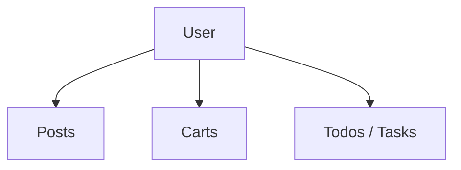

# 01 — Users Module Roadmap

> เป้าหมายของบทนี้คือสร้าง Users feature ตั้งแต่ API contract จนถึง List, Search, Filter, Sort, Detail, Relations และ simulated CRUD โดยใช้ Foundation จากบท 00

⬅️ ก่อนหน้า: [`00.project-init.md`](./00.project-init.md)  
➡️ ต่อไป: [`02.posts.md`](./02.posts.md)

---

## 1. ทำไมต้องเริ่มจาก Users

Users เป็น **central entity** ของโปรเจ็กต์นี้ เพราะ resource อื่นเชื่อมกลับมาที่ `userId`:



ถ้า Users architecture ดี เราจะ reuse แนวคิดเดียวกันใน Posts, Carts และ Todos ได้ทันที เช่น:

- Zod API boundary
- Query Key Factory
- URL-driven pagination/search/filter
- Query cache policy
- Route loader + Query composition
- Drawer/Dialog/Toast
- cache reconciliation หลัง simulated mutation

---

## 2. Official Documentation

- DummyJSON Users: https://dummyjson.com/docs/users
- TanStack Query `queryOptions`: https://tanstack.com/query/latest/docs/framework/react/reference/queryOptions
- TanStack Query Query Keys: https://tanstack.com/query/latest/docs/framework/react/guides/query-keys
- TanStack Query Mutations: https://tanstack.com/query/latest/docs/framework/react/guides/mutations
- TanStack Query Paginated Queries: https://tanstack.com/query/latest/docs/framework/react/guides/paginated-queries
- TanStack Router Search Params: https://tanstack.com/router/latest/docs/guide/search-params
- Zod: https://zod.dev/basics
- shadcn Skeleton: https://ui.shadcn.com/docs/components/aria/skeleton

---

## 3. Target Structure

เมื่อจบบทนี้ควรมี:

```text
src/features/users/
├── api/
│   ├── contracts.ts
│   ├── client.ts
│   ├── queries.ts
│   └── mutations.ts
├── pages/
│   ├── users-page.tsx
│   ├── user-detail-page.tsx
│   └── user-relations.tsx
└── index.ts

src/routes/(protected)/_admin/users/
├── index.tsx
└── $userId/
    ├── route.tsx
    ├── index.tsx
    ├── posts.tsx
    ├── carts.tsx
    └── todos.tsx
```

Reference implementation:

- [Users feature public API](https://github.com/thehermitdev/dummyjson-example/blob/main/src/features/users/index.ts)
- [Users routes](https://github.com/thehermitdev/dummyjson-example/tree/main/src/routes/%28protected%29/_admin/users)

---

# Phase 1 — เข้าใจ API ก่อนเขียน UI

## Step 1 — ทำ API inventory

ก่อนเขียนโค้ด ให้จด endpoints ที่ feature ต้องรองรับ:

```text
GET    /users
GET    /users/:id
GET    /users/search?q=...
GET    /users/filter?key=...&value=...
GET    /users/:id/posts
GET    /users/:id/carts
GET    /users/:id/todos
POST   /users/add
PATCH  /users/:id
DELETE /users/:id
```

รวมความสามารถ query params ของ list:

```text
limit
skip
select
sortBy
order
```

### สิ่งที่ต้องเข้าใจก่อนทำต่อ

DummyJSON write endpoints เป็น simulation: server ตอบกลับเหมือนเขียนสำเร็จ แต่ข้อมูลไม่ได้ persist ถาวร ดังนั้นเราไม่สามารถพึ่ง “mutation สำเร็จ -> refetch -> server คืนค่าที่แก้แล้ว” แบบ backend จริงได้

นี่คือเหตุผลที่บทนี้ต้องสอน **Query Cache reconciliation** อย่างจริงจัง

---

# Phase 2 — API Contracts

## Step 2 — สร้าง `contracts.ts`

Path:

```text
src/features/users/api/contracts.ts
```

หน้าที่ของไฟล์นี้:

1. บอกว่า API response ที่เชื่อถือได้ต้องมีรูปแบบอย่างไร
2. parse ข้อมูล runtime ด้วย Zod
3. สร้าง TypeScript types จาก schema เดียวกัน
4. แยก schema สำหรับ read model และ form input

สิ่งที่ควรมีอย่างน้อย:

- `userRoleSchema`
- `userSchema`
- `usersListResponseSchema`
- `userOptionSchema`
- `usersDirectoryResponseSchema`
- `createUserInputSchema`
- `updateUserInputSchema`
- deleted-user response schema
- relation response schemas สำหรับ Posts/Carts/Todos

### ทำไมไม่เขียนแค่ TypeScript interface

API response เป็นข้อมูลจาก network ซึ่ง TypeScript ไม่ได้ตรวจ runtime หาก backend เปลี่ยน `age` เป็น string หรือ field สำคัญหาย แอปอาจพังลึกเข้าไปใน UI การ parse ที่ boundary ทำให้ fail เร็วและรู้ว่า contract ผิดตรงไหน

Reference:

- [contracts.ts](https://github.com/thehermitdev/dummyjson-example/blob/main/src/features/users/api/contracts.ts)

### Checkpoint

- [ ] Schema parse sample `/users` response ได้
- [ ] Input schema ปฏิเสธ invalid email/age
- [ ] Types มาจาก `z.infer` ไม่ duplicate schema ด้วย interface อีกชุด

---

# Phase 3 — Transport Adapter

## Step 3 — สร้าง `client.ts`

Path:

```text
src/features/users/api/client.ts
```

ไฟล์นี้รับผิดชอบ “พูดภาษา HTTP” ให้ feature:

```text
Feature Input
   ↓
Users Client
   ↓
Shared Axios httpClient
   ↓
DummyJSON
   ↓
Zod parse
   ↓
Typed Feature Output
```

### Functions ที่ควรสร้าง

```text
getUsers(input, signal)
getUser(userId, signal)
getUsersDirectory(signal)
getUserPosts(userId, signal)
getUserCarts(userId, signal)
getUserTodos(userId, signal)
addUser(input)
updateUser(userId, input)
deleteUser(userId)
```

Reference:

- [client.ts](https://github.com/thehermitdev/dummyjson-example/blob/main/src/features/users/api/client.ts)
- [shared HTTP client](https://github.com/thehermitdev/dummyjson-example/blob/main/src/shared/api/http-client.ts)

### Important Design Decision — endpoint precedence

List input มีหลายโหมด แต่หนึ่ง request ไม่ควรพยายามใช้ search + filter + default list พร้อมกัน

แนวคิด:

```text
if q
  -> /users/search
else if filterKey && filterValue
  -> /users/filter
else
  -> /users + sort
```

ทำให้ request semantics ชัดและ Query Key สะท้อน input จริง

### Pagination conversion

UI ใช้ `page` แต่ DummyJSON ใช้ `skip`:

```text
skip = (page - 1) * pageSize
```

ตัวอย่าง page 3, pageSize 10:

```text
skip = (3 - 1) * 10 = 20
```

### AbortSignal

ให้ query function ส่ง `signal` ลง client เสมอ เพื่อให้ request ที่ไม่จำเป็นถูก cancel ได้เมื่อ query เปลี่ยน เช่น search จาก `john` เป็น `michael`

---

# Phase 4 — Query Key Design

## Step 4 — สร้าง `queries.ts`

Path:

```text
src/features/users/api/queries.ts
```

ออกแบบ key tree ก่อนสร้าง UI:

```text
["users"]
├── ["users", "list", input]
├── ["users", "detail", userId]
├── ["users", "directory"]
└── ["users", "detail", userId, relation]
    ├── posts
    ├── carts
    └── todos
```

Reference:

- [queries.ts](https://github.com/thehermitdev/dummyjson-example/blob/main/src/features/users/api/queries.ts)

### ทำไม list key ต้องมี input

สิ่งเหล่านี้ต้องเป็นคนละ cache entry:

```text
/users?page=1
/users?page=2
/users?q=john
/users?filterKey=role&filterValue=admin
```

ดังนั้น key ต้อง encode input ที่เปลี่ยนผลลัพธ์

### Cache Policy ที่ใช้ในโปรเจ็กต์

| Query                  | staleTime | เหตุผล                                     |
| ---------------------- | --------: | ------------------------------------------ |
| Users List             |       60s | search/filter/pagination เปลี่ยนบ่อย       |
| User Detail            |        5m | entity detail ค่อนข้างคงที่                |
| User Directory         |       10m | ใช้เป็น selector data หลาย feature         |
| User Posts/Carts/Todos |        2m | related data มีโอกาสเปลี่ยนมากกว่า profile |

List query ใช้ `keepPreviousData` เพื่อไม่ให้ table หายทุกครั้งที่เปลี่ยน page/search

### UX ที่เราต้องการ

```text
มี fresh cache
-> render ทันที

ไม่มี fresh cache แต่มี previous list
-> คง previous list + background fetching indicator

cold load ไม่มี data
-> Table Skeleton
```

---

# Phase 5 — Mutation Cache Reconciliation

## Step 5 — สร้าง `mutations.ts`

Path:

```text
src/features/users/api/mutations.ts
```

Reference:

- [mutations.ts](https://github.com/thehermitdev/dummyjson-example/blob/main/src/features/users/api/mutations.ts)

### Add User

หลัง DummyJSON ตอบ user ใหม่:

1. เพิ่ม user เข้า cached lists ที่มีอยู่
2. เพิ่ม `total`
3. seed detail cache ของ user ใหม่

### Update User

หลัง update:

1. replace user ที่ id ตรงกันในทุก Users list cache
2. update detail cache

### Delete User

หลัง delete:

1. ลบ user ออกจาก cached lists
2. ลด total
3. remove detail cache

### ทำไมไม่ใช้ `invalidateQueries()` อย่างเดียว

เพราะ DummyJSON ไม่ persist write หาก invalidate แล้ว refetch ทันที server จะส่ง original dataset กลับมาและ UI ดูเหมือน mutation ถูก undo

ดังนั้นสำหรับ demo backend นี้:

```text
mutation response
      ↓
manual cache reconciliation
      ↓
UI behaves like real session state
```

> ใน production backend จริง strategy อาจเปลี่ยนเป็น invalidate/refetch ตาม consistency model ของ API

---

# Phase 6 — Feature Public API

## Step 6 — สร้าง `src/features/users/index.ts`

เป้าหมายคือ routes ไม่ควร deep-import private implementation กระจัดกระจาย

Public API ควร export เฉพาะ:

- feature pages ที่ route ใช้
- query options ที่ route ใช้
- key factory ที่ mutation/consumer จำเป็นต้องใช้
- public types

Reference:

- [users/index.ts](https://github.com/thehermitdev/dummyjson-example/blob/main/src/features/users/index.ts)

### Dependency rule

ดี:

```text
route -> #/features/users
```

หลีกเลี่ยง:

```text
route -> #/features/users/pages/private-component
route -> #/features/users/api/internal-helper
```

---

# Phase 7 — Users List Route

## Step 7 — สร้าง URL search schema

Route:

```text
/users
```

Path:

```text
src/routes/(protected)/_admin/users/index.tsx
```

Search params ที่รองรับ:

```text
page
pageSize
q
filterKey
filterValue
sortBy
order
```

Reference:

- [users/index route](https://github.com/thehermitdev/dummyjson-example/blob/main/src/routes/%28protected%29/_admin/users/index.tsx)

### ทำไม URL เป็น Source of Truth

ถ้า state อยู่ URL เราได้:

- reload แล้ว filter ยังอยู่
- copy URL ให้คนอื่นได้
- back/forward browser ทำงาน
- Query Key สร้างจาก route search ได้ตรง ๆ

ตัวอย่าง:

```text
/users?page=2&pageSize=10&q=emily&order=asc
```

---

## Step 8 — Route loader ใช้ non-blocking prefetch

สำหรับ List screen ที่มี real-time search อย่า block route transition ทุก 600ms ด้วย `await ensureQueryData`

ใช้แนวคิด:

```text
loaderDeps = search
loader -> void queryClient.prefetchQuery(...)
component -> useQuery(...)
```

ทำให้ UI เดิมยัง render ได้ระหว่าง query ใหม่กำลังมา

---

# Phase 8 — Users List UI

## Step 9 — สร้าง `users-page.tsx`

Path:

```text
src/features/users/pages/users-page.tsx
```

Reference:

- [users-page.tsx](https://github.com/thehermitdev/dummyjson-example/blob/main/src/features/users/pages/users-page.tsx)

UI อย่างน้อยควรมี:

```text
Heading
Search
Filter Key
Filter Value
Sort By
Order
Add User
Table
Pagination
Add/Edit Drawer
Delete Dialog
```

---

## Step 10 — Real-time Search 600ms

แยก state เป็นสองชั้น:

```text
Local Draft Input
      ↓ debounce 600ms
Committed URL Search Param
      ↓
TanStack Query Key
      ↓
API
```

เหตุผลที่ไม่ update URL ทุก keystroke:

```text
J -> Jo -> Joh -> John
```

ไม่ควรสร้าง 4 network requests + 4 meaningful URL commits ถ้าผู้ใช้กำลังพิมพ์ต่อเนื่อง

### Search rules

- text search: debounce 600ms
- text filter value: debounce 600ms
- select filter/sort/order: apply ทันที
- search/filter เปลี่ยน: reset `page = 1`
- debounced commit: ใช้ history replace เพื่อลด history spam

---

## Step 11 — Skeleton และ Background Fetching

Cold load:

```text
query.data ไม่มี
-> TablePageSkeleton
```

เปลี่ยน search/page แล้ว previous data มี:

```text
Table เดิมยังอยู่
+ FetchingSkeletonBar
-> response ใหม่เข้ามา
-> table เปลี่ยน
```

นี่สำคัญมาก เพราะ real-time search ที่สลับ table เป็น full Skeleton ทุกครั้งจะรู้สึกกระพริบและช้ากว่าความเป็นจริง

---

# Phase 9 — Internal Navigation

## Step 12 — User row ต้องใช้ Router Link

ห้าม:

```text
<a href="/users/5">
```

เพราะจะ reload document และสร้าง QueryClient ใหม่

ใช้ `AppLink`/TanStack Router:

```text
to="/users/$userId"
params={ userId }
```

Reference:

- [AppLink adapter](https://github.com/thehermitdev/dummyjson-example/blob/main/src/shared/components/navigation/app-link.tsx)
- [TanStack Router + shadcn guide](https://tanstack.com/router/latest/docs/how-to/integrate-shadcn-ui)

### Expected Cache Behavior

```text
/users
 -> /users/5
 -> /users/5/posts
 -> /users/5/carts
 -> back /users/5/posts
```

ต้องเป็น SPA navigation ทั้งหมด เพื่อ reuse Query Cache เดิม

---

# Phase 10 — User Detail

## Step 13 — สร้าง parent route `$userId/route.tsx`

หน้าที่:

- parse `userId`
- ensure user detail query
- สร้าง layout/tabs สำหรับ nested relation routes

Paths:

- [user parent route](https://github.com/thehermitdev/dummyjson-example/blob/main/src/routes/%28protected%29/_admin/users/%24userId/route.tsx)
- [user detail index route](https://github.com/thehermitdev/dummyjson-example/blob/main/src/routes/%28protected%29/_admin/users/%24userId/index.tsx)

Detail route เหมาะกับ blocking `ensureQueryData` มากกว่า list เพราะ route นี้ต้องรู้ entity หลักก่อน render

ถ้า cache fresh -> เข้าได้ทันที  
ถ้า cold/slow -> route pending Skeleton

---

## Step 14 — สร้าง `user-detail-page.tsx`

Reference:

- [user-detail-page.tsx](https://github.com/thehermitdev/dummyjson-example/blob/main/src/features/users/pages/user-detail-page.tsx)

ควรแสดงข้อมูลที่ช่วยเข้าใจ entity:

- avatar
- full name
- email/phone
- role
- age/gender
- company/department/title
- hair metadata
- relation navigation tabs

อย่าโหลด Posts/Carts/Todos ทั้งหมดใน User Detail index ถ้ายังไม่ต้องใช้ ให้ nested routes รับผิดชอบเอง

---

# Phase 11 — User Relations

## Step 15 — Posts relation

Route:

```text
/users/$userId/posts
```

References:

- [route](https://github.com/thehermitdev/dummyjson-example/blob/main/src/routes/%28protected%29/_admin/users/%24userId/posts.tsx)
- [relation UI](https://github.com/thehermitdev/dummyjson-example/blob/main/src/features/users/pages/user-relations.tsx)

Query key:

```text
["users", "detail", userId, "posts"]
```

## Step 16 — Carts relation

Route:

```text
/users/$userId/carts
```

Reference:

- [route](https://github.com/thehermitdev/dummyjson-example/blob/main/src/routes/%28protected%29/_admin/users/%24userId/carts.tsx)

## Step 17 — Todos relation

Route:

```text
/users/$userId/todos
```

Reference:

- [route](https://github.com/thehermitdev/dummyjson-example/blob/main/src/routes/%28protected%29/_admin/users/%24userId/todos.tsx)

### Why nested relations matter

นี่ทำให้ User เป็น entry point ที่อธิบาย domain relationships ได้โดยไม่รวมทุกอย่างเป็น giant page เดียว

---

# Phase 12 — Add/Edit/Delete UX

## Step 18 — Add/Edit ใช้ Drawer

เหตุผล:

- ผู้ใช้ยังเห็น list context ด้านหลัง
- เหมาะกับ form ระดับกลาง
- ไม่ต้องสร้าง route ใหม่สำหรับงานสั้น ๆ

Validation ให้ reuse Zod input schema ก่อนส่ง mutation

## Step 19 — Delete ใช้ Dialog

อย่าใช้ `window.confirm()` เพราะ:

- styling/control ไม่สม่ำเสมอ
- accessibility/custom copy จำกัด
- ไม่เข้ากับ design system

## Step 20 — Mutation Feedback ใช้ Sonner

แสดงอย่างน้อย:

```text
success -> User added/updated/deleted
error   -> readable error message
```

---

# Phase 13 — Production Review

## Step 21 — ตรวจ Separation of Concerns

ถามทีละไฟล์:

### `contracts.ts`

รู้ HTTP endpoint ไหม? **ไม่จำเป็น**  
รู้ React UI ไหม? **ไม่ควร**

### `client.ts`

รู้ QueryClient ไหม? **ไม่ควร**  
รู้ Axios ผ่าน shared client ไหม? **ใช่**

### `queries.ts`

รู้ endpoint details ไหม? **ผ่าน client abstraction เท่านั้น**

### route

เรียก Axios ไหม? **ห้าม**  
จัด URL/query orchestration ไหม? **ใช่**

### page

สร้าง raw API request ไหม? **ห้าม**  
รับ data + interaction props / ใช้ mutations ไหม? **ได้**

---

# Phase 14 — Testing Manually Before Moving On

ตรวจ flow ต่อไปนี้ใน browser:

## List

```text
/users
/users?page=2
/users?q=emily
/users?filterKey=role&filterValue=admin
/users?sortBy=age&order=desc
```

## Detail

```text
/users/1
/users/1/posts
/users/1/carts
/users/1/todos
```

## Cache Navigation

```text
Users -> User #1 -> Posts -> Carts -> Posts
```

เปิด Network tab แล้วตรวจว่า fresh query ไม่ถูกยิงใหม่โดยไม่จำเป็น

## Mutation

```text
Add -> list update
Update -> list + detail update
Delete -> list remove + detail cache remove
```

จำไว้ว่า refresh browser จะกลับไป DummyJSON source dataset เพราะ writes ไม่ persist บน server

---

# Common Mistakes

## 1. Search input ผูก URL ตรงทุก keystroke

ผล: request เยอะ, history รก, UX กระตุก  
แก้: local draft + debounce 600ms

## 2. ใช้ `<a href>` กับ internal routes

ผล: SPA reload, in-memory Query Cache หาย  
แก้: `AppLink` / TanStack Router `Link`

## 3. `queryKey` ไม่มี filter/search input

ผล: คนละ request ใช้ cache key เดียวกัน  
แก้: list key ต้อง encode input

## 4. Mutation สำเร็จแล้ว invalidate อย่างเดียว

ผลใน DummyJSON: refetch original dataset กลับมา  
แก้: reconcile cache จาก mutation response

## 5. Route import Axios

ผล: orchestration กับ transport ปนกัน  
แก้: Route -> Feature Query -> Client -> Shared HTTP

## 6. เอา API data copy เข้า global client store

ผล: มีสอง source of truth  
แก้: TanStack Query เป็นเจ้าของ server state

---

# Definition of Done — Users

- [ ] `/users` render ได้
- [ ] pagination อยู่ใน URL
- [ ] search real-time + debounce 600ms
- [ ] filter real-time ตามประเภท control
- [ ] sort/order ทำงาน
- [ ] `keepPreviousData` ป้องกัน table flicker
- [ ] cold load แสดง Skeleton
- [ ] User Detail ทำงาน
- [ ] User Posts/Carts/Todos nested routes ทำงาน
- [ ] internal navigation ไม่ reload browser
- [ ] Add/Update/Delete ทำงานใน current session
- [ ] mutation cache reconciliation ถูกต้อง
- [ ] routes import feature public API ไม่ deep import โดยไม่จำเป็น
- [ ] `bun run check` ผ่าน

---

# Reference Implementation Index

- [Contracts](https://github.com/thehermitdev/dummyjson-example/blob/main/src/features/users/api/contracts.ts)
- [API Client](https://github.com/thehermitdev/dummyjson-example/blob/main/src/features/users/api/client.ts)
- [Queries + Query Keys](https://github.com/thehermitdev/dummyjson-example/blob/main/src/features/users/api/queries.ts)
- [Mutations](https://github.com/thehermitdev/dummyjson-example/blob/main/src/features/users/api/mutations.ts)
- [Feature Public API](https://github.com/thehermitdev/dummyjson-example/blob/main/src/features/users/index.ts)
- [Users Page](https://github.com/thehermitdev/dummyjson-example/blob/main/src/features/users/pages/users-page.tsx)
- [User Detail Page](https://github.com/thehermitdev/dummyjson-example/blob/main/src/features/users/pages/user-detail-page.tsx)
- [User Relations](https://github.com/thehermitdev/dummyjson-example/blob/main/src/features/users/pages/user-relations.tsx)
- [Users List Route](https://github.com/thehermitdev/dummyjson-example/blob/main/src/routes/%28protected%29/_admin/users/index.tsx)
- [User Parent Route](https://github.com/thehermitdev/dummyjson-example/blob/main/src/routes/%28protected%29/_admin/users/%24userId/route.tsx)
- [User Overview Route](https://github.com/thehermitdev/dummyjson-example/blob/main/src/routes/%28protected%29/_admin/users/%24userId/index.tsx)
- [User Posts Route](https://github.com/thehermitdev/dummyjson-example/blob/main/src/routes/%28protected%29/_admin/users/%24userId/posts.tsx)
- [User Carts Route](https://github.com/thehermitdev/dummyjson-example/blob/main/src/routes/%28protected%29/_admin/users/%24userId/carts.tsx)
- [User Todos Route](https://github.com/thehermitdev/dummyjson-example/blob/main/src/routes/%28protected%29/_admin/users/%24userId/todos.tsx)

เมื่อผ่าน Definition of Done แล้วจึงไป Posts เพราะ Posts จะ reuse Users Directory เพื่อเลือก Author และทำให้เห็นการเชื่อม feature-to-feature ผ่าน public API อย่างมีวินัย
