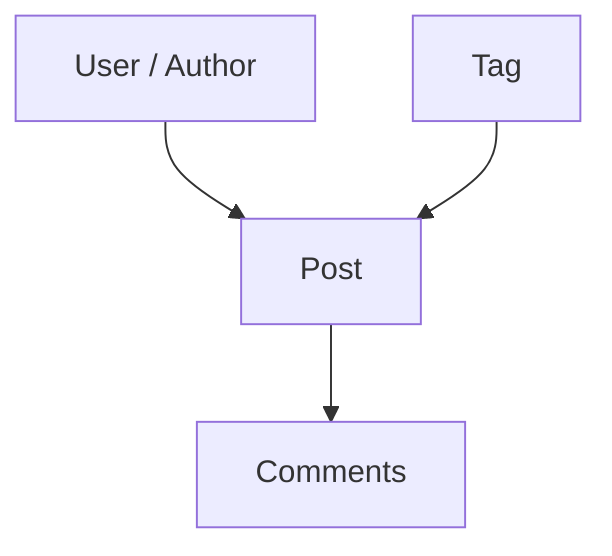

# 02 — Posts Module Roadmap

> บทนี้สร้าง Content Management feature ที่ต่อยอดจาก Users โดยเพิ่ม Search, Tag taxonomy, Author filter, Comments และ simulated CRUD พร้อมเรียนรู้วิธี reuse data จาก feature อื่นโดยไม่ทำ dependency ให้ยุ่งเหยิง

⬅️ ก่อนหน้า: [`01.users.md`](./01.users.md)  
➡️ ต่อไป: [`03.carts.md`](./03.carts.md)

---

## 1. สิ่งที่ Posts สอนเพิ่มจาก Users

Users สอน CRUD + URL state + Query Cache พื้นฐานแล้ว Posts จะเพิ่มโจทย์ใหม่:



Posts จึงเป็นตัวอย่างที่ดีของ feature ที่มีหลาย read modes:

```text
All Posts
Search Posts
Posts by Tag
Posts by User
Post Detail
Post Comments
Tags Metadata
Tag List
```

ถ้าเราใส่ทั้งหมดลง component เดียว จะบำรุงรักษายากมาก บทนี้จึงเน้นการทำให้ `PostsListInput` เป็นภาษาเดียวที่ Route, Query และ Client เข้าใจร่วมกัน

---

## 2. Official Documentation

- DummyJSON Posts: https://dummyjson.com/docs/posts
- TanStack Query Query Keys: https://tanstack.com/query/latest/docs/framework/react/guides/query-keys
- TanStack Query Mutations: https://tanstack.com/query/latest/docs/framework/react/guides/mutations
- TanStack Query Paginated Queries: https://tanstack.com/query/latest/docs/framework/react/guides/paginated-queries
- TanStack Router Search Params: https://tanstack.com/router/latest/docs/guide/search-params
- Zod: https://zod.dev/basics
- shadcn Drawer: https://ui.shadcn.com/docs/components/aria/drawer
- shadcn Dialog: https://ui.shadcn.com/docs/components/aria/dialog
- shadcn Skeleton: https://ui.shadcn.com/docs/components/aria/skeleton

---

## 3. Target Structure

```text
src/features/posts/
├── api/
│   ├── contracts.ts
│   ├── client.ts
│   ├── queries.ts
│   └── mutations.ts
├── pages/
│   ├── posts-page.tsx
│   ├── post-detail-page.tsx
│   └── post-tags-page.tsx
└── index.ts

src/routes/(protected)/_admin/posts/
├── index.tsx
├── tags.tsx
└── $postId.tsx
```

Reference directory:

- https://github.com/thehermitdev/dummyjson-example/tree/main/src/features/posts
- https://github.com/thehermitdev/dummyjson-example/tree/main/src/routes/%28protected%29/_admin/posts

---

# Phase 1 — API Inventory

## Step 1 — แยก endpoint ตาม use case

```text
GET    /posts
GET    /posts/:id
GET    /posts/search?q=...
GET    /posts/tag/:tag
GET    /posts/user/:userId
GET    /posts/tags
GET    /posts/tag-list
GET    /posts/:id/comments
POST   /posts/add
PATCH  /posts/:id
DELETE /posts/:id
```

List ยังรองรับ:

```text
limit
skip
select
sortBy
order
```

### Design Question

ทำไมไม่สร้าง function แยกเป็น `searchPosts()`, `getPostsByTag()`, `getPostsByUser()` แล้วให้ Route เลือกเอง?

ทำได้ แต่ใน application นี้เราต้องการให้ Route พูดภาษาเดียวคือ:

```text
PostsListInput
```

แล้ว Client เป็นผู้ตัดสิน endpoint จาก input ทำให้ Route ไม่ต้องรู้ transport details

---

# Phase 2 — Contracts

## Step 2 — สร้าง `src/features/posts/api/contracts.ts`

สิ่งที่ต้อง model:

- Post
- reactions
- tags
- Post list response
- tag metadata
- plain tag list
- comment
- comments response
- create input
- update input
- deleted-post response

Reference:

- [Posts contracts](https://github.com/thehermitdev/dummyjson-example/blob/main/src/features/posts/api/contracts.ts)

### Production Reasoning

อย่าใช้ schema เดียวกับทุกอย่างโดยไม่คิด เพราะ API shape ของ:

```text
/posts
/posts/tags
/posts/tag-list
/posts/:id/comments
```

ไม่เหมือนกัน การสร้าง schema ตาม boundary จริงทำให้ error message ชี้จุดถูก

### Checkpoint

- [ ] Post schema parse detail response ได้
- [ ] Posts list schema มี `posts`, `total`, `skip`, `limit`
- [ ] Tags metadata และ tag-list ถูกแยก model
- [ ] Create/Update input ไม่รับ field ที่ UI ไม่ควรแก้

---

# Phase 3 — API Client

## Step 3 — สร้าง `client.ts`

Path:

```text
src/features/posts/api/client.ts
```

Reference:

- [Posts API client](https://github.com/thehermitdev/dummyjson-example/blob/main/src/features/posts/api/client.ts)

Functions หลัก:

```text
getPosts(input, signal)
getPost(postId, signal)
getPostTags(signal)
getPostTagList(signal)
getPostComments(postId, signal)
addPost(input)
updatePost(post, input)
deletePost(postId)
```

---

## Step 4 — กำหนด read-mode precedence

Client เลือก endpoint ตามลำดับ:

```text
if q
  -> /posts/search
else if tag
  -> /posts/tag/:tag
else if userId
  -> /posts/user/:userId
else
  -> /posts
```

### ทำไมต้องชัดเจน

ถ้า URL มีทั้ง `q` และ `tag` โดยไม่กำหนด precedence เราไม่รู้ว่าควรเรียก endpoint ไหน ทำให้ cache semantics ไม่แน่นอน

Route layer ควรช่วย normalize state และ UI ควรหลีกเลี่ยงการเปิดหลาย incompatible modes พร้อมกัน

---

## Step 5 — Response normalization หลัง simulated writes

DummyJSON add/update response อาจไม่ได้เติม read-model fields ครบเหมือน GET detail

Client จึงควร normalize response ให้กลับเป็น `Post` ที่ UI ใช้ได้ เช่น default:

```text
reactions.likes = 0
reactions.dislikes = 0
views = 0
```

แล้วค่อย Zod parse ผลลัพธ์สุดท้าย

นี่คือ boundary responsibility ไม่ใช่หน้าที่ของ component

---

# Phase 4 — Query Keys + Cache Policy

## Step 6 — สร้าง `queries.ts`

Reference:

- [Posts queries](https://github.com/thehermitdev/dummyjson-example/blob/main/src/features/posts/api/queries.ts)

Key hierarchy:

```text
["posts"]
├── ["posts", "list", input]
├── ["posts", "detail", postId]
│   └── ["posts", "detail", postId, "comments"]
├── ["posts", "tags"]
└── ["posts", "tag-list"]
```

### Cache Policy

| Query | staleTime |
|---|---:|
| Posts List | 60s |
| Post Detail | 5m |
| Tags | 10m |
| Tag List | 10m |
| Comments | 2m |

### เหตุผล

Tags เปลี่ยนไม่ถี่และใช้เป็น reference data จึง cache นานกว่า list ส่วน comments เป็น relation data ที่มีโอกาสเปลี่ยนจึงสั้นกว่า detail

List ใช้ `keepPreviousData` เช่นเดียวกับ Users

---

# Phase 5 — Mutations

## Step 7 — สร้าง `mutations.ts`

Reference:

- [Posts mutations](https://github.com/thehermitdev/dummyjson-example/blob/main/src/features/posts/api/mutations.ts)

### Add

```text
mutation response
-> prepend เข้า cached post lists
-> total + 1
-> seed post detail cache
```

### Update

```text
mutation response
-> replace matching post ใน list caches
-> update detail cache
```

### Delete

```text
mutation response
-> remove จาก list caches
-> total - 1
-> remove detail query
```

### สิ่งที่ต้องระวัง

Posts มี filtered list หลายแบบ เช่น tag/author/search การ insert post ใหม่เข้า “ทุก cached list” แบบไม่ตรวจเงื่อนไขอาจไม่สมบูรณ์ใน production system

โปรเจ็กต์นี้เป็น demo backend จึงเลือก behavior ที่ทำให้ current session ดูต่อเนื่อง แต่ถ้าทำ production จริงควรกำหนด predicate ว่า post ควรปรากฏในแต่ละ active list หรือไม่

นี่เป็นจุดที่ผู้เรียนควรถามตัวเองว่า:

> “Cache patch นี้สะท้อน business rule หรือแค่ทำให้หน้าดูเปลี่ยน?”

---

# Phase 6 — Reuse Users Directory

## Step 8 — Author Selector ต้องไม่ fetch Users ซ้ำแบบ ad-hoc

Posts ต้องแสดง/เลือก Author แต่เราไม่ควรสร้าง:

```text
posts/api/users.ts
```

เพราะ Users feature มี directory query อยู่แล้ว

ใช้ public API จาก:

- [Users feature public API](https://github.com/thehermitdev/dummyjson-example/blob/main/src/features/users/index.ts)
- [Users Directory Query](https://github.com/thehermitdev/dummyjson-example/blob/main/src/features/users/api/queries.ts)

### Architecture

```text
Posts Route/Page
   ↓ public API
Users Directory Query
   ↓
Users Client
```

ไม่ควร deep-import private helper ภายใน Users โดยไม่จำเป็น

### เหตุผลของ Directory Query แยกจาก Users List

Selector ต้องการข้อมูลทั้งหมดแบบ lightweight:

```text
id
firstName
lastName
email
image
```

ไม่ควร reuse paginated table query เพราะ selector ต้องการคนทุกคน ไม่ใช่ page ปัจจุบัน

---

# Phase 7 — Posts List Route

## Step 9 — Search schema

Route:

```text
/posts
```

Path:

```text
src/routes/(protected)/_admin/posts/index.tsx
```

Reference:

- [Posts list route](https://github.com/thehermitdev/dummyjson-example/blob/main/src/routes/%28protected%29/_admin/posts/index.tsx)

Search params:

```text
page
pageSize
q
tag
userId
sortBy
order
```

ทุก input ต้องถูก Zod validate ก่อนใช้

---

## Step 10 — Prefetch แบบ non-blocking

เหมือน Users:

```text
loaderDeps(search)
-> prefetchQuery(postsListQueryOptions(search))
-> component useQuery(...)
```

เหตุผลคือ search box เป็น real-time ไม่ควร block route ทุกครั้งที่ query param เปลี่ยน

---

# Phase 8 — Posts List UI

## Step 11 — สร้าง `posts-page.tsx`

Reference:

- [Posts Page](https://github.com/thehermitdev/dummyjson-example/blob/main/src/features/posts/pages/posts-page.tsx)

UI ควรมี:

- Search input
- Tag select
- Author select
- Sort select
- Order select
- Add Post action
- Posts table
- Pagination
- Add/Edit Drawer
- Delete Dialog
- Toast feedback

---

## Step 12 — Real-time Search

Text search:

```text
input draft
-> debounce 600ms
-> replace URL ?q=...
-> page = 1
-> query key ใหม่
```

Tag/Author/Sort/Order เป็น discrete controls จึง update ทันที ไม่ต้อง debounce

### UX Rule

```text
q changes      -> debounce
select changes -> immediate
```

อย่า debounce ทุกอย่างโดยไม่จำเป็น เพราะ select interaction มี intent ชัดเจนอยู่แล้ว

---

## Step 13 — Tag URLs ต้องใช้ Router search state

ห้ามสร้าง link แบบ hard-coded browser navigation:

```text
/posts?tag=fiction
```

ผ่าน raw `<a href>`

ใช้ TanStack Router link/search API เพื่อรักษา QueryClient instance และ cache

Reference:

- [AppLink](https://github.com/thehermitdev/dummyjson-example/blob/main/src/shared/components/navigation/app-link.tsx)
- [TanStack Router + shadcn integration](https://tanstack.com/router/latest/docs/how-to/integrate-shadcn-ui)

---

# Phase 9 — Tags Page

## Step 14 — สร้าง `/posts/tags`

Route:

- [Posts Tags Route](https://github.com/thehermitdev/dummyjson-example/blob/main/src/routes/%28protected%29/_admin/posts/tags.tsx)

Page:

- [Post Tags Page](https://github.com/thehermitdev/dummyjson-example/blob/main/src/features/posts/pages/post-tags-page.tsx)

หน้านี้ต้องอธิบายความต่างของสอง endpoints:

```text
/posts/tags
-> metadata ของ tag

/posts/tag-list
-> string list สำหรับใช้งานแบบ lightweight
```

### Cache Strategy

ทั้งสองเป็น reference data จึงใช้ staleTime ยาวกว่าปกติ

### Skeleton

ถ้า cold load และ request ใช้เวลานาน ให้แสดง Tags-layout Skeleton ไม่ใช่ข้อความ `Loading...`

---

# Phase 10 — Post Detail + Comments

## Step 15 — สร้าง `/posts/$postId`

Route reference:

- [Post Detail Route](https://github.com/thehermitdev/dummyjson-example/blob/main/src/routes/%28protected%29/_admin/posts/%24postId.tsx)

Page reference:

- [Post Detail Page](https://github.com/thehermitdev/dummyjson-example/blob/main/src/features/posts/pages/post-detail-page.tsx)

### Data ที่ต้องเตรียม

```text
Post Detail
+ Comments
```

แต่ Query Keys ต้องแยกกัน เพื่อให้ comments invalidation/caching ไม่ผูกกับ post object ทั้งก้อน

```text
posts.detail(postId)
posts.comments(postId)
```

### Layout Concept

```text
Main column
- title
- body
- tags
- reactions/views

Side column
- comments
```

ถ้าทั้ง detail/comments cold load สามารถใช้ layout-matched Post Detail Skeleton

---

# Phase 11 — Author Relationship

## Step 16 — แสดง Author ที่อ่านง่าย

API ให้ `userId` แต่ UI ไม่ควรบังคับคนอ่านตัวเลขเพียงอย่างเดียว

สร้าง lookup จาก Users Directory:

```text
Map<userId, "First Last">
```

ใช้ใน:

- Posts table
- Add/Edit author selector
- Detail metadata

### Important

อย่า copy Users directory เข้า local global store อีกชั้น TanStack Query cache เป็น server-state source of truth อยู่แล้ว

---

# Phase 12 — Form + Mutation UX

## Step 17 — Add Post Drawer

Form อย่างน้อย:

```text
Title
Body
Tags
Author
```

ก่อน mutation ให้ validate input ด้วย Zod schema ของ feature

## Step 18 — Update Post Drawer

Reuse form schema/composition เดิม แต่ initialize จาก Post ปัจจุบัน

## Step 19 — Delete Dialog

ยืนยัน title ชัดเจน เช่น:

```text
Delete “Post title” from current demo session?
```

เน้นคำว่า current demo session เพื่อไม่ทำให้ผู้เรียนเข้าใจผิดว่า DummyJSON persist write จริง

---

# Phase 13 — Loading + Cache UX

## Step 20 — List

```text
Cold query
-> Table Skeleton

Existing/previous data + fetching
-> keep table
-> subtle FetchingSkeletonBar
```

## Step 21 — Detail/Tags

ใช้ Route pending component เพราะหน้านั้นต้องการ core data ก่อน render

```text
fresh cache -> no Skeleton
slow cold load -> Skeleton
```

---

# Phase 14 — Navigation Acceptance Test

ทดสอบ:

```text
/posts
-> /posts/1
-> /posts?tag=fiction
-> /posts/tags
-> /posts?tag=fiction
```

Expected:

- document ไม่ reload
- QueryClient instance เดิม
- fresh cached queries ไม่ยิง API ซ้ำโดยไม่จำเป็น
- URL back/forward ทำงาน

---

# Common Mistakes

## 1. สร้าง Authors API ซ้ำใน Posts

แก้: reuse Users Directory ผ่าน Users public API

## 2. Tag filter ใช้ local state อย่างเดียว

ผล: reload/share URL แล้ว state หาย  
แก้: tag เป็น URL search param

## 3. ทุก filter debounce 600ms

ผล: select ดูหน่วงโดยไม่จำเป็น  
แก้: debounce เฉพาะ text input

## 4. Comments รวมใน Post query key เดียว

ผล: cache lifecycle ผูกกันเกินไป  
แก้: child query key แยก

## 5. Add/Update response ใช้ทันทีโดยไม่ normalize/validate

ผล: UI อาจได้ object ที่ read-model field ไม่ครบ  
แก้: normalize ที่ client boundary แล้ว Zod parse

## 6. `<a href>` สำหรับ Tag/Post internal links

ผล: browser reload + in-memory cache หาย  
แก้: Router-aware link

---

# Definition of Done — Posts

- [ ] `/posts` render ได้
- [ ] pagination เป็น URL state
- [ ] search debounce 600ms
- [ ] tag filter immediate
- [ ] author filter immediate
- [ ] sort/order ทำงาน
- [ ] Users Directory ถูก reuse
- [ ] `keepPreviousData` ทำงานตอน list transition
- [ ] cold list มี Skeleton
- [ ] `/posts/tags` ทำงาน
- [ ] tag metadata/tag list แยก contract
- [ ] `/posts/$postId` ทำงาน
- [ ] comments มี query key/cache แยก
- [ ] Add/Update/Delete update current-session cache
- [ ] internal navigation ไม่ reload browser
- [ ] `bun run check` ผ่าน

---

# Reference Implementation Index

- [Contracts](https://github.com/thehermitdev/dummyjson-example/blob/main/src/features/posts/api/contracts.ts)
- [API Client](https://github.com/thehermitdev/dummyjson-example/blob/main/src/features/posts/api/client.ts)
- [Queries](https://github.com/thehermitdev/dummyjson-example/blob/main/src/features/posts/api/queries.ts)
- [Mutations](https://github.com/thehermitdev/dummyjson-example/blob/main/src/features/posts/api/mutations.ts)
- [Public API](https://github.com/thehermitdev/dummyjson-example/blob/main/src/features/posts/index.ts)
- [Posts Page](https://github.com/thehermitdev/dummyjson-example/blob/main/src/features/posts/pages/posts-page.tsx)
- [Post Detail](https://github.com/thehermitdev/dummyjson-example/blob/main/src/features/posts/pages/post-detail-page.tsx)
- [Tags Page](https://github.com/thehermitdev/dummyjson-example/blob/main/src/features/posts/pages/post-tags-page.tsx)
- [Posts Route](https://github.com/thehermitdev/dummyjson-example/blob/main/src/routes/%28protected%29/_admin/posts/index.tsx)
- [Tags Route](https://github.com/thehermitdev/dummyjson-example/blob/main/src/routes/%28protected%29/_admin/posts/tags.tsx)
- [Post Detail Route](https://github.com/thehermitdev/dummyjson-example/blob/main/src/routes/%28protected%29/_admin/posts/%24postId.tsx)

บทถัดไป Carts จะ intentionally ลด complexity ลง เพื่อสอนว่าทุก feature ไม่จำเป็นต้องมี mutations เพียงเพราะ Users/Posts มี
