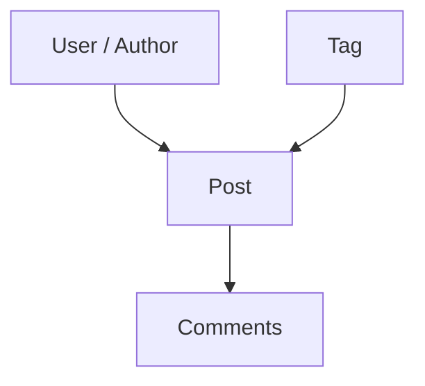

# 02 — Posts Module Roadmap

> บทนี้สร้าง Posts module ตาม Project ปัจจุบันเท่านั้น โดยต่อยอดจาก Users ด้วย Search, Tags, Author filter, Comments, simulated CRUD และการ reuse Users Directory ไม่มีการเพิ่ม capability หรือไฟล์นอก Project

⬅️ ก่อนหน้า: [`01.users.md`](./01.users.md)  
➡️ ต่อไป: [`03.carts.md`](./03.carts.md)

---

## 1. Project Files ที่ต้องเกิดในบทนี้

```text
src/features/posts/
├── api/
│   ├── client.ts
│   ├── contracts.ts
│   ├── mutations.ts
│   └── queries.ts
├── pages/
│   ├── post-detail-page.tsx
│   ├── post-tags-page.tsx
│   └── posts-page.tsx
└── index.ts

src/routes/(protected)/_admin/posts/
├── index.tsx
├── tags.tsx
└── $postId.tsx
```

References:

- [Posts feature directory](https://github.com/thehermitdev/dummyjson-example/tree/main/src/features/posts)
- [Posts routes directory](https://github.com/thehermitdev/dummyjson-example/tree/main/src/routes/%28protected%29/_admin/posts)

ไม่มี `components/` หรือ API file อื่นใน Posts Project ปัจจุบัน

---

## 2. Prerequisites จากบทก่อนหน้า

Posts ไม่ได้ยืนคนเดียว ต้องมี:

### จาก Chapter 00

```text
httpClient
ApplicationError
AppLink
RouterButton
ConfirmDeleteDialog
DataPagination
FetchingSkeletonBar
TablePageSkeleton
TagsPageSkeleton
PostDetailSkeleton
RouteErrorState
useDebouncedValue
parseNumericId
Drawer / Alert / Button primitives
```

### จาก Chapter 01

```text
usersDirectoryQueryOptions
Users public API
```

Posts ใช้ Users Directory เพื่อแสดง/เลือก Author ดังนั้นถ้า Users Directory ยังไม่ทำงาน อย่าสร้าง `posts/api/users.ts` ขึ้นมาใหม่ เพราะไฟล์นั้นไม่มีใน Project

---

## 3. เอกสารที่เกี่ยวข้อง

- DummyJSON Posts: https://dummyjson.com/docs/posts
- TanStack Query Query Keys: https://tanstack.com/query/latest/docs/framework/react/guides/query-keys
- TanStack Query Mutations: https://tanstack.com/query/latest/docs/framework/react/guides/mutations
- TanStack Query Paginated Queries: https://tanstack.com/query/latest/docs/framework/react/guides/paginated-queries
- TanStack Router Search Params: https://tanstack.com/router/latest/docs/framework/react/guide/search-params
- TanStack Router Data Loading: https://tanstack.com/router/latest/docs/framework/react/guide/data-loading
- Zod: https://zod.dev/

---

# Phase 1 — API Inventory

## Step 1 — แยก Posts use cases ให้ครบก่อนเขียน Client

Project ใช้ endpoints:

```text
GET    /posts
GET    /posts/:id
GET    /posts/search?q=...
GET    /posts/tag/:tag
GET    /posts/user/:userId
GET    /posts/tags
GET    /posts/tag-list
GET    /posts/:id/comments
POST   /posts/add
PATCH  /posts/:id
DELETE /posts/:id
```

List input ของ Project มี:

```text
page
pageSize
q?
tag?
userId?
sortBy?
order?
select?
```

Reference:

- [Posts client](https://github.com/thehermitdev/dummyjson-example/blob/main/src/features/posts/api/client.ts)

---

## Step 2 — เข้าใจความสัมพันธ์



Posts เพิ่ม complexity จาก Users เพราะ list มีหลาย read modes:

```text
All Posts
Search Posts
Posts by Tag
Posts by User
```

และยังมี read models ที่ไม่ใช่ Posts list:

```text
Post Detail
Comments
Tag metadata
Plain Tag List
```

---

# Phase 2 — Contracts

## Step 3 — สร้าง `src/features/posts/api/contracts.ts`

Reference:

- [Posts contracts](https://github.com/thehermitdev/dummyjson-example/blob/main/src/features/posts/api/contracts.ts)

ตรวจให้ครบตาม Project:

```text
Post schema
Reactions shape
Posts list response
Tag metadata schema
Tag list response
Post comment schema
Comments response
Create Post input
Update Post input
Deleted Post response
```

### เหตุผลที่ Tags ต้องมีมากกว่าหนึ่ง contract

DummyJSON มีสอง endpoints คนละ shape:

```text
/posts/tags
→ metadata objects

/posts/tag-list
→ plain string list
```

อย่ารวมเป็น schema เดียวแล้ว cast เพราะ Project แยก boundary ตาม response จริง

---

# Phase 3 — Client

## Step 4 — สร้าง `src/features/posts/api/client.ts`

Reference:

- [Posts client](https://github.com/thehermitdev/dummyjson-example/blob/main/src/features/posts/api/client.ts)

Functions ของ Project:

```text
getPosts(input, signal)
getPost(postId, signal)
getPostTags(signal)
getPostTagList(signal)
getPostComments(postId, signal)
addPost(input)
updatePost(post, input)
deletePost(postId)
```

Client ต้องใช้ shared:

- [httpClient](https://github.com/thehermitdev/dummyjson-example/blob/main/src/shared/api/http-client.ts)
- [ApplicationError](https://github.com/thehermitdev/dummyjson-example/blob/main/src/shared/errors/application-error.ts)

ห้าม import Axios ตรงจาก feature

---

## Step 5 — Read-mode precedence

Project ตัดสิน endpoint ตามลำดับ:

```text
if q
→ /posts/search

else if tag
→ /posts/tag/:tag

else if userId
→ /posts/user/:userId

else
→ /posts
```

ดังนั้นถ้า state มีทั้ง `q` กับ `tag`, search จะชนะตาม Client implementation

อย่าเพิ่ม combination endpoint เอง เพราะ Project ไม่มี

---

## Step 6 — Pagination

เหมือน Users:

```text
skip = (page - 1) * pageSize
limit = pageSize
```

Pagination transformation อยู่ transport boundary ไม่อยู่ Page component

---

## Step 7 — Simulated write normalization

DummyJSON add/update response อาจไม่คืน read-model fields ครบแบบ GET detail

Project Client จึง normalize response ก่อนปล่อยออกจาก boundary เช่นเติมค่า read fields ที่ UI ต้องใช้ แล้ว parse ผ่าน Zod อีกครั้ง

ตรวจ logic จริงที่:

- [Posts client](https://github.com/thehermitdev/dummyjson-example/blob/main/src/features/posts/api/client.ts)

อย่าย้าย normalization ไปไว้ใน Page เพราะทุก consumer ควรได้รับ `Post` ที่สมบูรณ์จาก Client

---

# Phase 4 — Query Keys และ Cache

## Step 8 — สร้าง `src/features/posts/api/queries.ts`

Reference:

- [Posts queries](https://github.com/thehermitdev/dummyjson-example/blob/main/src/features/posts/api/queries.ts)

Key hierarchy:

```text
["posts"]
├── ["posts", "list", input]
├── ["posts", "detail", postId]
│   └── ["posts", "detail", postId, "comments"]
├── ["posts", "tags"]
└── ["posts", "tag-list"]
```

Cache policy ของ Project:

| Query         | staleTime |
| ------------- | --------: |
| Posts list    | 60 วินาที |
| Post detail   |    5 นาที |
| Tags metadata |   10 นาที |
| Tag list      |   10 นาที |
| Comments      |    2 นาที |

Posts list ใช้ `placeholderData: keepPreviousData`

### เหตุผล

- List เปลี่ยนตาม search/filter/page บ่อย
- Tag reference data ค่อนข้างคงที่
- Comments เป็น relation data ที่อาจเปลี่ยนได้มากกว่า Post detail

---

# Phase 5 — Mutations

## Step 9 — สร้าง `src/features/posts/api/mutations.ts`

Reference:

- [Posts mutations](https://github.com/thehermitdev/dummyjson-example/blob/main/src/features/posts/api/mutations.ts)

Exports ของ Project:

```text
addPostMutationOptions(queryClient)
updatePostMutationOptions(queryClient)
deletePostMutationOptions(queryClient)
```

### Add

```text
ทุก cached Posts list
→ prepend post
→ จำกัดตาม current limit
→ total + 1

post detail
→ seed response
```

### Update

```text
ทุก Posts list
→ replace matching id

post detail
→ replace object
```

### Delete

```text
ทุก Posts list
→ remove matching id
→ total - 1

post detail
→ remove query
```

Project ใช้ broad list patch เช่นเดียวกับ Users อย่าเพิ่ม predicate-aware cache logic ใน implementation roadmap นี้เพราะ Project ปัจจุบันไม่ได้มี

---

# Phase 6 — Feature Public API

## Step 10 — สร้าง `src/features/posts/index.ts`

Reference:

- [Posts public API](https://github.com/thehermitdev/dummyjson-example/blob/main/src/features/posts/index.ts)

Exports จริง:

```text
Pages
├── PostsPage
├── PostDetailPage
└── PostTagsPage

Queries
├── postsListQueryOptions
├── postDetailQueryOptions
├── postTagsQueryOptions
├── postTagListQueryOptions
├── postCommentsQueryOptions
└── postsKeys

Types
├── PostsListInput
├── Post
├── PostTag
├── PostComment
└── PostsListResponse
```

Route files ควร import ผ่าน `#/features/posts`

---

# Phase 7 — Posts List Route

## Step 11 — สร้าง `src/routes/(protected)/_admin/posts/index.tsx`

Reference:

- [Posts list route](https://github.com/thehermitdev/dummyjson-example/blob/main/src/routes/%28protected%29/_admin/posts/index.tsx)

Search schema ของ Project:

```text
page       >= 1, catch 1
pageSize   5..30, catch 10
q          optional <= 120 chars
tag        optional <= 80 chars
userId     optional positive integer
sortBy     title | views | userId
order      asc | desc, catch asc
```

### Loader prefetches 3 queries แบบ non-blocking

```text
postsListQueryOptions(deps)
postTagListQueryOptions()
usersDirectoryQueryOptions()
```

เหตุผล:

- Posts table ต้องมี data
- Tag filter ต้องมี tag options
- Author filter/form ต้องมี Users Directory

---

## Step 12 — Component query composition

Route component ใช้ `useQuery` ทั้ง 3 ชุด

ถ้า data ชุดใดชุดหนึ่งยังไม่มีและยังไม่ error:

```text
→ TablePageSkeleton
```

ถ้ามี data แล้วแต่กำลัง refetch:

```text
→ render page ต่อ
→ ส่ง isFetching รวมให้ PostsPage
```

นี่ทำให้ list transition ไม่กระพริบเป็น Skeleton เต็มหน้า

---

# Phase 8 — Posts Page

## Step 13 — สร้าง `src/features/posts/pages/posts-page.tsx`

Reference:

- [Posts page](https://github.com/thehermitdev/dummyjson-example/blob/main/src/features/posts/pages/posts-page.tsx)

Foundation dependencies ที่ใช้จริง:

```text
AppLink
RouterButton
FetchingSkeletonBar
ConfirmDeleteDialog
DataPagination
Alert
Button
Drawer
useDebouncedValue
```

Users dependency:

```text
UserOption[] / Users Directory
```

UI capability ตาม Project:

- search
- tag filter
- author filter
- sort/order
- Tags navigation
- Add Post
- Posts table
- View/Edit/Delete
- pagination
- Add/Edit Drawer
- Delete Dialog
- toast/pending/error state

---

## Step 14 — Real-time Search

Text search ใช้ pattern เดียวกับ Users:

```text
local draft
→ debounce 600ms
→ URL replace
→ page reset 1
→ query key เปลี่ยน
```

Tag/Author/Sort/Order เป็น discrete control จึง update ทันทีตาม implementation

---

## Step 15 — Internal Navigation

ใช้ `AppLink` สำหรับ:

```text
/posts/tags
/posts/$postId
/posts?tag=...
```

ห้าม raw `<a href>` สำหรับ internal route เพราะจะ reload document และสร้าง QueryClient ใหม่

Reference:

- [AppLink](https://github.com/thehermitdev/dummyjson-example/blob/main/src/shared/components/navigation/app-link.tsx)

---

# Phase 9 — Tags Page

## Step 16 — สร้าง `src/features/posts/pages/post-tags-page.tsx`

Reference:

- [Post Tags page](https://github.com/thehermitdev/dummyjson-example/blob/main/src/features/posts/pages/post-tags-page.tsx)

หน้านี้ได้รับ data สอง shape:

```text
metadata tags
plain tag list
```

และใช้ Router-aware navigation กลับไป Posts list พร้อม `tag` search param

---

## Step 17 — สร้าง `src/routes/(protected)/_admin/posts/tags.tsx`

Reference:

- [Posts Tags route](https://github.com/thehermitdev/dummyjson-example/blob/main/src/routes/%28protected%29/_admin/posts/tags.tsx)

Route ใช้ blocking `Promise.all` ของ:

```text
postTagsQueryOptions()
postTagListQueryOptions()
```

Loading state:

```text
pendingComponent = TagsPageSkeleton
```

Error state:

```text
RouteErrorState
```

Tags page ไม่ใช่ real-time list จึงไม่จำเป็นต้องใช้ non-blocking `useQuery + keepPreviousData` แบบ Posts list

---

# Phase 10 — Post Detail

## Step 18 — สร้าง `src/features/posts/pages/post-detail-page.tsx`

Reference:

- [Post Detail page](https://github.com/thehermitdev/dummyjson-example/blob/main/src/features/posts/pages/post-detail-page.tsx)

Page รับข้อมูลที่ route เตรียมให้:

```text
post
comments
author display name
```

Page ไม่ควร fetch User เอง

---

## Step 19 — สร้าง `src/routes/(protected)/_admin/posts/$postId.tsx`

Reference:

- [Post Detail route](https://github.com/thehermitdev/dummyjson-example/blob/main/src/routes/%28protected%29/_admin/posts/%24postId.tsx)

Route dependencies:

```text
parseNumericId
postDetailQueryOptions
postCommentsQueryOptions
usersDirectoryQueryOptions
PostDetailSkeleton
RouteErrorState
```

Loader เตรียม 3 queries พร้อมกัน:

```text
Post detail
Post comments
Users Directory
```

จากนั้น component resolve author:

```text
post.userId
→ find user in directory
→ firstName + lastName
→ fallback User #id
```

---

# Phase 11 — Query/Cache Scenarios

## Scenario A — Posts list search

```text
q=react
→ key A

q=javascript
→ key B

กลับ q=react
→ reuse A ถ้ายัง fresh
```

## Scenario B — Tags

```text
/posts/tags
→ tags metadata cache 10m
→ tag list cache 10m

ไป /posts แล้วกลับ /posts/tags
→ ถ้า cache fresh ensureQueryData resolve จาก cache
```

## Scenario C — Post detail

```text
/posts/10
→ detail 5m
→ comments 2m
→ directory 10m
```

แต่ละ query มี lifetime ของตัวเอง แม้ route ใช้พร้อมกัน

---

# Phase 12 — Acceptance Tests

ทดสอบ:

```text
/posts
/posts?page=2&pageSize=10&order=asc
/posts?q=love
/posts?tag=history
/posts?userId=5
/posts?sortBy=views&order=desc
/posts/tags
/posts/1
```

### Search test

- ไม่มี request ต่อ keystroke ทุกตัว
- URL update หลังประมาณ 600ms
- previous table ไม่หายถ้ามี data
- query key สะท้อน `q`

### Filter test

```text
All Tags
→ tag A
→ tag B
→ tag A
```

ตรวจ cache behavior ใน Network/Query devtools

### Author test

ตรวจว่าชื่อ author มาจาก Users Directory ไม่ใช่ ad-hoc users request ใหม่ใน Posts feature

### Navigation test

```text
/posts
→ /posts/tags
→ /posts?tag=...
→ /posts/1
→ back
```

ต้องเป็น SPA navigation

---

# Phase 13 — Interim Validation

```bash
bun run format:check
bun run lint
bun run routes:generate
```

ยังไม่ใช้ `bun run check` เป็น final gate เพราะ `/dashboard` route จะสร้างในบท 05

---

## Project File Checklist — Chapter 02

```text
src/features/posts/api/client.ts
src/features/posts/api/contracts.ts
src/features/posts/api/mutations.ts
src/features/posts/api/queries.ts
src/features/posts/pages/post-detail-page.tsx
src/features/posts/pages/post-tags-page.tsx
src/features/posts/pages/posts-page.tsx
src/features/posts/index.ts
src/routes/(protected)/_admin/posts/index.tsx
src/routes/(protected)/_admin/posts/tags.tsx
src/routes/(protected)/_admin/posts/$postId.tsx
```

ต้องไม่มี Posts-owned file เพิ่มจากรายการนี้ถ้าเป้าหมายคือ reconstruct Project ปัจจุบัน

---

## Common Mistakes

### 1. Fetch Users ซ้ำใน Posts API

Project reuse `usersDirectoryQueryOptions`

### 2. รวม `/posts/tags` กับ `/posts/tag-list` เป็น contract เดียว

Response shape ต่างกัน

### 3. ใช้ Suspense List สำหรับ real-time search

Project Posts list ใช้ `useQuery + keepPreviousData`

### 4. ใช้ raw internal href สำหรับ Tags/Post detail

ทำให้ Query cache runtime หายจาก full reload

### 5. แสดง full-page Skeleton ทุก filter change

Project เก็บ previous data และใช้ subtle fetching state

### 6. เพิ่ม cache predicate reconciliation ที่ Project ไม่มี

แม้อาจเหมาะกับ production บางแบบ แต่ reconstruction นี้ต้องตาม Project implementation

---

## Definition of Done — Chapter 02

- [ ] Posts Project files ครบตาม checklist
- [ ] ไม่มี Posts file นอก Project
- [ ] Contracts แยก list/detail/tags/tag-list/comments ตาม API shape
- [ ] Client ใช้ read-mode precedence ตรง Project
- [ ] Query keys และ stale times ตรง Project
- [ ] Posts list ใช้ `keepPreviousData`
- [ ] Search debounce 600ms
- [ ] Tag/Author filters ใช้ URL state
- [ ] Users Directory ถูก reuse
- [ ] Tags route ใช้ `TagsPageSkeleton`
- [ ] Detail route ใช้ `PostDetailSkeleton` และ `parseNumericId`
- [ ] simulated CRUD patch Query Cache ตาม Project
- [ ] `bun run format:check` ผ่าน
- [ ] `bun run lint` ผ่าน

➡️ ไปต่อ [`03.carts.md`](./03.carts.md)
