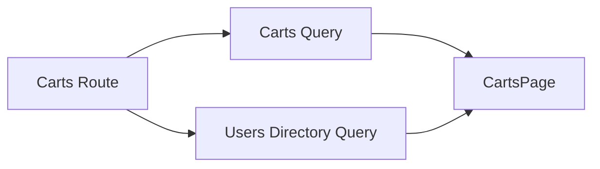

# 03 — Carts Module Roadmap

> บทนี้สร้าง Carts module ตาม Project ปัจจุบันเท่านั้น จุดสำคัญคือ Carts เป็น **read-only feature** ใน Project: มี List, filter by user และ Detail แต่ไม่มี Add/Update/Delete และไม่มี `mutations.ts`

⬅️ ก่อนหน้า: [`02.posts.md`](./02.posts.md)  
➡️ ต่อไป: [`04.todos.md`](./04.todos.md)

---

## 1. Project Files ที่ต้องเกิดในบทนี้

```text
src/features/carts/
├── api/
│   ├── client.ts
│   ├── contracts.ts
│   └── queries.ts
├── pages/
│   ├── cart-detail-page.tsx
│   └── carts-page.tsx
└── index.ts

src/routes/(protected)/_admin/carts/
├── index.tsx
└── $cartId.tsx
```

References:

- [Carts feature](https://github.com/thehermitdev/dummyjson-example/tree/main/src/features/carts)
- [Carts routes](https://github.com/thehermitdev/dummyjson-example/tree/main/src/routes/%28protected%29/_admin/carts)

สิ่งที่ **ไม่มี** ใน Project:

```text
src/features/carts/api/mutations.ts
Add Cart UI
Edit Cart UI
Delete Cart UI
```

ดังนั้นห้ามเพิ่มสิ่งเหล่านี้ใน reconstruction แม้ DummyJSON API จะมีความสามารถมากกว่าที่ Project ใช้

---

## 2. Prerequisites

จาก Chapter 00:

```text
httpClient
ApplicationError
DataPagination
AppLink
TablePageSkeleton
DetailPageSkeleton
RouteErrorState
parseNumericId
```

จาก Chapter 01:

```text
usersDirectoryQueryOptions
Users public API
```

Carts ใช้ Users Directory เพื่อแปลง `userId` ให้เป็นชื่อ Owner ทั้งใน List และ Detail

---

## 3. เอกสารที่เกี่ยวข้อง

- DummyJSON Carts: https://dummyjson.com/docs/carts
- TanStack Query: https://tanstack.com/query/latest/docs/framework/react/overview
- TanStack Query Query Keys: https://tanstack.com/query/latest/docs/framework/react/guides/query-keys
- TanStack Query Paginated Queries: https://tanstack.com/query/latest/docs/framework/react/guides/paginated-queries
- TanStack Router Search Params: https://tanstack.com/router/latest/docs/framework/react/guide/search-params
- TanStack Router Data Loading: https://tanstack.com/router/latest/docs/framework/react/guide/data-loading
- Zod: https://zod.dev/

---

# Phase 1 — เข้าใจ Cart Domain

## Step 1 — API Inventory

Project ใช้เพียง:

```text
GET /carts
GET /carts/:id
GET /carts/user/:userId
```

List input:

```text
page
pageSize
userId?
```

Reference:

- [Carts client](https://github.com/thehermitdev/dummyjson-example/blob/main/src/features/carts/api/client.ts)

### ทำไมต้องยึด use case ของ Project ไม่ใช่ API ทั้งหมด

Roadmap นี้ reconstruct application ที่มีอยู่จริง ไม่ใช่สร้าง admin สำหรับทุก DummyJSON endpoint

ดังนั้น capability ของ upstream API ที่ Project ไม่ได้ใช้ไม่ถือเป็น requirement

---

## Step 2 — Cart shape มี nested products

Cart มีโครงสร้างเชิงแนวคิด:

```text
Cart
├── id
├── userId
├── total
├── discountedTotal
├── totalProducts
├── totalQuantity
└── products[]
    ├── id
    ├── title
    ├── price
    ├── quantity
    ├── total
    ├── discountPercentage
    ├── discountedTotal
    └── thumbnail
```

ผลต่อ architecture:

- Zod ต้อง validate nested product records
- list แสดง summary
- detail แสดง product breakdown
- owner ถูก resolve จาก Users Directory

---

# Phase 2 — Contracts

## Step 3 — สร้าง `src/features/carts/api/contracts.ts`

Reference:

- [Carts contracts](https://github.com/thehermitdev/dummyjson-example/blob/main/src/features/carts/api/contracts.ts)

ตรวจให้มีเฉพาะ model ที่ Project ใช้จริง:

```text
Cart Product
Cart
Carts List Response
inferred TypeScript types
```

### Boundary rule

Nested `products[]` เป็น network data เช่นเดียวกับ outer Cart ดังนั้นต้องผ่าน Zod validation ไม่ใช่ validate Cart แล้ว cast products เอง

### Checkpoint

- [ ] `/carts` response parse ผ่าน
- [ ] `/carts/:id` response parse ผ่าน
- [ ] product ที่ shape ไม่ถูกต้องถูก reject

---

# Phase 3 — Client

## Step 4 — สร้าง `src/features/carts/api/client.ts`

Reference:

- [Carts client](https://github.com/thehermitdev/dummyjson-example/blob/main/src/features/carts/api/client.ts)

Functions ของ Project มีเพียง:

```text
getCarts(input, signal)
getCart(cartId, signal)
```

`getCarts()` ทำงานดังนี้:

```text
page/pageSize
→ limit/skip

ถ้ามี userId
→ /carts/user/:userId

ถ้าไม่มี userId
→ /carts

HTTP response
→ Zod parse
→ CartsListResponse
```

`getCart()`:

```text
cartId
→ GET /carts/:id
→ Zod parse
→ Cart
```

Client ใช้:

- [Shared httpClient](https://github.com/thehermitdev/dummyjson-example/blob/main/src/shared/api/http-client.ts)
- [ApplicationError](https://github.com/thehermitdev/dummyjson-example/blob/main/src/shared/errors/application-error.ts)

---

## Step 5 — Pagination formula

Project ใช้:

```text
limit = pageSize
skip = (page - 1) * pageSize
```

ตัวอย่าง:

```text
page = 2
pageSize = 10
→ limit = 10
→ skip = 10
```

อย่าย้าย formula ไปไว้ใน Carts Page เพราะ transport adapter เป็น owner ของ DummyJSON paging convention

---

# Phase 4 — Query Keys + Cache

## Step 6 — สร้าง `src/features/carts/api/queries.ts`

Reference:

- [Carts queries](https://github.com/thehermitdev/dummyjson-example/blob/main/src/features/carts/api/queries.ts)

Key hierarchy:

```text
["carts"]
├── ["carts", "list", input]
└── ["carts", "detail", cartId]
```

Cache Policy ของ Project:

| Query | staleTime |
| --- | ---: |
| Carts list | 60 วินาที |
| Cart detail | 5 นาที |

List ใช้:

```text
placeholderData: keepPreviousData
```

### ทำไม `userId` ต้องอยู่ใน Query Key

ข้อมูลเหล่านี้เป็นคนละ result set:

```text
/carts
/carts?userId=5
/carts?userId=10
```

ดังนั้น `input` ทั้ง object อยู่ใน list key

---

# Phase 5 — Feature Public API

## Step 7 — สร้าง `src/features/carts/index.ts`

Reference:

- [Carts public API](https://github.com/thehermitdev/dummyjson-example/blob/main/src/features/carts/index.ts)

Project export:

```text
CartsPage
CartDetailPage
cartsListQueryOptions
cartDetailQueryOptions
cartsKeys
CartsListInput
Cart
CartsListResponse
```

ไม่มี mutation export เพราะ Carts ไม่มี mutation layer

---

# Phase 6 — Carts List Route

## Step 8 — สร้าง `src/routes/(protected)/_admin/carts/index.tsx`

Reference:

- [Carts list route](https://github.com/thehermitdev/dummyjson-example/blob/main/src/routes/%28protected%29/_admin/carts/index.tsx)

Search schema:

```text
page      >= 1, catch 1
pageSize  5..30, catch 10
userId    optional positive integer
```

### Loader

Project prefetch แบบ non-blocking:

```text
cartsListQueryOptions(deps)
usersDirectoryQueryOptions()
```

ด้วย:

```text
void context.queryClient.prefetchQuery(...)
```

### Component

ใช้ `useQuery` สองชุด:

```text
Carts list
Users Directory
```

จากนั้น:

```text
ไม่มี data และไม่มี error
→ TablePageSkeleton

มี data
→ CartsPage

query กำลัง refetch
→ ส่ง isFetching ให้ Page
```

---

# Phase 7 — Users Directory ใน Carts

## Step 9 — ทำไม Carts ต้อง reuse Users

Cart API ให้เพียง:

```text
userId: 5
```

Admin UI ต้องการชื่อที่อ่านง่ายกว่า

```text
Emily Johnson
```

Route จึงโหลด Users Directory ผ่าน public API ที่สร้างใน Chapter 01

ห้ามสร้าง:

```text
src/features/carts/api/users.ts
```

เพราะไม่มีใน Project และทำให้เกิด duplicate cache ownership

Data flow:



---

# Phase 8 — Carts List Page

## Step 10 — สร้าง `src/features/carts/pages/carts-page.tsx`

Reference:

- [Carts page](https://github.com/thehermitdev/dummyjson-example/blob/main/src/features/carts/pages/carts-page.tsx)

หน้าที่ตาม Project:

```text
Heading
Owner filter
Result count
Fetching state
Cart table
Detail navigation
Pagination/page size
```

Shared dependencies ที่ Project ใช้:

```text
AppLink
DataPagination
FetchingSkeletonBar
```

### Table content

อ่าน source จริงเพื่อสร้าง columns ตาม Project ไม่เพิ่ม column ใหม่จากความเห็นส่วนตัว:

- [Carts page](https://github.com/thehermitdev/dummyjson-example/blob/main/src/features/carts/pages/carts-page.tsx)

---

## Step 11 — Owner Filter เป็น URL state

Project ใช้ `userId` ใน Route search state

Flow:

```text
เลือก User 5
→ onInputChange({ userId: 5, ...ตาม page behavior ใน source })
→ URL search เปลี่ยน
→ list key เปลี่ยน
→ getCarts เลือก /carts/user/5
```

Owner เป็น select/discrete control จึงไม่มี debounce ใน Project

---

# Phase 9 — Loading UX

## Step 12 — Cold Load

```text
ไม่มี carts data หรือ users directory
→ TablePageSkeleton
```

## Step 13 — Page/Owner Transition

List query มี `keepPreviousData`

ดังนั้นเมื่อมี previous Carts data:

```text
คง table เดิม
+ isFetching
+ FetchingSkeletonBar
```

แทนการล้างทั้งหน้าเป็น Skeleton ทุก filter change

---

# Phase 10 — Cart Detail

## Step 14 — สร้าง `src/features/carts/pages/cart-detail-page.tsx`

Reference:

- [Cart Detail page](https://github.com/thehermitdev/dummyjson-example/blob/main/src/features/carts/pages/cart-detail-page.tsx)

Page รับ:

```text
cart
owner display name
```

Page ไม่ fetch owner เอง

---

## Step 15 — สร้าง `src/routes/(protected)/_admin/carts/$cartId.tsx`

Reference:

- [Cart Detail route](https://github.com/thehermitdev/dummyjson-example/blob/main/src/routes/%28protected%29/_admin/carts/%24cartId.tsx)

Dependencies:

```text
parseNumericId
cartDetailQueryOptions
usersDirectoryQueryOptions
DetailPageSkeleton
RouteErrorState
```

Loader:

```text
cartId string
→ parseNumericId
→ Promise.all([
    ensure cart detail,
    ensure Users Directory
  ])
```

Component:

```text
useSuspenseQuery(cart)
useSuspenseQuery(users)
→ find owner by cart.userId
→ full name หรือ fallback User #id
→ CartDetailPage
```

---

# Phase 11 — Cart Detail Content

## Step 16 — Summary

สร้างตาม source จริงใน:

- [Cart Detail page](https://github.com/thehermitdev/dummyjson-example/blob/main/src/features/carts/pages/cart-detail-page.tsx)

ข้อมูลมาจาก Cart read model เช่น:

```text
Cart ID
Owner
Totals
Product/quantity counts
```

## Step 17 — Product breakdown

Nested `products[]` ถูก validate ตั้งแต่ contracts/client แล้ว Page จึงอ่านข้อมูลแต่ละ product ได้โดยไม่ cast runtime response

หลักการคือ:

```text
API boundary validate
→ UI consume typed data
```

---

# Phase 12 — ทำไมไม่มี Mutations

นี่ไม่ใช่ TODO และไม่ใช่ omission ของบท

Project ปัจจุบัน **ตั้งใจไม่มี**:

```text
carts/api/mutations.ts
```

ดังนั้น Chapter 03 ต้องหยุดที่ read capabilities จริง

ถ้าคุณสร้าง Add/Edit/Delete Cart ขึ้นมาเอง คุณไม่ได้ reconstruct Project นี้แล้ว

---

# Phase 13 — Carts สองมุมมอง

Project มีสองวิธีเข้าถึง carts ของ User:

```text
/carts?userId=5
/users/5/carts
```

แต่เป็นคนละ presentation context

### `/carts?userId=5`

```text
Commerce-centric
Carts module
→ filter owner
```

### `/users/5/carts`

```text
User-centric
User detail
→ relation panel
```

Route หลังถูกสร้างแล้วใน Chapter 01:

- [User Carts route](https://github.com/thehermitdev/dummyjson-example/blob/main/src/routes/%28protected%29/_admin/users/%24userId/carts.tsx)

ไม่ต้องรวมสอง route เพราะ Project มีทั้งคู่

---

# Phase 14 — Acceptance Tests

ทดสอบ:

```text
/carts
/carts?page=2&pageSize=10
/carts?userId=5
/carts/1
```

### Filter cache scenario

```text
All Owners
→ User 5
→ User 6
→ User 5
```

ถ้า User 5 query key ยัง fresh การกลับไปควร reuse cache ได้

### Navigation

```text
/carts
→ /carts/1
→ back
→ /carts/2
→ back
```

Internal Cart row navigation ต้องใช้ Router-aware link ไม่ full reload

### Detail

- valid numeric id เปิด detail ได้
- invalid id ถูก `parseNumericId` ปฏิเสธ
- owner แสดงชื่อจาก Users Directory เมื่อ resolve ได้

---

# Phase 15 — Interim Validation

```bash
bun run format:check
bun run lint
bun run routes:generate
```

ยังไม่ใช้ `bun run check` เป็น final gate เพราะ Dashboard route ที่ Foundation อ้างถึงจะสร้างใน Chapter 05

---

## Project File Checklist — Chapter 03

```text
src/features/carts/api/client.ts
src/features/carts/api/contracts.ts
src/features/carts/api/queries.ts
src/features/carts/pages/cart-detail-page.tsx
src/features/carts/pages/carts-page.tsx
src/features/carts/index.ts
src/routes/(protected)/_admin/carts/index.tsx
src/routes/(protected)/_admin/carts/$cartId.tsx
```

ตรวจว่า **ไม่มี**:

```text
src/features/carts/api/mutations.ts
```

---

## Common Mistakes

### 1. Copy Users module แล้วสร้าง `mutations.ts`

Project ไม่มี Carts mutations

### 2. Fetch Users เองจาก Carts feature

Project reuse Users Directory

### 3. Owner filter อยู่ local state อย่างเดียว

Project ใช้ URL search param `userId`

### 4. Detail link ใช้ raw `<a href>`

ทำให้ document reload และ cache runtime หาย

### 5. ไม่ส่ง AbortSignal ลง Carts Client

Project read queries รองรับ cancellation

### 6. สร้าง Skeleton/Pagination เฉพาะ Carts ใหม่

Project ใช้ shared infrastructure จาก Chapter 00

---

## Definition of Done — Chapter 03

- [ ] Carts Project files ครบตาม checklist
- [ ] ไม่มี mutation layer
- [ ] Contracts validate nested Cart/Product data
- [ ] Client เลือก `/carts` vs `/carts/user/:id` ตาม `userId`
- [ ] Query keys รวม list input
- [ ] List staleTime 60s + `keepPreviousData`
- [ ] Detail staleTime 5m
- [ ] List route prefetch Carts + Users Directory แบบ non-blocking
- [ ] Owner filter อยู่ URL
- [ ] Detail route ใช้ `parseNumericId` และ `DetailPageSkeleton`
- [ ] shared infrastructure มาจาก Chapter 00
- [ ] `bun run format:check` ผ่าน
- [ ] `bun run lint` ผ่าน

➡️ ไปต่อ [`04.todos.md`](./04.todos.md)
