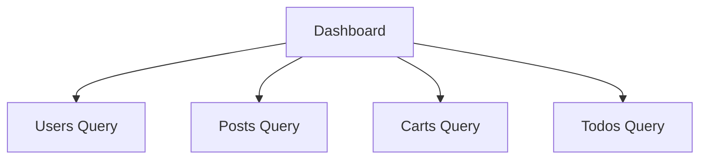
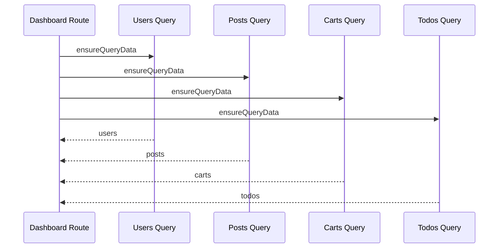

# 05 — Dashboard Integration Roadmap

> บทสุดท้ายของชุดนี้ไม่ได้สร้าง API domain ใหม่ แต่สอนวิธีประกอบ Users, Posts, Carts และ Todos ที่เราสร้างมาแล้วให้กลายเป็น Admin Dashboard โดย **reuse query options และ cache เดิม** แทนการสร้าง `/dashboard/api` ซ้ำขึ้นมาอีกชั้น

⬅️ ก่อนหน้า: [`04.todos.md`](./04.todos.md)

---

## 1. Dashboard ควรสร้างเป็นบทสุดท้ายเพราะอะไร

Dashboard เป็น consumer ของหลาย domain:



ถ้าสร้าง Dashboard ก่อน modules เรามักจะลงเอยด้วย:

```text
dashboard/api.ts
-> fetch /users
dashboard/api.ts
-> fetch /posts
dashboard/api.ts
-> fetch /carts
dashboard/api.ts
-> fetch /todos
```

เมื่อ feature จริงถูกสร้างทีหลัง จะมี data-access logic ซ้ำสองชุด

ใน architecture นี้ Dashboard ควร reuse public query APIs ที่มีอยู่แล้ว

---

## 2. เอกสารที่เกี่ยวข้อง

- TanStack Query `queryOptions`: https://tanstack.com/query/latest/docs/framework/react/reference/queryOptions
- TanStack Query QueryClient: https://tanstack.com/query/latest/docs/reference/QueryClient
- TanStack Query Suspense: https://tanstack.com/query/latest/docs/framework/react/guides/suspense
- TanStack Router Data Loading: https://tanstack.com/router/latest/docs/guide/data-loading
- TanStack Router Preloading: https://tanstack.com/router/latest/docs/guide/preloading
- TanStack Router + shadcn/ui: https://tanstack.com/router/latest/docs/how-to/integrate-shadcn-ui
- shadcn Skeleton: https://ui.shadcn.com/docs/components/aria/skeleton

---

## 3. Target Structure

Dashboard intentionally เล็ก:

```text
src/features/dashboard/
├── pages/
│   └── dashboard-page.tsx
└── index.ts

src/routes/(protected)/_admin/dashboard/
└── index.tsx
```

ไม่มี:

```text
dashboard/api/contracts.ts
dashboard/api/client.ts
dashboard/api/queries.ts
dashboard/api/mutations.ts
```

เพราะ Dashboard ไม่ได้เป็น owner ของข้อมูลเหล่านั้น

References:

- [Dashboard Feature](https://github.com/thehermitdev/dummyjson-example/tree/main/src/features/dashboard)
- [Dashboard Route](https://github.com/thehermitdev/dummyjson-example/blob/main/src/routes/%28protected%29/_admin/dashboard/index.tsx)

---

# Phase 1 — กำหนด Dashboard Questions

## Step 1 — อย่าเริ่มจาก “ต้องมี Card อะไรบ้าง”

เริ่มจากคำถามที่ Dashboard ต้องตอบ:

```text
ตอนนี้ระบบมี Users กี่คน?
มี Posts กี่รายการ?
มี Carts กี่รายการ?
มี Tasks กี่รายการ?
Users ล่าสุดที่ควรเข้าดูต่อคือใคร?
จะเข้าแต่ละ module อย่างไร?
```

จากนั้น map คำถามไป Query ที่มีอยู่แล้ว

---

# Phase 2 — Reuse Existing Query Options

## Step 2 — Users

เราต้องการ:

- total users
- preview users 5 คน

Reuse:

- [Users Queries](https://github.com/thehermitdev/dummyjson-example/blob/main/src/features/users/api/queries.ts)

Input ที่เหมาะสม:

```text
page = 1
pageSize = 5
```

Response เดียวให้ได้ทั้ง:

```text
users.total
users.users[0..4]
```

ไม่ต้องยิง query แยกเพื่อ count และ recent preview

---

## Step 3 — Posts/Carts/Todos Totals

เราต้องการแค่ `total` ไม่ได้ต้องการรายการเต็ม

จึงเรียก list query ด้วย page size เล็ก เช่น:

```text
page = 1
pageSize = 1
```

Reuse:

- [Posts Queries](https://github.com/thehermitdev/dummyjson-example/blob/main/src/features/posts/api/queries.ts)
- [Carts Queries](https://github.com/thehermitdev/dummyjson-example/blob/main/src/features/carts/api/queries.ts)
- [Todos Queries](https://github.com/thehermitdev/dummyjson-example/blob/main/src/features/todos/api/queries.ts)

### Production Principle

ถ้า backend จริงมี aggregation endpoint ที่ถูกกว่า เช่น `/metrics`, `/dashboard-summary` การใช้ endpoint เฉพาะอาจดีกว่า

แต่เมื่อ upstream API ไม่มี endpoint ดังกล่าว การ reuse existing list contracts เป็นทางเลือกที่ลด duplication

---

# Phase 3 — Route-level Data Orchestration

## Step 4 — สร้าง `/dashboard`

Path:

```text
src/routes/(protected)/_admin/dashboard/index.tsx
```

Reference:

- [Dashboard Route](https://github.com/thehermitdev/dummyjson-example/blob/main/src/routes/%28protected%29/_admin/dashboard/index.tsx)

Route import query options ผ่าน feature public APIs:

```text
#/features/users
#/features/posts
#/features/carts
#/features/todos
```

ไม่ import Axios และไม่รู้ endpoint URL

---

## Step 5 — Loader ใช้ `Promise.all`

ข้อมูล 4 domain ไม่ได้มี dependency ต่อกัน จึงโหลดพร้อมกัน:



Conceptually:

```text
Promise.all([
  users query,
  posts query,
  carts query,
  todos query,
])
```

### ทำไม Dashboard ใช้ blocking loader ได้ แต่ Search Lists ใช้ non-blocking prefetch

List Search:

```text
user เปลี่ยน query บ่อย
-> ต้องรักษา previous table
-> useQuery + keepPreviousData
```

Dashboard:

```text
หน้า overview ต้องการ metrics หลักพร้อมกัน
-> route-level loading เหมาะกว่า
-> ensureQueryData + pending Skeleton
```

นี่คือเหตุผลที่ data-loading strategy ไม่ควรถูก copy แบบเดียวทุก route

---

# Phase 4 — Suspense Query Consumption

## Step 6 — ใช้ query options ชุดเดียวกันใน loader และ component

Route loader และ component ต้องอ้าง `usersListQueryOptions(usersInput)` ชุดเดียวกัน

ข้อดี:

```text
loader seed Query Cache
      ↓
component useSuspenseQuery
      ↓
same Query Key
      ↓
read cache instead of duplicate contract
```

Reference implementation แสดง pattern นี้ชัดเจน:

- [Dashboard Route](https://github.com/thehermitdev/dummyjson-example/blob/main/src/routes/%28protected%29/_admin/dashboard/index.tsx)

---

# Phase 5 — Dashboard View Model

## Step 7 — อย่าส่ง raw query objects ทั้งหมดให้ Presentation Page

`DashboardPage` ไม่จำเป็นต้องรู้ `skip`, `limit`, query status หรือ cache implementation

Route แปลงข้อมูลเป็น view model:

```text
totals
├── users
├── posts
├── carts
└── todos

recentUsers[]
├── id
├── firstName
├── lastName
├── email
└── image
```

ทำให้ presentation component ง่ายและ testable กว่า

Reference:

- [Dashboard Page](https://github.com/thehermitdev/dummyjson-example/blob/main/src/features/dashboard/pages/dashboard-page.tsx)

---

# Phase 6 — Dashboard Feature Public API

## Step 8 — สร้าง `src/features/dashboard/index.ts`

Dashboard feature ต้อง export แค่ page ที่ route ใช้

Reference:

- [Dashboard Public API](https://github.com/thehermitdev/dummyjson-example/blob/main/src/features/dashboard/index.ts)

### ทำไมไม่มี API public exports

เพราะ Dashboard ไม่มี data ownership ของตัวเอง

---

# Phase 7 — Metric Cards

## Step 9 — สร้าง 4 Cards

```text
Users
Posts
Carts
Tasks
```

แต่ละ Card ต้องทำสองหน้าที่:

1. แสดง total
2. เป็น navigation entry point

### Link behavior

ใช้ `AppLink` พร้อม canonical initial search state

Users:

```text
/users?page=1&pageSize=10&order=asc
```

Posts:

```text
/posts?page=1&pageSize=10&order=asc
```

Carts:

```text
/carts?page=1&pageSize=10
```

Todos:

```text
/todos?page=1&pageSize=10
```

Reference:

- [Dashboard Page](https://github.com/thehermitdev/dummyjson-example/blob/main/src/features/dashboard/pages/dashboard-page.tsx)

### ทำไมใส่ canonical search params

List routes มี validated search schema การส่ง initial state ชัดเจนช่วย:

- type-safe navigation
- deterministic URL state
- deterministic query input

---

# Phase 8 — Recent Users

## Step 10 — สร้าง lightweight preview

แสดง 5 users พร้อม:

- avatar
- full name
- email

แต่ละ row link ไป:

```text
/users/$userId
```

ใช้ Router-aware `AppLink`

### Cache Benefit

Dashboard query ใช้ Users list อยู่แล้ว เมื่อ user ไป Users module หรือ user detail บาง cache อาจถูก reuse ตาม query key/stale policy

อย่างน้อยการ navigation จะไม่ทำ full browser reload และ QueryClient instance จะไม่ถูกสร้างใหม่

---

# Phase 9 — Admin Model Explanation

## Step 11 — Dashboard ควรสื่อ domain relationship

นอกจาก metrics ควรมี section ที่บอก mental model ของระบบ:

```text
Users are central entities
Posts are authored by users
Carts belong to users
Tasks are assigned to users
```

นี่ทำให้ Dashboard ไม่ใช่แค่ “ตัวเลขสวย ๆ” แต่ช่วย orient ผู้ใช้ใหม่

---

# Phase 10 — Skeleton

## Step 12 — DashboardPageSkeleton

Route กำหนด:

```text
pendingComponent = DashboardPageSkeleton
```

Reference:

- [API Skeletons](https://github.com/thehermitdev/dummyjson-example/blob/main/src/shared/components/api-skeletons.tsx)

Skeleton ควร match layout:

```text
Heading skeleton
4 metric card skeletons
Recent users panel skeleton
Admin model panel skeleton
```

### Rule

Fresh cache:

```text
ensureQueryData resolves from cache
-> route render
-> ไม่ควรเห็น Skeleton
```

Cold/slow request:

```text
pending threshold passed
-> Dashboard Skeleton
```

---

# Phase 11 — Error Handling

## Step 13 — Route Error State

ถ้า query ใด query หนึ่งใน `Promise.all` fail ให้ route error boundary แสดง readable error + retry

Reference:

- [Route Error State](https://github.com/thehermitdev/dummyjson-example/blob/main/src/shared/components/route-state.tsx)

### Trade-off

`Promise.all` หมายความว่า Dashboard core data ถูกมองเป็นหนึ่งชุด หากหนึ่ง query fail หน้า overview fail ทั้งหน้า

Production dashboard ที่ต้องการ partial availability อาจใช้ independent widgets/error boundaries แยกกัน

ในโปรเจ็กต์นี้เลือก all-or-nothing เพราะ implementation และ mental model ชัดกว่า

---

# Phase 12 — Cache Reuse Scenarios

## Step 14 — Scenario A: Dashboard -> Users -> Dashboard

```text
/dashboard
  -> Users preview query cached

/users
  -> list input อาจต่างจาก dashboard preview จึงเป็นคนละ list key

/dashboard
  -> dashboard preview key ยัง fresh
  -> reuse cache
```

## Step 15 — Scenario B: Dashboard -> Post module -> Dashboard

Posts total query ใช้:

```text
posts list page 1 / pageSize 1
```

เมื่อกลับ Dashboard ภายใน staleTime ไม่ต้อง refetch โดยไม่จำเป็น

## Step 16 — Identity Change

ถ้า Clerk user เปลี่ยน:

```text
AppRouterProvider
-> queryClient.clear()
```

Dashboard จึงไม่ reuse cache จาก identity ก่อนหน้า

Reference:

- [Router Provider](https://github.com/thehermitdev/dummyjson-example/blob/main/src/app/router/router-provider.tsx)

---

# Phase 13 — Navigation Integrity

## Step 17 — ห้าม Metric Card ใช้ raw `<a href>`

หากใช้:

```text
<a href="/users">
```

จะทำ:

```text
document reload
-> React bootstrap ใหม่
-> QueryClient ใหม่
-> in-memory cache หาย
```

ใช้:

- [AppLink](https://github.com/thehermitdev/dummyjson-example/blob/main/src/shared/components/navigation/app-link.tsx)
- [TanStack Router + shadcn guide](https://tanstack.com/router/latest/docs/how-to/integrate-shadcn-ui)

Dashboard เป็นหนึ่งในหน้าที่เห็นผลของ router-aware navigation ชัดที่สุด เพราะมัน warm caches หลาย domain ไว้แล้ว

---

# Phase 14 — Responsive Layout

## Step 18 — Metric Grid

แนวคิด:

```text
mobile   -> 1 column
small    -> 2 columns
wide     -> 4 columns
```

## Step 19 — Lower Content

```text
mobile/tablet -> stacked
wide          -> recent users + admin model side-by-side
```

อย่าออกแบบ Dashboard desktop-only เพราะ Admin shell รองรับ mobile sidebar อยู่แล้ว

---

# Phase 15 — Accessibility

## Step 20 — Cards ที่คลิกได้ต้องเป็น Link semantics

อย่าทำ clickable `<div onClick>` ถ้า destination เป็น URL

Router-aware link ช่วยให้:

- keyboard activation
- link semantics
- open in new tab behavior ตาม browser
- accessibility ดีขึ้น

## Step 21 — Images

Recent user avatar ถ้า name ถูกแสดงข้างกันอยู่แล้ว สามารถใช้ empty alt เพื่อไม่ให้ screen readerอ่านข้อมูลซ้ำ

---

# Phase 16 — Acceptance Test

## Dashboard Cold Load

```text
เปิด /dashboard ครั้งแรก
-> ถ้าช้าเห็น Skeleton
-> metrics 4 modules ปรากฏ
-> recent users ปรากฏ
```

## Navigation

```text
Dashboard -> Users -> Dashboard
Dashboard -> Posts -> Dashboard
Dashboard -> Carts -> Dashboard
Dashboard -> Tasks -> Dashboard
```

Expected:

- ไม่มี full document reload
- sidebar/admin shell ไม่ bootstrap ใหม่
- QueryClient instance เดิม
- fresh dashboard queries reuse cache

## User Preview

```text
Dashboard -> Recent User #1 -> Back
```

Expected:

- typed dynamic route
- no browser reload

---

# Phase 17 — สิ่งที่ไม่ควรใส่ใน Dashboard

## 1. Duplicate HTTP Client

ไม่สร้าง:

```text
dashboard/api/client.ts
```

เพื่อยิง endpoints ของ modules อื่นซ้ำ

## 2. Duplicate Zod Contracts

อย่า copy User/Post/Cart/Todo schema เข้า Dashboard

## 3. Global Store สำหรับ Metrics

ข้อมูล API อยู่ใน Query Cache แล้ว ไม่ต้อง copy ไป Zustand/Context เพียงเพื่อ Dashboard

## 4. Business Mutations

Dashboard overview ไม่ควรเป็น owner ของ mutation logic ของแต่ละ domain

---

# Phase 18 — Production Extension Ideas

เมื่อเข้าใจ baseline แล้ว Dashboard สามารถต่อยอดได้ เช่น:

### Independent Widgets

แต่ละ metric widget ใช้ error/loading boundary แยก

### Server Aggregation Endpoint

ถ้า backend จริงรองรับ:

```text
GET /dashboard/summary
```

อาจลดจำนวน requests

### Role-aware Dashboard

ใช้ authorization จาก backend เพื่อกำหนด widgets ที่ user แต่ละ role เห็น

### Prefetch Navigation

ใช้ Router intent preloading สำหรับ module cards

### Analytics

สามารถเพิ่ม event tracking ที่ navigation boundary โดยไม่ผูกกับ API clients

แต่ทุก enhancement ควรเกิดหลัง baseline architecture ทำงานครบก่อน

---

# Common Mistakes

## 1. Dashboard สร้าง API layer ใหม่ทั้งหมด

แก้: reuse feature queries

## 2. Query totals โดยโหลดข้อมูลทั้งหมด

แก้: ขอ page size เล็กเมื่อ API response มี `total`

## 3. Route ส่ง raw Query objects ให้ UI

แก้: map เป็น view model

## 4. Metric cards ใช้ `<a href>`

แก้: AppLink

## 5. Dashboard ต้องการทุก query แต่โหลดทีละอัน

แก้: independent queries เตรียมพร้อมแบบ parallel

## 6. Skeleton ไม่ตรง layout

แก้: layout-matched Dashboard Skeleton

## 7. Copy server data เข้า global store

แก้: Query Cache เป็น server-state source of truth

---

# Definition of Done — Dashboard

- [ ] `/dashboard` route ทำงาน
- [ ] totals ของ Users/Posts/Carts/Tasks แสดงได้
- [ ] recent users แสดงได้
- [ ] ไม่มี Dashboard-specific duplicate API client
- [ ] query options reuse จาก feature public APIs
- [ ] loader เตรียม independent queries พร้อมกัน
- [ ] component อ่าน query keys เดียวกับ loader
- [ ] route มี Dashboard Skeleton
- [ ] route มี error state
- [ ] module cards ใช้ router-aware links
- [ ] list destinations ได้ canonical search params
- [ ] Recent User links เป็น typed dynamic navigation
- [ ] fresh cache ถูก reuse ตอนย้อนกลับ
- [ ] responsive layout ทำงาน
- [ ] `bun run check` ผ่าน

---

# Reference Implementation Index

- [Dashboard Public API](https://github.com/thehermitdev/dummyjson-example/blob/main/src/features/dashboard/index.ts)
- [Dashboard Page](https://github.com/thehermitdev/dummyjson-example/blob/main/src/features/dashboard/pages/dashboard-page.tsx)
- [Dashboard Route](https://github.com/thehermitdev/dummyjson-example/blob/main/src/routes/%28protected%29/_admin/dashboard/index.tsx)
- [Users Queries](https://github.com/thehermitdev/dummyjson-example/blob/main/src/features/users/api/queries.ts)
- [Posts Queries](https://github.com/thehermitdev/dummyjson-example/blob/main/src/features/posts/api/queries.ts)
- [Carts Queries](https://github.com/thehermitdev/dummyjson-example/blob/main/src/features/carts/api/queries.ts)
- [Todos Queries](https://github.com/thehermitdev/dummyjson-example/blob/main/src/features/todos/api/queries.ts)
- [Shared Skeletons](https://github.com/thehermitdev/dummyjson-example/blob/main/src/shared/components/api-skeletons.tsx)
- [Router-aware AppLink](https://github.com/thehermitdev/dummyjson-example/blob/main/src/shared/components/navigation/app-link.tsx)
- [Router Provider / cache isolation](https://github.com/thehermitdev/dummyjson-example/blob/main/src/app/router/router-provider.tsx)

---

# Course Completion Checklist

เมื่อจบบท 05 ให้ย้อนตรวจทั้งหลักสูตร:

```text
00 Foundation
  ✓ App composition
  ✓ Router
  ✓ Query
  ✓ Clerk
  ✓ HTTP/Zod
  ✓ shadcn shell
  ✓ Skeleton/navigation/cache foundation

01 Users
  ✓ central entity
  ✓ search/filter/sort
  ✓ detail/relations
  ✓ simulated CRUD

02 Posts
  ✓ search/tag/author
  ✓ comments
  ✓ simulated CRUD

03 Carts
  ✓ read-only feature
  ✓ owner filter
  ✓ cart detail

04 Todos
  ✓ task management
  ✓ assignee
  ✓ simulated CRUD/reassignment

05 Dashboard
  ✓ cross-feature composition
  ✓ query reuse
  ✓ cache reuse
```

จากจุดนี้คุณไม่ได้แค่ “ทำ DummyJSON Admin ตามตัวอย่างได้” แต่ควรเข้าใจวิธีสร้าง production-oriented React SPA ที่มี boundary และ ownership ชัดเจนตั้งแต่โปรเจ็กต์ว่างจนประกอบหลาย domain เข้าด้วยกัน
