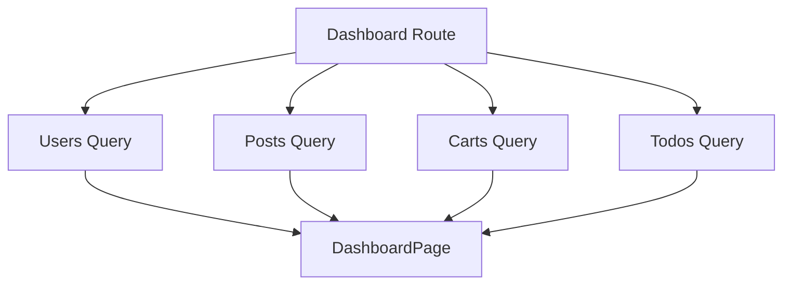
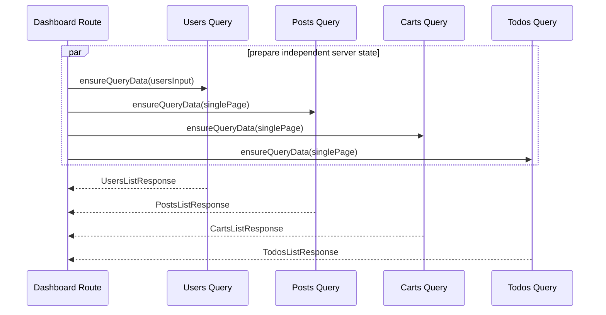

# 05 — Dashboard Integration Roadmap

> บทสุดท้ายสร้าง Dashboard ตาม Project ปัจจุบันโดย **ไม่สร้าง Dashboard API layer ใหม่** Dashboard เป็น consumer ของ Users, Posts, Carts และ Todos queries ที่สร้างในบทก่อนหน้า เมื่อจบบทนี้ file-based route tree จะครบตาม Project และเราจึงใช้ `bun run check` เป็น final reconstruction gate

⬅️ ก่อนหน้า: [`04.todos.md`](./04.todos.md)

---

## 1. Project Files ที่ต้องเกิดในบทนี้

Dashboard ของ Project มีเพียง 3 files:

```text
src/features/dashboard/
├── pages/
│   └── dashboard-page.tsx
└── index.ts

src/routes/(protected)/_admin/dashboard/
└── index.tsx
```

References:

- [Dashboard feature](https://github.com/thehermitdev/dummyjson-example/tree/main/src/features/dashboard)
- [Dashboard route](https://github.com/thehermitdev/dummyjson-example/blob/main/src/routes/%28protected%29/_admin/dashboard/index.tsx)

Project **ไม่มี**:

```text
src/features/dashboard/api/contracts.ts
src/features/dashboard/api/client.ts
src/features/dashboard/api/queries.ts
src/features/dashboard/api/mutations.ts
```

ห้ามสร้าง files เหล่านี้ เพราะ Dashboard ไม่ได้เป็น owner ของ Users/Posts/Carts/Todos data

---

## 2. ทำไม Dashboard อยู่บทสุดท้าย

Dashboard เป็น integration layer ของ 4 domain modules:



ถ้าสร้าง Dashboard ก่อน modules เราจะไม่มี public query APIs ให้ reuse และอาจเผลอสร้าง duplicate fetching logic

ลำดับของ roadmap จึงเป็น:

```text
00 Foundation
→ 01 Users
→ 02 Posts
→ 03 Carts
→ 04 Todos
→ 05 Dashboard
```

หลัง Chapter 05 เราจึงมีทุก route ที่ Foundation `AppSidebar` และ public `/` route อ้างถึง

---

## 3. Prerequisites

จาก Chapter 00:

```text
AppLink
DashboardPageSkeleton
RouteErrorState
Admin shell
Router/QueryClient composition
```

จาก Chapter 01:

```text
usersListQueryOptions
```

จาก Chapter 02:

```text
postsListQueryOptions
```

จาก Chapter 03:

```text
cartsListQueryOptions
```

จาก Chapter 04:

```text
todosListQueryOptions
```

ถ้าขาด query ใด query หนึ่ง อย่าสร้าง dashboard-specific replacement ให้ย้อนกลับไปแก้ chapter ที่เป็น owner ของ domain นั้น

---

## 4. เอกสารที่เกี่ยวข้อง

- TanStack Query `queryOptions`: https://tanstack.com/query/latest/docs/framework/react/reference/queryOptions
- TanStack Query QueryClient: https://tanstack.com/query/latest/docs/reference/QueryClient
- TanStack Query Suspense: https://tanstack.com/query/latest/docs/framework/react/guides/suspense
- TanStack Router Data Loading: https://tanstack.com/router/latest/docs/framework/react/guide/data-loading
- TanStack Router Preloading: https://tanstack.com/router/latest/docs/framework/react/guide/preloading
- TanStack Router + shadcn: https://tanstack.com/router/latest/docs/how-to/integrate-shadcn-ui

---

# Phase 1 — Dashboard Questions

## Step 1 — ดูสิ่งที่ Project Dashboard ต้องตอบ

Project Dashboard สรุป:

```text
Users มีทั้งหมดเท่าไร?
Posts มีทั้งหมดเท่าไร?
Carts มีทั้งหมดเท่าไร?
Tasks มีทั้งหมดเท่าไร?
Users 5 คนแรกที่ใช้เป็น recent preview คือใครบ้าง?
จะเข้าแต่ละ module อย่างไร?
```

ไม่มี chart API, analytics endpoint หรือ dashboard-specific backend contract ใน Project

---

# Phase 2 — Query Inputs ที่ Project ใช้จริง

## Step 2 — Users preview input

Dashboard route กำหนด:

```text
usersInput = {
  page: 1,
  pageSize: 5
}
```

Response เดียวให้ข้อมูลสองอย่าง:

```text
users.total
→ total Users

users.users
→ recentUsers 5 records
```

ไม่ยิง Users query แยกอีก request สำหรับ total

Reference:

- [Dashboard route](https://github.com/thehermitdev/dummyjson-example/blob/main/src/routes/%28protected%29/_admin/dashboard/index.tsx)

---

## Step 3 — Posts/Carts/Todos total input

Project ใช้ object เดียว:

```text
singlePage = {
  page: 1,
  pageSize: 1
}
```

แล้ว reuse กับ:

```text
postsListQueryOptions(singlePage)
cartsListQueryOptions(singlePage)
todosListQueryOptions(singlePage)
```

เพราะ Dashboard ต้องการ `total` แต่ไม่ต้องโหลด list ขนาดใหญ่

นี่คือ behavior ของ Project ปัจจุบัน ไม่ต้องสร้าง `/metrics` หรือ `/dashboard-summary`

---

# Phase 3 — Dashboard Route

## Step 4 — สร้าง `src/routes/(protected)/_admin/dashboard/index.tsx`

Reference:

- [Dashboard route](https://github.com/thehermitdev/dummyjson-example/blob/main/src/routes/%28protected%29/_admin/dashboard/index.tsx)

Imports มาจาก feature public APIs:

```text
#/features/users
#/features/posts
#/features/carts
#/features/todos
#/features/dashboard
```

Route ไม่ import Axios และไม่รู้ DummyJSON endpoint path

---

## Step 5 — Loader ใช้ `Promise.all`

Project loader:

```text
Promise.all([
  ensure Users preview,
  ensure Posts total query,
  ensure Carts total query,
  ensure Todos total query
])
```

Data ทั้ง 4 domains ไม่มี dependency ต่อกัน จึงเตรียมพร้อมกัน



### ทำไม Dashboard block route ได้

Dashboard ไม่ใช่ input-driven real-time list

```text
Users/Posts list
→ search/filter เปลี่ยนบ่อย
→ non-blocking prefetch + useQuery + keepPreviousData

Dashboard
→ core metrics 4 กลุ่มควรพร้อมก่อน render overview
→ ensureQueryData + useSuspenseQuery
```

Project จึงใช้ data-loading strategy ต่างกันตาม screen behavior

---

## Step 6 — Pending และ Error State

Route กำหนด:

```text
pendingComponent = DashboardPageSkeleton
errorComponent = RouteErrorState
```

References:

- [DashboardPageSkeleton](https://github.com/thehermitdev/dummyjson-example/blob/main/src/shared/components/api-skeletons.tsx)
- [RouteErrorState](https://github.com/thehermitdev/dummyjson-example/blob/main/src/shared/components/route-state.tsx)

Router Foundation มี:

```text
defaultPendingMs = 300
defaultPendingMinMs = 400
```

ดังนั้น fast cache/navigation ไม่จำเป็นต้อง flash Skeleton แต่ cold/slow route มี layout-matched loading state

---

# Phase 4 — Query Consumption

## Step 7 — Component ใช้ query options ชุดเดิม

หลัง loader เตรียม cache แล้ว Dashboard route component ใช้:

```text
useSuspenseQuery(usersListQueryOptions(usersInput))
useSuspenseQuery(postsListQueryOptions(singlePage))
useSuspenseQuery(cartsListQueryOptions(singlePage))
useSuspenseQuery(todosListQueryOptions(singlePage))
```

จุดสำคัญคือ **query options และ query key ต้องชุดเดียวกับ loader**

Flow:

```text
loader ensureQueryData(options)
→ Query Cache
→ component useSuspenseQuery(options)
→ อ่าน cache entry เดียวกัน
```

ไม่สร้าง fetch contract ซ้ำใน component

---

# Phase 5 — View Model

## Step 8 — Route แปลง query responses ก่อนส่ง Page

`DashboardPage` ไม่ต้องรู้:

```text
skip
limit
query status
query cache internals
```

Route ส่ง view model สั้น ๆ:

```text
totals
├── users
├── posts
├── carts
└── todos

recentUsers[]
├── id
├── firstName
├── lastName
├── email
└── image
```

Project map `users.users` ด้วย fields เหล่านี้โดยตรง

Reference:

- [Dashboard route](https://github.com/thehermitdev/dummyjson-example/blob/main/src/routes/%28protected%29/_admin/dashboard/index.tsx)

---

# Phase 6 — Dashboard Page

## Step 9 — สร้าง `src/features/dashboard/pages/dashboard-page.tsx`

Reference:

- [Dashboard page](https://github.com/thehermitdev/dummyjson-example/blob/main/src/features/dashboard/pages/dashboard-page.tsx)

Props ของ Project:

```text
totals: {
  users
  posts
  carts
  todos
}

recentUsers: Array<{
  id
  firstName
  lastName
  email
  image
}>
```

Page ไม่มี React Query hooks และไม่มี Axios

มันเป็น presentation component ที่ได้รับข้อมูลพร้อมใช้จาก Route

---

# Phase 7 — Metric Cards

## Step 10 — สร้าง Cards 4 modules

Project มี:

```text
Users
Posts
Carts
Tasks
```

แต่ละ Card แสดง total และเป็น internal navigation link

ใช้ `AppLink` ไม่ raw anchor

### Canonical search state ตาม Project

Users:

```text
/users
search = {
  page: 1,
  pageSize: 10,
  order: "asc"
}
```

Posts:

```text
/posts
search = {
  page: 1,
  pageSize: 10,
  order: "asc"
}
```

Carts:

```text
/carts
search = {
  page: 1,
  pageSize: 10
}
```

Todos:

```text
/todos
search = {
  page: 1,
  pageSize: 10
}
```

Reference:

- [Dashboard page](https://github.com/thehermitdev/dummyjson-example/blob/main/src/features/dashboard/pages/dashboard-page.tsx)

### เหตุผลของ explicit search state

List routes มี validated search schemas การส่ง initial values ทำให้ typed navigation และ query input ชัดเจนตาม Project

---

# Phase 8 — Recent Users

## Step 11 — Render User preview

Project แสดง Users 5 records จาก query เดียวกับ total Users

แต่ละ row มี:

```text
avatar
full name
email
```

และ link:

```text
/users/$userId
params = { userId: String(user.id) }
```

ใช้ `AppLink`

### Cache note

Dashboard Users query key ใช้ `pageSize: 5` ส่วน Users main page ปกติใช้ `pageSize: 10` จึงเป็นคนละ list cache key นี่เป็น behavior ที่ถูกต้องตาม key design

---

# Phase 9 — Admin Model Panel

## Step 12 — สร้าง relationship explanation ตาม Project

Dashboard Page มี panel อธิบาย mental model:

```text
Users เป็น central entity
Posts authored by users
Carts belong to users
Tasks assigned to users
```

และมี links:

```text
Manage users
Review content
Manage tasks
```

ทั้งหมดใช้ `AppLink` พร้อม canonical search state ตาม Page source

นี่เป็น UI ที่มีอยู่จริงใน Project จึงเป็นส่วนหนึ่งของ reconstruction ไม่ใช่เนื้อหาเสริม

---

# Phase 10 — Feature Public API

## Step 13 — สร้าง `src/features/dashboard/index.ts`

ไฟล์ Project จริงมีเพียง:

```ts
export { DashboardPage } from "./pages/dashboard-page";
```

Reference:

- [Dashboard index](https://github.com/thehermitdev/dummyjson-example/blob/main/src/features/dashboard/index.ts)

อย่า export query/client ของ Dashboard เพราะไม่มีไฟล์เหล่านั้น

---

# Phase 11 — Cache Scenarios

## Scenario A — Dashboard → Dashboard

ครั้งแรก:

```text
4 query keys อาจ cold
→ loader ensure data
→ DashboardPageSkeleton หาก pending นานพอ
```

กลับ Dashboard ภายใน stale windows:

```text
ensureQueryData
→ resolve จาก fresh cache
→ render โดยไม่จำเป็นต้อง request ใหม่
```

## Scenario B — Dashboard → Users → Dashboard

Dashboard Users key:

```text
{ page: 1, pageSize: 5 }
```

Users main page initial key:

```text
{ page: 1, pageSize: 10, order: "asc" }
```

เป็นคนละ cache entries

แต่เมื่อกลับ Dashboard key เดิมยังสามารถ reuse ได้ถ้ายัง fresh

## Scenario C — Dashboard → Posts/Carts/Todos → Dashboard

Dashboard total queriesใช้ `pageSize: 1`

Module list pagesใช้ `pageSize: 10`

จึงเป็นคนละ list keys แต่ Dashboard keys ยังเก็บอยู่ตาม Query cache policy

## Scenario D — Clerk identity เปลี่ยน

Chapter 00 `AppRouterProvider` ทำ:

```text
previous userId !== current userId
→ queryClient.clear()
```

ดังนั้น Dashboard cache ไม่ถูก reuse ข้าม Clerk identity

---

# Phase 12 — Acceptance Tests

## Step 14 — เปิด Dashboard

ทดสอบ:

```text
/dashboard
```

ตรวจ:

- Users total
- Posts total
- Carts total
- Tasks total
- recent Users
- Admin model panel

## Step 15 — Metric navigation

```text
/dashboard
→ Users card
→ back
→ Posts card
→ back
→ Carts card
→ back
→ Tasks card
→ back
```

ทุก navigation ต้องเป็น SPA navigation

## Step 16 — Recent User

```text
/dashboard
→ click recent user
→ /users/:userId
```

User Detail route จาก Chapter 01 ต้องทำงานพร้อม detail Skeleton/cache behavior

---

# Phase 13 — ตอนนี้ Route Tree ครบ Project แล้ว

หลังสร้าง Dashboard files บทนี้ physical route structure ต้องเป็น:

```text
src/routes/
├── __root.tsx
├── index.tsx
└── (protected)/
    └── _admin/
        ├── route.tsx
        ├── dashboard/
        │   └── index.tsx
        ├── users/
        │   ├── index.tsx
        │   └── $userId/
        │       ├── route.tsx
        │       ├── index.tsx
        │       ├── posts.tsx
        │       ├── carts.tsx
        │       └── todos.tsx
        ├── posts/
        │   ├── index.tsx
        │   ├── tags.tsx
        │   └── $postId.tsx
        ├── carts/
        │   ├── index.tsx
        │   └── $cartId.tsx
        └── todos/
            ├── index.tsx
            └── $todoId.tsx
```

นี่คือจุดแรกของ roadmap ที่ Foundation forward references มี route targets ครบทั้งหมด

---

# Phase 14 — Final Quality Gate

## Step 17 — Generate Route Tree

```bash
bun run routes:generate
```

`src/routeTree.gen.ts` จะถูกสร้าง แต่ Project `.gitignore` และ `.prettierignore` ไม่ให้ commit/format ไฟล์นี้

ห้ามแก้ generated file ด้วยมือ

---

## Step 18 — Run Full Project Check

ตอนนี้จึงใช้:

```bash
bun run check
```

คำสั่งนี้รันตาม `package.json`:

```text
format:check
→ lint
→ typecheck
   └── routes:generate + tsc --noEmit
→ build
   └── routes:generate + vite build
```

ถ้า command นี้ไม่ผ่าน อย่าถือว่า reconstruction เสร็จ

---

# Phase 15 — Project ↔ Reconstruction Audit

หลัง `bun run check` ผ่าน ให้เทียบ filesystem กับ Project โดย **ไม่นับ `docs/` และ generated `src/routeTree.gen.ts`**

## Step 19 — Repository/Foundation files

ต้องมี:

```text
.agents/AGENTS.md
.github/workflows/ci.yml
.vscode/settings.json
.env.example
.gitignore
.prettierignore
README.md
components.json
eslint.config.js
index.html
package.json
prettier.config.js
tsconfig.json
tsr.config.json
vite.config.ts
```

## Step 20 — App/Foundation files

```text
src/app/auth/auth.ts
src/app/auth/clerk-auth.ts
src/app/auth/clerk-navigation.ts
src/app/auth/clerk-profile.tsx
src/app/providers/app-providers.tsx
src/app/query-client/query-client.ts
src/app/router/router-context.ts
src/app/router/router-provider.tsx
src/app/router/router.tsx
src/app/shell/admin-layout.tsx
src/app/shell/app-breadcrumb.tsx
src/app/shell/app-sidebar.tsx
```

## Step 21 — Shared files

```text
src/shared/api/http-client.ts
src/shared/components/api-skeletons.tsx
src/shared/components/confirm-delete-dialog.tsx
src/shared/components/data-pagination.tsx
src/shared/components/navigation/app-link.tsx
src/shared/components/navigation/router-button.tsx
src/shared/components/route-state.tsx
src/shared/components/ui/alert.tsx
src/shared/components/ui/breadcrumb.tsx
src/shared/components/ui/button.tsx
src/shared/components/ui/card.tsx
src/shared/components/ui/dialog.tsx
src/shared/components/ui/drawer.tsx
src/shared/components/ui/dropdown-menu.tsx
src/shared/components/ui/pagination.tsx
src/shared/components/ui/sidebar.tsx
src/shared/components/ui/skeleton.tsx
src/shared/components/ui/sonner.tsx
src/shared/config/env.ts
src/shared/errors/application-error.ts
src/shared/hooks/use-debounced-value.ts
src/shared/lib/route-params.ts
src/shared/lib/utils.ts
src/shared/theme/mode-toggle.tsx
src/shared/theme/theme-provider.tsx
```

## Step 22 — Styles + Entry

```text
src/styles/admin.css
src/styles/globals.css
src/main.tsx
```

## Step 23 — Users files

ตรวจตาม Chapter 01 checklist

## Step 24 — Posts files

ตรวจตาม Chapter 02 checklist

## Step 25 — Carts files

ตรวจตาม Chapter 03 checklist

## Step 26 — Todos files

ตรวจตาม Chapter 04 checklist

## Step 27 — Dashboard files

```text
src/features/dashboard/index.ts
src/features/dashboard/pages/dashboard-page.tsx
src/routes/(protected)/_admin/dashboard/index.tsx
```

---

# Phase 16 — สิ่งที่ไม่ควรมีหลัง Reconstruction

ตรวจว่าไม่ได้สร้างสิ่งนอก Project เช่น:

```text
Dashboard API layer
Carts mutations
placeholder routes
custom Users fetch ใน Posts/Carts/Todos
persistent Query Cache
extra state store
extra route guards
extra analytics layer
extra tests/files ที่ Project ไม่มี
```

แม้บางอย่างอาจเป็นแนวทางที่ดีใน project อื่น แต่ไม่ใช่ Project source of truth ของ roadmap นี้

---

# Phase 17 — Final Functional Route Matrix

หลัง `bun run check` ผ่าน ทดสอบ routes:

```text
/
/dashboard
/users
/users/:userId
/users/:userId/posts
/users/:userId/carts
/users/:userId/todos
/posts
/posts/tags
/posts/:postId
/carts
/carts/:cartId
/todos
/todos/:todoId
```

### Authentication

```text
signed out
→ protected route
→ redirect /

signed in
→ /
→ redirect /dashboard
```

### Navigation integrity

เดิน:

```text
/dashboard
→ /users
→ /users/5
→ /users/5/posts
→ /posts
→ /posts/tags
→ /carts
→ /todos
→ /dashboard
```

ตรวจว่า internal links ไม่ทำ full document reload

---

# Phase 18 — Final Cache/Loading Matrix

พฤติกรรมที่ควรตรง Project:

| สถานการณ์ | UX |
| --- | --- |
| Fresh list cache | render data ทันที |
| New list key + previous data | เก็บ previous data + FetchingSkeletonBar |
| Cold list | TablePageSkeleton |
| Cold detail | Detail/Post/Relation Skeleton ตาม route |
| Cold Tags | TagsPageSkeleton |
| Cold Dashboard | DashboardPageSkeleton |
| Fresh detail/dashboard cache | route render โดยไม่จำเป็นต้อง flash Skeleton |
| Clerk identity เปลี่ยน | QueryClient cache clear |

---

# Phase 19 — Final State Ownership Audit

ตรวจ architecture สุดท้าย:

```text
URL state
→ TanStack Router search params

Server state
→ TanStack Query

Runtime external validation
→ Zod

HTTP transport
→ shared Axios httpClient

Auth composition
→ Clerk ใน src/app

Drawer/Dialog/Form draft
→ local React state

Theme
→ ThemeProvider/localStorage
```

ห้ามมี duplicate ownership ที่ roadmap ไม่ได้ระบุและ Project ไม่มี

---

# Phase 20 — Final Dependency Audit

Dependency direction ต้องยังเป็น:

```text
routes → features → shared
routes → shared
app → shared
shared → ไม่ import app/features/routes
```

และ:

```text
Axios
→ import โดย src/shared/api/http-client.ts เท่านั้น
```

ESLint configuration จาก Chapter 00 เป็น guardrail ของกฎนี้

---

## Project File Checklist — Chapter 05

```text
src/features/dashboard/pages/dashboard-page.tsx
src/features/dashboard/index.ts
src/routes/(protected)/_admin/dashboard/index.tsx
```

ไม่มี Dashboard file อื่น

---

## Common Mistakes

### 1. สร้าง `dashboard/api/*`

Project reuse Queries ของ domain features

### 2. Query total แยกจาก recent Users

Project ใช้ Users query `pageSize: 5` response เดียว

### 3. โหลด Posts/Carts/Todos list ขนาด 10 เพื่อเอา total

Project ใช้ `singlePage = { page: 1, pageSize: 1 }`

### 4. Dashboard Page ใช้ React Query hooks เอง

Project Route เป็นผู้ consume queries และส่ง view model ให้ Page

### 5. Metric cards ใช้ raw href

Project ใช้ `AppLink`

### 6. เพิ่ม Dashboard chart/analytics เพราะคิดว่าควรมี

Project ปัจจุบันไม่มี ห้ามเติม

### 7. ยังเลื่อน `bun run check` ต่อไปอีก

หลัง Chapter 05 route tree ครบแล้ว ต้องใช้ full gate ตอนนี้

---

## Definition of Done — Chapter 05 และทั้ง Project

ถือว่า roadmap 00–05 reconstruction เสร็จเมื่อ:

- [ ] Dashboard Project files ครบ 3 files
- [ ] Dashboard ไม่มี API layer
- [ ] Route reuse 4 feature query APIs
- [ ] Loader ใช้ `Promise.all` + `ensureQueryData` ตาม Project
- [ ] Component ใช้ `useSuspenseQuery` กับ options เดิม
- [ ] Page รับ `totals` + `recentUsers` view model
- [ ] Metric cards ใช้ canonical search state ตาม Project
- [ ] Recent User links ใช้ typed params
- [ ] `DashboardPageSkeleton` และ `RouteErrorState` ทำงาน
- [ ] physical route tree ครบทุก Project route
- [ ] `bun run routes:generate` สำเร็จ
- [ ] `bun run format:check` ผ่าน
- [ ] `bun run lint` ผ่าน
- [ ] `bun run typecheck` ผ่าน
- [ ] `bun run build` ผ่าน
- [ ] `bun run check` ผ่านทั้งหมด
- [ ] File audit ตั้งแต่ Chapter 00–05 ไม่พบ Project file ที่ขาด
- [ ] ไม่พบ file/capability ที่ Project ไม่มี
- [ ] ไม่แก้ generated `src/routeTree.gen.ts`

เมื่อทุกข้อผ่าน คุณได้ reconstruct Project ปัจจุบันจากศูนย์ตาม Roadmap 00–05 โดยไม่ต้อง clone implementation สำเร็จรูป และโดยไม่เติมสิ่งที่อยู่นอกขอบเขต Project
